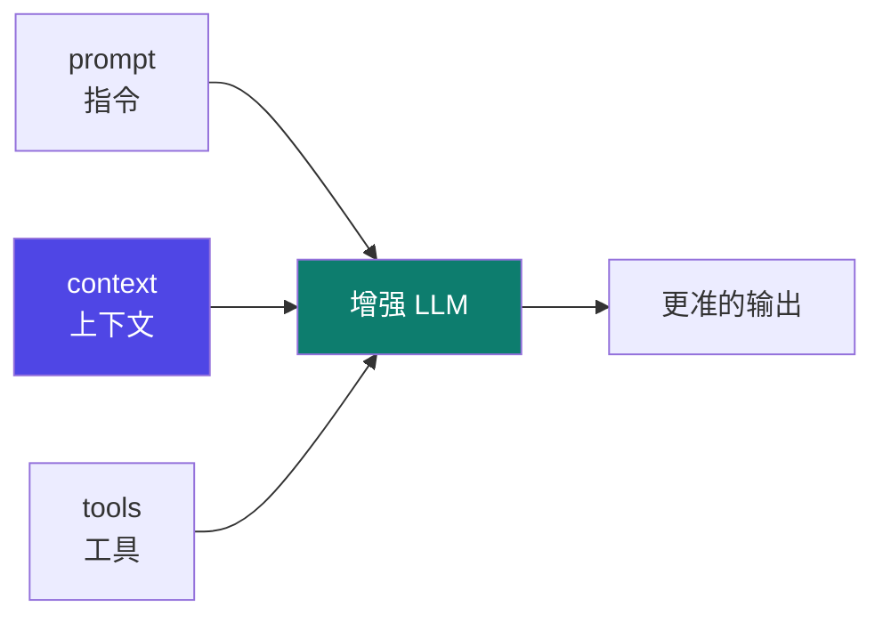
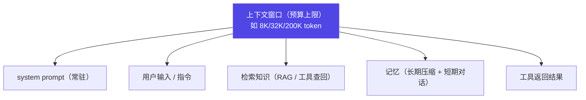
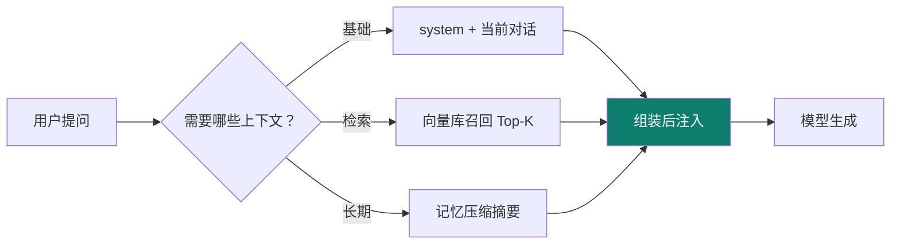

# 02 · context engineering

主轴第二节：在 prompt 之后，**往模型的"桌子"上摆什么**——上下文窗口是有限预算，context engineering 就是管理"摆多少、何时摆、怎么压缩"。

::: tip 类比
context engineering 就像**给厨师备料**：冰箱（上下文窗口）容量有限，你不能把整间超市塞进去。得想清楚——今天这道菜（当前任务）需要哪几样料、现切还是提前腌好（检索还是记忆）、放不下时先扔什么（压缩/总结）。
:::

## 一句话概念

> **Context Engineering**：在一个**有限的上下文窗口**内，动态地**选取、组织、注入、压缩**信息，让增强型 LLM 在每一步都能"看到对的上下文"。  
> 增强 LLM = **指令（prompt） + 额外上下文（context） + 工具（tools）**。context 是其中"额外喂给模型的信息"这一整块。

## 图示：增强 LLM 的三块拼图

## 上下文窗口 = 预算

窗口不是无限大的。每类信息都**占用同一份预算**，必须取舍：

| 信息类型 | 占用预算 | 典型来源 |
|---|---|---|
| system prompt | 高（常驻） | 角色、规则、约束 |
| 检索知识 | 中–高 | 向量库 / 文档 / 数据库 |
| 记忆 | 中 | 压缩摘要 / 历史对话 |
| 工具结果 | 波动大 | API 返回、文件内容 |

::: warning 事实与边界
本页对"增强 LLM = 指令 + 上下文 + 工具"这一结构的描述，依据 **【事实】** Anthropic《Effective context engineering》《Building effective agents》两篇官方文章的论述。具体"窗口该给多少预算、何时注入"是**工程取舍（【建议】）**，没有唯一标准答案。
:::

## 核心策略

### 1. 分层注入（Layered Injection）
不同信息在不同阶段进入，不一次性堆满窗口：

### 2. 渐进式披露（Progressive Disclosure）
先给"目录"，模型要用时再给"详情"，避免一开始就把长文档全塞进来。

### 3. 压缩 / 总结（Compression）
放不下时对旧对话、长工具结果做摘要，保留"要点"腾出预算。

### 4. 记忆分层
- **短期记忆**：当前对话轮次（天然在窗口内）。
- **长期记忆**：跨会话沉淀，用摘要/向量存储，用时再召回。

## 小测验

::: details 点击展开题目与答案
**Q1（选择）**：增强 LLM 由以下哪三块构成？  
A. prompt + context + tools　B. prompt + model + GPU　C. context + cache + API  
✅ A。依据 Anthropic 官方论述。

**Q2（判断）**：上下文窗口越大，就不需要做 context engineering 了。  
❌ 错。窗口再大也有上限，且长上下文会拖慢、稀释注意力，取舍仍然必要。

**Q3（选择）**：渐进式披露的核心思想是？  
A. 一次性塞满所有文档　B. 先给目录、按需给详情　C. 完全不检索  
✅ B。
:::

## 三档自检（了解 / 熟悉 / 精通）

| 档位 | 你能做到 |
|---|---|
| 了解 | 说清"增强 LLM = 指令 + 上下文 + 工具"，知道窗口是有限预算 |
| 熟悉 | 能区分分层注入 / 渐进式披露 / 压缩三种策略，并说明何时用哪种 |
| 精通 | 能在真实 agent 里设计记忆分层 + RAG 召回 + 预算上限，压住成本与遗忘 |

::: tip 本页要点
context engineering = 在有限窗口里"选对、组织对、按时注入、放不下就压缩"。它是 prompt 之后、harness 之前的关键一环——**信息摆对了，模型才做对**。
:::

> 上一章：[01 prompt engineering](/concepts/prompt) ｜ 下一章：[03 harness engineering](/concepts/harness)
