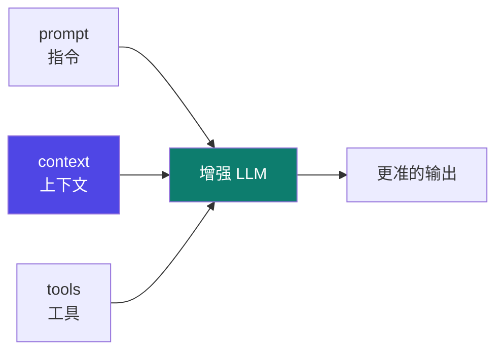
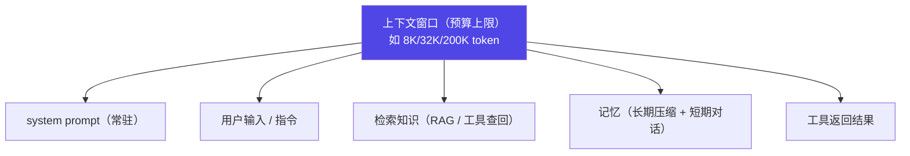

# 02 · context engineering

主轴第二节：在 prompt 之后，**往模型的"桌子"上摆什么**——上下文窗口是有限预算，context engineering 就是管理"摆多少、何时摆、怎么压缩"。

::: tip 类比
context engineering 就像**给厨师备料**：冰箱（上下文窗口）容量有限，你不能把整间超市塞进去。得想清楚——今天这道菜（当前任务）需要哪几样料、现切还是提前腌好（检索还是记忆）、放不下时先扔什么（压缩/总结）。
:::

## 一句话概念

> **Context Engineering**：在一个**有限的上下文窗口**内，动态地**选取、组织、注入、压缩**信息，让增强型 LLM 在每一步都能"看到对的上下文"。  
> 增强 LLM = **指令（prompt） + 额外上下文（context） + 工具（tools）**。context 是其中"额外喂给模型的信息"这一整块。

## 图示：增强 LLM 的三块拼图

## 本章地图

本章不再是"一篇短文"，而是拆成两层，对齐 Track 01 prompt 的子页深度：

| 子页 | 内容 | 对应工程动作 |
|---|---|---|
| [📐 2-1 机制详解](/concepts/context/mechanism) | 预算分配算例、分层注入、渐进披露、压缩、spill、compaction 触发、记忆分层，**附可运行预算控制伪代码** | 设计 + 实现 |
| [⚠️ 2-2 常见坑 + 自检](/concepts/context/pitfalls) | 上下文填满、相关度不足、压缩丢关键信息等坑 + **产物化三档**（精通=交一份上下文组装器） | 验证 + 自检 |
| [🧭 2-3 设计决策 + 验证](/concepts/context/design) | compaction **五步流水线** + prune/summarize 分派、**DSE 确定性信号提取**、真实 tokenizer 计量、**压缩不丢可审计性**、gate 验收 | 设计 + 验证 |

::: info 承接关系
02 承接 01：01 讲"指令（prompt）怎么写"，02 讲"在窗口预算内，怎么把额外信息喂给模型"。02 的输出（一套受预算约束的上下文注入/压缩策略）是 03 harness 的输入之一——**AGENTS.md 等规则文件由 harness 管理、由 context 注入**。
:::

## 上下文窗口 = 预算

窗口不是无限大的。每类信息都**占用同一份预算**，必须取舍：

| 信息类型 | 占用预算 | 典型来源 |
|---|---|---|
| system prompt | 高（常驻） | 角色、规则、约束 |
| 检索知识 | 中–高 | 向量库 / 文档 / 数据库 |
| 记忆 | 中 | 压缩摘要 / 历史对话 |
| 工具结果 | 波动大 | API 返回、文件内容 |

::: warning 事实与边界
本页对"增强 LLM = 指令 + 上下文 + 工具"这一结构的描述，依据 **【事实】** Anthropic《Effective context engineering》《Building effective agents》两篇官方文章的论述。具体"窗口该给多少预算、何时注入、如何压缩"是**工程取舍（【建议】）**，没有唯一标准答案，详见 [2-1 机制详解](/concepts/context/mechanism) 的落地算例。
:::

> 上一章：[01 prompt engineering](/concepts/prompt) ｜ 下一章：[03 harness engineering](/concepts/harness)
