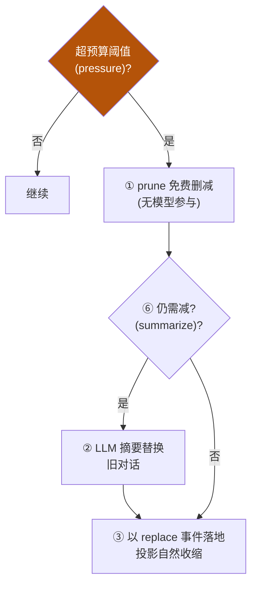
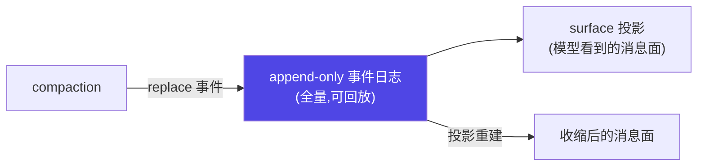

# 2-3 · context 设计决策与验证

2-1 给了预算控制骨架、spill、compaction 双触发，本节把深度推到**设计者级**：compaction 的完整流水线怎么走、prune 与 summarize 什么时候各自出场、DSE 确定性信号提取是什么、真实 tokenizer 计量为何必要、以及如何保持"压缩不丢可审计性"。

::: tip 承接 2-1 / 2-2
2-1 有预算记账 + spill + compaction 双触发（pressure / context-overflow）+ 记忆分层。本节是它们的**工程决策层**：把"触发"细化成"完整分派流水线"，并补 DSE 与审计性。
:::

## 决策一：compaction 五步流水线 + prune/summarize 分派

iceyao 源码解析（【事实】）揭示 compaction 不是"满了一次性压缩"，而是一条**分派流水线**：



**分派决策**：**先免费 prune、再动用 LLM 摘要**——摘要成本高、可能有损，能删的先删。

| 阶段 | 是否耗模型 | 作用 |
|---|---|---|
| prune | 否（免费） | 删冗余消息、空事件、可重建的中间状态 |
| summarize | 是（LLM） | 把旧对话聚合成摘要节点，保要点 |
| replace 落地 | 否 | 以 `surfaceOp: replace` 追加事件，投影自然收缩 |

## 决策二：压缩不绕过日志（可审计 + 可收缩同时成立）

iceyao 关键设计（【事实】）：compaction **没有绕过日志**——它不是改内存历史，而是**以 `surface: replace` 追加新事件**，让"投影"（模型看到的 surface 消息）自然收缩，但**完整日志仍可回放**。

含义：
- **模型可见即已记录**：抵达模型的一切都必须能从日志重建；
- 摘要节点落地为日志事件，原事件保留 → **可审计**；
- 模型看到的是收缩后的投影 → **可收缩**。



## 决策三：DSE（确定性信号提取）—— 比通用摘要更省更可复现

除 LLM 摘要外，生产会引入 **DSE（确定性信号提取）**：从原始对话/prompt 用**确定性规则**提取结构化信号（实体、意图、关键约束），而非只做模糊摘要。对照：

| 方式 | 成本 | 可复现性 | 适合 |
|---|---|---|---|
| LLM 摘要 | 高 | 低（每次不同） | 需要凝练语义时 |
| **DSE 确定性提取** | 低 | 高（同一输入同输出） | 实体/意图/约束等结构化信息 |

> 工程建议（【建议】）：能确定性提取的（如用户身份、工具调用记录、关键约束）走 DSE；需要语义凝练的才动用 LLM 摘要——这是 2-1 骨架的升级方向。

## 决策四：真实 tokenizer 计量（不是 `len(split())`）

2-1 骨架用了 `len(content.split())` 粗略估算。生产必须用**真实 tokenizer**（Anthropic/OpenAI/本地模型的 tokenizer），因为：

- 中文/代码的 token 与空格切分**差异巨大**；
- 预算应**保持留有安全余量**（避免服务端 `context-overflow`）。

```python
# 正确计量（示意）：用所选模型对应的 tokenizer
from anthropic import Anthropic  # 或 tiktoken / 本地 tokenizer
client = Anthropic()
def count_tokens(text):
    # id 计算/按 provider：这里用 tiktoken 或 client.count_tokens 占位
    from tiktoken import encoding_for_model
    enc = encoding_for_model("gpt-4o")
    return len(enc.encode(text))
```
> 生产注记：预算控制器要接真实 tokenizer 并按 provider 切换；上游估算误差主要来自多语言与代码。

## 验收 gate

```python
# gate/context_gate.py —— 2-3 验收
def run():
    checks = []
    # ① 预算控制器超限时降配不崩（沿用 2-1）
    checks.append(budget_controller_degrades_ok())
    # ② 压缩走 replace 事件落地，原日志可回放（可审计）
    checks.append(compaction_not_bypass_log())
    # ③ DSE 对同一输入给出确定性输出
    checks.append(dse_is_deterministic())
    # ④ 真实 tokenizer 与 len(split) 估算存在差异（需切换真计数）
    checks.append(tiktoken_differs_from_split())
    for i, ok in enumerate(checks, 1):
        assert ok, f"check {i} failed"
    print("PASS: context gate 4/4")
```

## 三档自检（2-3 版）

| 档位 | 必须提交的产物 |
|---|---|
| 熟悉 | 能解释 compaction 五步流水线与 prune/summarize 分派顺序 |
| 精通 | 实现带 pressure/overflow 双触发 + prune/summarize 分派 + DSE 的上下文管线，且用真实 tokenizer 计量、事件可回放 |

> 上一节：[2-2 常见坑 + 自检](/concepts/context/pitfalls) ｜ 下一章：[03 harness engineering](/concepts/harness)