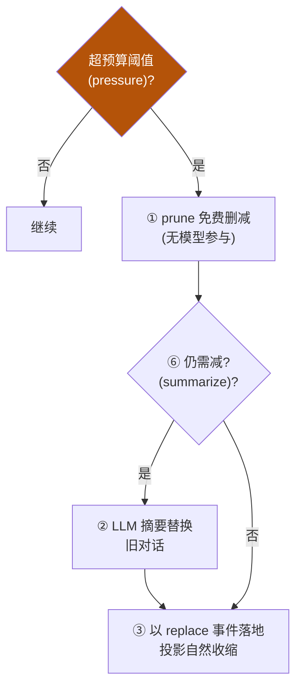
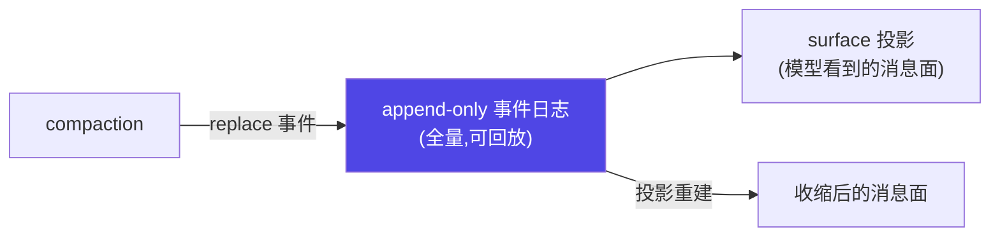
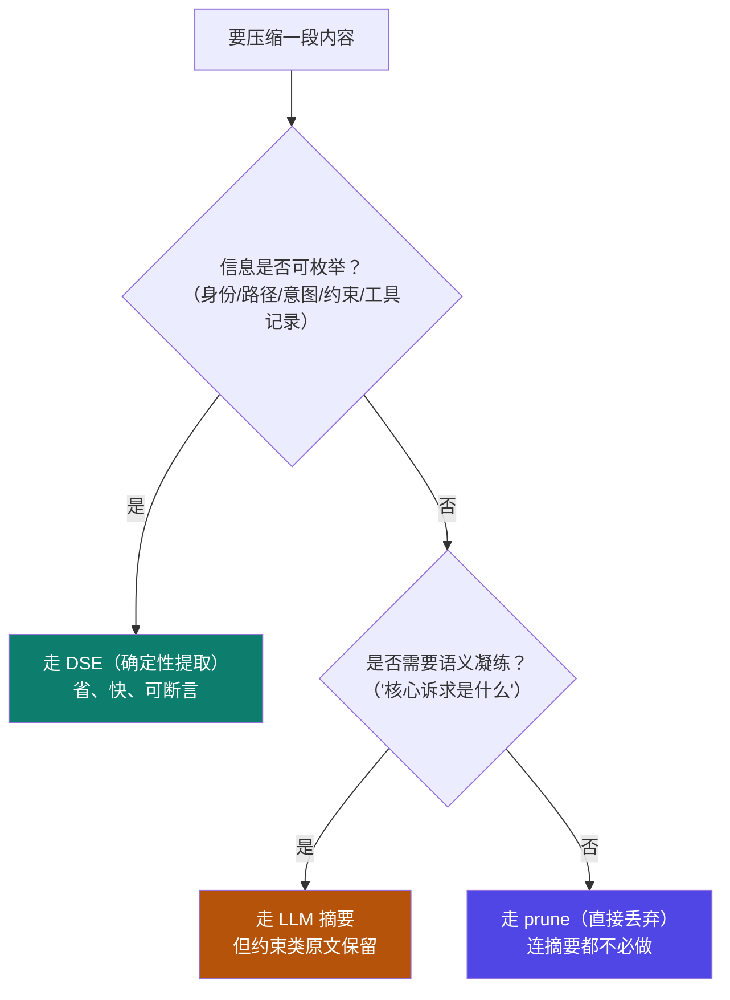

# 2-2 · context 设计决策与验证

::: info 难度分层 · 本页 = L2「设计层」
**前置**：请先掌握 [L1 机制详解](/concepts/context/mechanism)。
本页是 L2——讲**选型 / 权衡 / 取舍**，并附可直接运行的 [gate 验收](/concepts/context/gate/context_gate)。
:::


2-1 给了预算控制骨架、spill、compaction 双触发，本节把深度推到**设计者级**：compaction 的完整流水线怎么走、prune 与 summarize 什么时候各自出场、DSE 确定性信号提取是什么、真实 tokenizer 计量为何必要、以及如何保持"压缩不丢可审计性"。

::: tip 承接 2-1
2-1 有预算记账 + spill + compaction 双触发（pressure / context-overflow）+ 记忆分层。本节是它们的**工程决策层**：把"触发"细化成"完整分派流水线"，并补 DSE 与审计性。
:::

## 决策一：compaction 五步流水线 + prune/summarize 分派

iceyao 源码解析（【事实】）揭示 compaction 不是"满了一次性压缩"，而是一条**分派流水线**：



**分派决策**：**先免费 prune、再动用 LLM 摘要**——摘要成本高、可能有损，能删的先删。

| 阶段 | 是否耗模型 | 作用 |
|---|---|---|
| prune | 否（免费） | 删冗余消息、空事件、可重建的中间状态 |
| summarize | 是（LLM） | 把旧对话聚合成摘要节点，保要点 |
| replace 落地 | 否 | 以 `surfaceOp: replace` 追加事件，投影自然收缩 |

## 决策二：压缩不绕过日志（可审计 + 可收缩同时成立）

iceyao 关键设计（【事实】）：compaction **没有绕过日志**——它不是改内存历史，而是**以 `surface: replace` 追加新事件**，让"投影"（模型看到的 surface 消息）自然收缩，但**完整日志仍可回放**。

含义：
- **模型可见即已记录**：抵达模型的一切都必须能从日志重建；
- 摘要节点落地为日志事件，原事件保留 → **可审计**；
- 模型看到的是收缩后的投影 → **可收缩**。



## 决策三：DSE（确定性信号提取）—— 比通用摘要更省更可复现

### 什么是 DSE

除 LLM 摘要外，生产会引入 **DSE（确定性信号提取）**：从原始对话/prompt 用**确定性规则**提取结构化信号（实体、意图、关键约束），而非只做模糊摘要。

"**确定性**"是三个可检验的硬条件，缺一不可：

| 条件 | 含义 | 怎么验 |
|---|---|---|
| **无模型参与** | 纯正则 / 解析器 / 状态机，**不调用 LLM** | 断网/断 API 后仍能跑 |
| **同输入同输出** | 同一段文本两次提取，结果**逐字节相同** | `dse(s) == dse(s)` 做回归 |
| **输出可枚举** | 结果是**结构化字段**（JSON），不是自然语言段落 | 字段可被程序断言 |

### 与 LLM 摘要的分工

| 方式 | 成本 | 可复现性 | 延迟 | 适合 |
|---|---|---|---|---|
| LLM 摘要 | 高（一次模型调用） | 低（每次不同） | 高 | 需要**语义凝练**时 |
| **DSE 确定性提取** | 低（本地计算） | **高（同一输入同输出）** | 低 | 实体/意图/约束等**结构化信息** |

### 三类信号的提取规则（可落地）

| 信号 | 提取依据 | 示例规则 | 输出字段 |
|---|---|---|---|
| **实体** | 模式匹配 | 邮箱 / URL / 文件路径 / `@handle` / 版本号 `\d+\.\d+\.\d+` | `entities.emails[]`、`entities.paths[]` |
| **意图** | 动词-宾语模式 | 动作词表（部署/回滚/查询/修改/删除）+ 其宾语 | `intent.action`、`intent.target` |
| **约束** | 关键词 + 断言 | "必须/禁止/只读/不超过 N/超时 Xs" | `constraints[]`（原文保留 + 归一化） |
| **工具调用记录** | 结构化事件流 | `tool_call` / `tool_result` 事件 | `tool_trace[]` |

> 注意约束类信号的**不可再生性**：它必须**原文保留**（不能摘要），否则后续轮次会丢失边界（见 [2-3 坑③](/concepts/context/pitfalls)）。

### 完整实现（可运行，仅标准库）

```python
"""dse.py — 确定性信号提取器：无 LLM、同输入同输出、可回归。
运行：python dse.py
"""
import re

# ---------- 规则表（可扩展、可版本化）----------
ENTITY_RULES = {
    "emails": re.compile(r"[\w.+-]+@[\w-]+\.[\w.]+"),
    "urls":   re.compile(r"https?://[^\s)。，、；]+"),
    "paths":  re.compile(r"(?:[\w.-]+/)+[\w.-]+\.\w+"),
    "versions": re.compile(r"\b\d+\.\d+\.\d+\b"),
}
INTENT_VERBS = ["部署", "回滚", "查询", "修改", "删除", "新增", "重构", "部署到", "跑通"]
CONSTRAINT_PAT = re.compile(r"(必须[^。;；，\n]*|禁止[^。;；，\n]*|只读|不改[^。;；，\n]*|不超过\s*\d+[^。;；，\n]*|超时\s*\d+\s*秒?)")


def dse_extract(text: str) -> dict:
    """确定性提取：同一输入必得同一输出（无随机、无模型）。"""
    entities = {k: sorted(set(p.findall(text))) for k, p in ENTITY_RULES.items()}
    entities = {k: v for k, v in entities.items() if v}          # 去掉空类

    intent = {"action": None, "target": None}
    for line in text.splitlines():
        for v in INTENT_VERBS:                                    # 词表顺序固定 → 结果确定
            if v in line:
                intent = {"action": v, "target": line.strip()[:60]}
                break
        if intent["action"]:
            break

    constraints = CONSTRAINT_PAT.findall(text)                    # 原文保留，不摘要

    return {
        "entities": entities,
        "intent": intent,
        "constraints": constraints,
        "tool_trace": [],                                        # 由事件流填充（此处留空）
    }


def is_deterministic(sample: str) -> bool:
    """回归判据：同输入两次结果必须完全一致。"""
    return dse_extract(sample) == dse_extract(sample)


if __name__ == "__main__":
    s = ("用户 alice@corp.com 要求：把 https://svc/api/v1.2.3 部署到 prod，"
         "必须只读校验，超时 5 秒，不改 config.yaml")
    out = dse_extract(s)
    print(out)
    assert out["entities"]["emails"] == ["alice@corp.com"]        # 实体可断言
    assert out["intent"]["action"] == "部署"                       # 意图可断言
    assert any("只读" in c for c in out["constraints"])            # 约束可断言
    assert is_deterministic(s)                                     # 确定性可断言
    print("PASS: DSE 提取确定、可断言")
```

**跑出来的关键点**：`entities` / `intent` / `constraints` 都能被 **assert 直接断言**——这就是 DSE 相对 LLM 摘要的核心价值：**把"总结得对不对"变成"字段等不等于"**。

实测输出（本地运行结果）：
```
{'entities': {'emails': ['alice@corp.com'],
              'urls': ['https://svc/api/v1.2.3'],
              'paths': ['svc/api/v1.2.3']},
 'intent': {'action': '部署', 'target': '用户 alice@corp.com 要求：把 https://svc/api/v1.2.3 部署到 prod，必须只读校'},
 'constraints': ['必须只读校验', '超时 5 秒', '不改 config.yaml'],
 'tool_trace': []}
PASS: DSE 提取确定、可断言
```
> 注意 `constraints` 是**逐条列出**（3 条），不是一段摘要——这正是"约束不可再生、必须原文保留"的落地。

### 分工决策：什么时候走 DSE，什么时候才动 LLM



::: tip 工程建议（【建议】）
能确定性提取的（用户身份、工具调用记录、关键约束）**一律走 DSE**；只有需要语义凝练时才动用 LLM 摘要。**两者可以叠加**：DSE 抽结构、LLM 补语义——这正是 [2-1 骨架](/concepts/context/mechanism) 的升级方向。
:::

### 为什么 DSE 更"可复现"——与可审计性打通

- **LLM 摘要不可复现** → 压缩前后无法做 A/B 回归 → 线上出问题**无法定位**是哪次摘要丢的信息；
- **DSE 产物可断言** → 可以写测试："这段对话提取出的约束必须是 3 条"；
- 与 [2-2 的可审计压缩](/concepts/context/design) 结合：DSE 产物以**事件**形式 append 进日志，压缩**不绕过**日志，"模型可见即已记录"。

### 边界：DSE 不能做什么

| 做不了 | 原因 | 该找谁 |
|---|---|---|
| 语义凝练 | 规则无法表达"这段话的主旨" | LLM 摘要 |
| 处理未见模式 | 新格式的实体需要新规则 | 补规则 / 版本化规则表 |
| 替代检索 | DSE 是"已有文本 → 信号"，不是"库 → 相关文档" | [RAG 召回 / 检索](/concepts/context/mechanism) |
| 判断语义等价 | "禁止改 A"与"A 不可修改"规则难覆盖 | LLM + 人工抽检 |

### 反模式

- **用 LLM 做本该确定性的提取**：让模型"读出用户 ID / 文件路径"——**又贵又不稳**，且每次可能不同。
- **用 DSE 硬啃语义摘要**：为覆盖各种说法不断加规则，最终**规则爆炸**且仍不准。
- **只提取不校验**：规则改了却没有回归用例，静默漏提约束类信息（后果最重）。
- **把 DSE 输出直接当摘要喂模型**：DSE 给的是"信号"，缺少上下文黏合；应**结构化字段 + 必要时一句 LLM 语义补充**。

## 决策四：真实 tokenizer 计量（不是 `len(split())`）

2-1 骨架用了 `len(content.split())` 粗略估算。生产必须用**真实 tokenizer**（Anthropic/OpenAI/本地模型的 tokenizer），因为：

- 中文/代码的 token 与空格切分**差异巨大**；
- 预算应**保持留有安全余量**（避免服务端 `context-overflow`）。

```python
# 正确计量（示意）：用所选模型对应的 tokenizer
from anthropic import Anthropic  # 或 tiktoken / 本地 tokenizer
client = Anthropic()
def count_tokens(text):
    # id 计算/按 provider：这里用 tiktoken 或 client.count_tokens 占位
    from tiktoken import encoding_for_model
    enc = encoding_for_model("gpt-4o")
    return len(enc.encode(text))
```
> 生产注记：预算控制器要接真实 tokenizer 并按 provider 切换；上游估算误差主要来自多语言与代码。

## 验收 gate

```python
# gate/context_gate.py —— 2-3 验收
def run():
    checks = []
    # ① 预算控制器超限时降配不崩（沿用 2-1）
    checks.append(budget_controller_degrades_ok())
    # ② 压缩走 replace 事件落地，原日志可回放（可审计）
    checks.append(compaction_not_bypass_log())
    # ③ DSE 对同一输入给出确定性输出
    checks.append(dse_is_deterministic())
    # ④ 真实 tokenizer（tiktoken）与 len(split) 估算存在差异
    checks.append(tiktoken_differs_from_split())
    # ⑤ 中文按字计 token，长中文段落显著消耗预算
    checks.append(chinese_token_cost_is_real())
    # ⑥ DSE 产物是结构化字段，可被 assert 直接断言（实体/意图/约束）
    checks.append(dse_fields_are_assertable())
    for i, ok in enumerate(checks, 1):
        assert ok, f"check {i} failed"
    print("PASS: context gate 6/6（真实 tokenizer 已启用 + DSE 产物可断言）")
```

::: tip 实测输出（真实 tiktoken，非模拟）
```
    split估算=4, 真实tokens=10     ← 空格切分低估 2.5 倍
    中文 24 字 -> 27 tokens        ← 中文按字计，不是"1 词 1 token"
entities=['alice@corp.com'], intent=部署, constraints=3 条
check1..check6: PASS
PASS: context gate 6/6（真实 tokenizer 已启用 + DSE 产物可断言）
```
这组数据直接证明：2-1 骨架里的 `len(content.split())` **会严重低估中文/代码的真实开销**，生产必须换真实 tokenizer（此前版本用硬编码 `realistic = 9` 自证，已废弃）。
:::

## 三档自检（2-2 版）

| 档位 | 必须提交的产物 |
|---|---|
| 熟悉 | 能解释 compaction 五步流水线与 prune/summarize 分派顺序 |
| 精通 | 实现带 pressure/overflow 双触发 + prune/summarize 分派 + DSE 的上下文管线，且用真实 tokenizer 计量、事件可回放 |

> 上一节：[2-1 context 机制详解](/concepts/context/mechanism) ｜ 下一节：[2-3 常见坑 + 自检](/concepts/context/pitfalls)