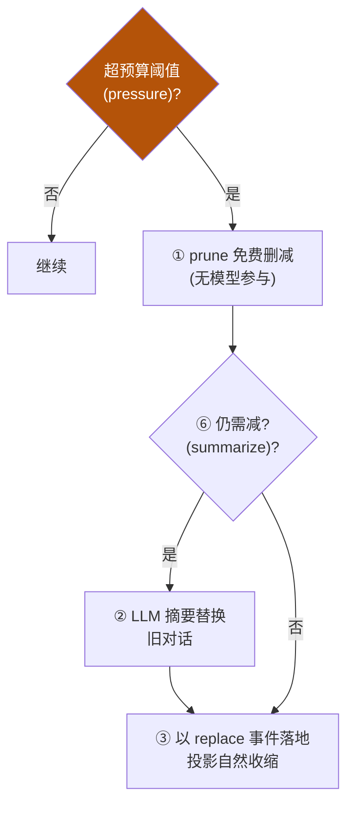
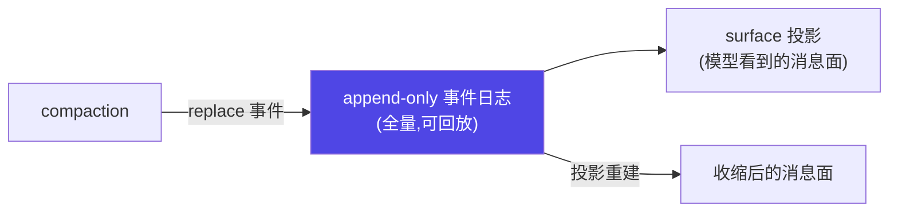
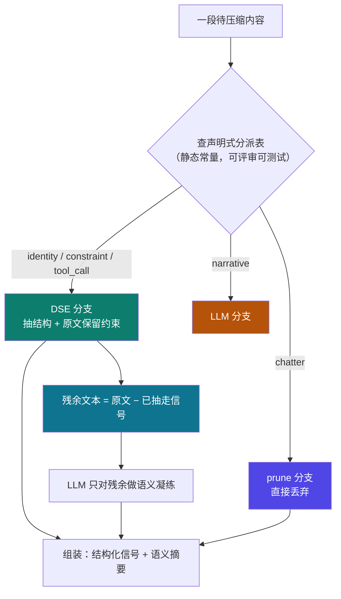

# 2-2 · context 设计决策与验证

::: info 难度分层 · 本页 = L2「设计层」
**前置**：请先掌握 [L1 机制详解](/concepts/context/mechanism)。
本页是 L2——讲**选型 / 权衡 / 取舍**，并附可直接运行的 [gate 验收](/concepts/context/gate/context_gate)。
:::


2-1 给了预算控制骨架、spill、compaction 双触发，本节把深度推到**设计者级**：compaction 的完整流水线怎么走、prune 与 summarize 什么时候各自出场、DSE 确定性信号提取是什么、真实 tokenizer 计量为何必要、以及如何保持"压缩不丢可审计性"。

::: tip 承接 2-1
2-1 有预算记账 + spill + compaction 双触发（pressure / context-overflow）+ 记忆分层。本节是它们的**工程决策层**：把"触发"细化成"完整分派流水线"，并补 DSE 与审计性。
:::

## 决策一：compaction 五步流水线 + prune/summarize 分派

iceyao 源码解析（【事实】）揭示 compaction 不是"满了一次性压缩"，而是一条**分派流水线**：



**分派决策**：**先免费 prune、再动用 LLM 摘要**——摘要成本高、可能有损，能删的先删。

| 阶段 | 是否耗模型 | 作用 |
|---|---|---|
| prune | 否（免费） | 删冗余消息、空事件、可重建的中间状态 |
| summarize | 是（LLM） | 把旧对话聚合成摘要节点，保要点 |
| replace 落地 | 否 | 以 `surfaceOp: replace` 追加事件，投影自然收缩 |

## 决策二：压缩不绕过日志（可审计 + 可收缩同时成立）

iceyao 关键设计（【事实】）：compaction **没有绕过日志**——它不是改内存历史，而是**以 `surface: replace` 追加新事件**，让"投影"（模型看到的 surface 消息）自然收缩，但**完整日志仍可回放**。

含义：
- **模型可见即已记录**：抵达模型的一切都必须能从日志重建；
- 摘要节点落地为日志事件，原事件保留 → **可审计**；
- 模型看到的是收缩后的投影 → **可收缩**。



## 决策三：DSE（确定性信号提取）—— 比通用摘要更省更可复现

### 什么是 DSE

除 LLM 摘要外，生产会引入 **DSE（确定性信号提取）**：从原始对话/prompt 用**确定性规则**提取结构化信号（实体、意图、关键约束），而非只做模糊摘要。

"**确定性**"是三个可检验的硬条件，缺一不可：

| 条件 | 含义 | 怎么验 |
|---|---|---|
| **无模型参与** | 纯正则 / 解析器 / 状态机，**不调用 LLM** | 断网/断 API 后仍能跑 |
| **同输入同输出** | 同一段文本两次提取，结果**逐字节相同** | `dse(s) == dse(s)` 做回归 |
| **输出可枚举** | 结果是**结构化字段**（JSON），不是自然语言段落 | 字段可被程序断言 |

### 与 LLM 摘要的分工

| 方式 | 成本 | 可复现性 | 延迟 | 适合 |
|---|---|---|---|---|
| LLM 摘要 | 高（一次模型调用） | 低（每次不同） | 高 | 需要**语义凝练**时 |
| **DSE 确定性提取** | 低（本地计算） | **高（同一输入同输出）** | 低 | 实体/意图/约束等**结构化信息** |

### 三类信号的提取规则（可落地）

| 信号 | 提取依据 | 示例规则 | 输出字段 |
|---|---|---|---|
| **实体** | 模式匹配 | 邮箱 / URL / 文件路径 / `@handle` / 版本号 `\d+\.\d+\.\d+` | `entities.emails[]`、`entities.paths[]` |
| **意图** | 动词-宾语模式 | 动作词表（部署/回滚/查询/修改/删除）+ 其宾语 | `intent.action`、`intent.target` |
| **约束** | 关键词 + 断言 | "必须/禁止/只读/不超过 N/超时 Xs" | `constraints[]`（原文保留 + 归一化） |
| **工具调用记录** | 结构化事件流 | `tool_call` / `tool_result` 事件 | `tool_trace[]` |

> 注意约束类信号的**不可再生性**：它必须**原文保留**（不能摘要），否则后续轮次会丢失边界（见 [2-3 坑③](/concepts/context/pitfalls)）。

### 完整实现（可运行，仅标准库）

```python
"""dse.py — 确定性信号提取器：无 LLM、同输入同输出、可回归。
运行：python dse.py
"""
import re

# ---------- 规则表（可扩展、可版本化）----------
ENTITY_RULES = {
    "emails": re.compile(r"[\w.+-]+@[\w-]+\.[\w.]+"),
    "urls":   re.compile(r"https?://[^\s)。，、；]+"),
    "paths":  re.compile(r"(?:[\w.-]+/)+[\w.-]+\.\w+"),
    "versions": re.compile(r"\b\d+\.\d+\.\d+\b"),
}
INTENT_VERBS = ["部署", "回滚", "查询", "修改", "删除", "新增", "重构", "部署到", "跑通"]
CONSTRAINT_PAT = re.compile(r"(必须[^。;；，\n]*|禁止[^。;；，\n]*|只读|不改[^。;；，\n]*|不超过\s*\d+[^。;；，\n]*|超时\s*\d+\s*秒?)")


def dse_extract(text: str) -> dict:
    """确定性提取：同一输入必得同一输出（无随机、无模型）。"""
    entities = {k: sorted(set(p.findall(text))) for k, p in ENTITY_RULES.items()}
    entities = {k: v for k, v in entities.items() if v}          # 去掉空类

    intent = {"action": None, "target": None}
    for line in text.splitlines():
        for v in INTENT_VERBS:                                    # 词表顺序固定 → 结果确定
            if v in line:
                intent = {"action": v, "target": line.strip()[:60]}
                break
        if intent["action"]:
            break

    constraints = CONSTRAINT_PAT.findall(text)                    # 原文保留，不摘要

    return {
        "entities": entities,
        "intent": intent,
        "constraints": constraints,
        "tool_trace": [],                                        # 由事件流填充（此处留空）
    }


def is_deterministic(sample: str) -> bool:
    """回归判据：同输入两次结果必须完全一致。"""
    return dse_extract(sample) == dse_extract(sample)


if __name__ == "__main__":
    s = ("用户 alice@corp.com 要求：把 https://svc/api/v1.2.3 部署到 prod，"
         "必须只读校验，超时 5 秒，不改 config.yaml")
    out = dse_extract(s)
    print(out)
    assert out["entities"]["emails"] == ["alice@corp.com"]        # 实体可断言
    assert out["intent"]["action"] == "部署"                       # 意图可断言
    assert any("只读" in c for c in out["constraints"])            # 约束可断言
    assert is_deterministic(s)                                     # 确定性可断言
    print("PASS: DSE 提取确定、可断言")
```

**跑出来的关键点**：`entities` / `intent` / `constraints` 都能被 **assert 直接断言**——这就是 DSE 相对 LLM 摘要的核心价值：**把"总结得对不对"变成"字段等不等于"**。

实测输出（本地运行结果）：
```
{'entities': {'emails': ['alice@corp.com'],
              'urls': ['https://svc/api/v1.2.3'],
              'paths': ['svc/api/v1.2.3']},
 'intent': {'action': '部署', 'target': '用户 alice@corp.com 要求：把 https://svc/api/v1.2.3 部署到 prod，必须只读校'},
 'constraints': ['必须只读校验', '超时 5 秒', '不改 config.yaml'],
 'tool_trace': []}
PASS: DSE 提取确定、可断言
```
> 注意 `constraints` 是**逐条列出**（3 条），不是一段摘要——这正是"约束不可再生、必须原文保留"的落地。

### 分工决策：DSE 与 LLM 摘要怎么选（谁来决定 · 怎么排 · 怎么算）

上一节只回答了"两者各适合什么"。但工程上真正会卡住的是三个问题：**这个选择谁来做？两个都跑还是只跑一个？成本怎么预先算？** 下面把这三问逐个钉死。

#### ① 先破题：三个候选方案的判定

| 候选 | 可行性 | 判定依据 |
|---|---|---|
| **A. 让 LLM 自我选择**（"你来判断这段要不要摘要"） | ❌ **反模式** | **元级自相矛盾**：DSE 的全部价值是确定、可复现、可断言；若"要不要用确定性提取"这个决策本身是不确定的，价值被自己抵消 |
| **B. 默认两种都跑**（DSE + LLM 全量各来一遍） | ⚠️ **需限定** | 无条件双跑 = 在已被 DSE 抽走的字段上**浪费 LLM token**，且产生语义重复（约束既在结构化字段里、又在摘要里被改写一遍） |
| **C. 自己定死**（静态声明，运行时零决策） | ✅ **骨架** | 分派表可评审、可测试、可预算；但**只定"谁走哪条"，不解决"两路怎么合"** |
| **正解** | ✅ | **C 的分派表 + B 的混合流水线**，按**固定顺序**串联：DSE 先把信号抽干并原文保留，LLM 只对**残余**做语义凝练 |

**为什么 A（LLM 自选）必须排除**——三条硬理由，缺一不可：

1. **元级自相矛盾**：确定性提取的决策过程本身不能是不确定的。否则"DSE 结果稳定"只在下游成立，上游仍在漂移。
2. **不可预算**：LLM 决定 → 你**无法预先推导**每次压缩的 token 上限。成本从"可静态计算"退化为"运行时可波动"，直接破坏 2-1 的预算控制器（它需要**事前**知道配额）。
3. **失败不可复现**：判断错误（"这段不需要摘要"）导致的丢信息，**下次同样的输入可能不丢**——线上事故无法定位、无法回归。

> 一句话：**"要不要用 LLM"这个决策，本身不能用 LLM 来做。**

#### ② 可判定判据：可枚举性测试

别凭感觉分配。一个信号能否 DSE 化，只问两个**客观可回答**的问题：

1. 能否为它写出**有限规则**（正则 / 模板 / 枚举字典）？
2. 能否为它写出 **assert**（期望值唯一、无歧义）？

两问皆"能" → 走 DSE；任一"不能" → 走 LLM。

| 信号 / 内容 | 能写规则？ | 能写 assert？ | 结论 |
|---|---|---|---|
| 用户 ID / 邮箱 / 路径 / 版本号 | ✅ | ✅ | **DSE** |
| 硬约束（必须 / 禁止 / 超时 / 只读） | ✅（模板有限） | ✅ | **DSE**，且**原文保留** |
| 工具调用记录（工具名 / 参数 / 返回码） | ✅ | ✅ | **DSE** |
| "用户的核心诉求是什么" | ❌ | ❌（无唯一正解） | **LLM** 摘要 |
| "当前任务实际在解决什么" | ❌ | ❌ | **LLM** 摘要 |
| 寒暄 / 冗余过渡 / 已失效的闲聊 | — | — | **prune**（直接丢） |

> **判据的核心就一句**：**能写 assert 就能 DSE**。因为 DSE 的定义（[什么是 DSE](#什么是-dse)）就是"输出可枚举"——写不出 assert 意味着输出不唯一，那它本来就不是确定性信号。

#### ③ 正解形态：声明式分派表 + 固定顺序流水线



分派表本身是一段**静态常量**（不是 prompt、不是模型输出），因此它可以被 code review、被单测、被 diff 审计：

```python
DSE, LLM, PRUNE = "dse", "llm", "prune"

ROUTING = {                      # 内容类型 → 策略（静态声明，运行时零决策）
    "identity":   DSE,           # 用户 / 邮箱 / 路径 / 版本  → 抽结构
    "constraint": DSE,           # 必须 / 禁止 / 超时        → 抽结构 + 原文保留
    "tool_call":  DSE,           # 工具名 / 参数 / 返回码     → 抽结构
    "narrative":  LLM,           # 叙述性内容                → 语义凝练
    "chatter":    PRUNE,         # 寒暄 / 冗余               → 丢弃
}
```

#### ④ 顺序不可颠倒（最容易被做错的一步）

- **正确**：`DSE → 在残余上做 LLM 摘要`
- **错误**：`先 LLM 摘要 → 再 DSE`

原因：LLM 摘要会**改写措辞**（"必须只读校验" → "需要保证可读"），而 DSE 规则**依赖措辞**（`必须|禁止|只读`）。先摘要，约束就被改写，规则**静默失配**——不报错，只是悄悄少了几条。

实测（见下方 ⑤）：正确顺序抽出 **3 条**约束；顺序颠倒后只剩 **1 条**——**丢了 2/3 且无声无息**。这也解释了为什么"两路都跑"必须是**串联且有序**，不能并联。

#### ⑤ 完整实现（可运行）

```python
# dse_router.py —— 三种策略可切换：dse_only / llm_only / hybrid（默认）
import re

DSE, LLM, PRUNE = "dse", "llm", "prune"
ROUTING = {
    "identity": DSE, "constraint": DSE, "tool_call": DSE,
    "narrative": LLM, "chatter": PRUNE,
}

DSE_ENTITY_RULES = {
    "emails": re.compile(r"[\w.+-]+@[\w-]+\.[\w.]+"),
    "urls":   re.compile(r"https?://[^\s)。，、；]+"),
}
DSE_INTENT_VERBS = ["部署", "回滚", "查询", "修改", "删除", "重构"]
DSE_CONSTRAINT_PAT = re.compile(
    r"(必须[^。;；，\n]*|禁止[^。;；，\n]*|只读|不改[^。;；，\n]*|不超过\s*\d+[^。;；，\n]*|超时\s*\d+\s*秒?)"
)


def dse_extract_rich(text):
    """确定性提取（无 LLM、同输入同输出）。"""
    entities = {k: sorted(set(p.findall(text))) for k, p in DSE_ENTITY_RULES.items()}
    entities = {k: v for k, v in entities.items() if v}
    intent = None
    for line in text.splitlines():
        for v in DSE_INTENT_VERBS:              # 词表顺序固定 → 结果确定
            if v in line:
                intent = v
                break
        if intent:
            break
    return {"entities": entities, "intent": intent,
            "constraints": DSE_CONSTRAINT_PAT.findall(text)}


def residual_text(text, dse_out):
    """剔除 DSE 已抽走的行 —— 残余才交给 LLM，避免双份成本与语义重复。"""
    cons = set(dse_out["constraints"])
    keep = []
    for line in text.splitlines():
        if line in cons:                                # 约束已由 DSE 原文保留
            continue
        if DSE_CONSTRAINT_PAT.search(line):             # 含硬约束信号的行
            continue
        if any(p.search(line) for p in DSE_ENTITY_RULES.values()):   # 含实体信号的行
            continue
        keep.append(line)
    return "\n".join(keep)


def compress(text, strategy="hybrid", summarize_fn=None):
    """三模式：dse_only（零 LLM）/ llm_only（全量 LLM）/ hybrid（默认）。"""
    stats = {"llm_calls": 0, "llm_in_chars": 0}
    payload = {}
    if strategy in ("dse_only", "hybrid"):
        payload["signals"] = dse_extract_rich(text)          # ① DSE 总是先跑
    residual = text if strategy == "llm_only" else residual_text(text, payload["signals"])
    if strategy != "dse_only" and residual.strip() and len(residual) > 40:
        fn = summarize_fn or (lambda s: s[:40] + "…")         # 生产换成真实 LLM 调用
        payload["summary"] = fn(residual)                     # ② LLM 只吃残余
        stats["llm_calls"] += 1
        stats["llm_in_chars"] = len(residual)
    return payload, stats                                 # ③ 组装：signals + summary
```

**实测输出**（本地真跑，原文 160 字符）：

```text
[dse_only]  keys=['signals']            llm_calls=0
[llm_only]  keys=['summary']            llm_calls=1  llm_in_chars=160
[hybrid]    keys=['signals','summary']  llm_calls=1  llm_in_chars=60    ← 省 62%

① dse_only 零 LLM 调用 ..................... True
② hybrid 的 LLM 只吃 60/160 字符 ........... True（省 62%）
③ hybrid.signals == dse_only.signals ....... True（LLM 阶段不污染 DSE 输入）
④ 顺序正确 → 3 条约束；顺序颠倒 → 1 条 ..... True（丢 2/3 且无声）
⑤ 残余中已无约束原文（不重复进 LLM） ....... True
```

#### ⑥ 成本怎么预先算

有了"定死的分派表 + 固定顺序"，每次压缩的成本就是**可静态推导**的：

```text
B_llm = B_total − tokens(DSE 输出字段) − tokens(原文保留的约束)
```

- DSE 部分：**0 token**（本地正则，只花 CPU 时间）
- LLM 部分：只针对**残余**，上例中从 160 字符压到 60 字符
- 因此预算控制器可以在**压缩前**就为 LLM 留出确定配额，而不是"跑完再看花了多少"

这也是 A 方案（LLM 自选）的致命处：**决策不可预知 → 配额不可预算 → 预算控制器失效**。

#### ⑦ 漏抽怎么办：这是闭环信号，不是 bug

DSE 规则未命中（新格式、新措辞）时的处理是**设计好的**，不是兜底：

```text
DSE 未命中 → 落 unknown 桶 → 交由 LLM 兜底（不丢信息）
                          → 同时记一条「规则缺口」事件
                          → 反哺规则表（补规则 + 版本号 + 回归用例）
                          → 下次同模式输入即命中
```

关键点：**漏抽是"可观测的规则缺口信号"**，会留下事件、能被统计（缺口率）、能被补规则关闭。这与"静默失败"完全不同——这也是 DSE 与 LLM 在可运维性上的根本差别：LLM 漏了信息你**不知道**，DSE 没命中你**看得见**。

#### ⑧ 工程默认值（可直接抄的起点）

| 场景 | 策略 | 理由 |
|---|---|---|
| 编码 agent 长会话 | **hybrid** | 既有路径/约束/工具记录（DSE），又有任务叙述（LLM） |
| 多轮客服（订票/退改签） | **hybrid**，约束强制 DSE | 退改签规则**不可被改写**，其余叙述可信赖 LLM 凝练 |
| 高合规（金融/医疗/法务） | **dse_only** + 人工抽检 | 不允许任何 LLM 改写约束；宁可留冗余 |
| 纯闲聊 / 客套 / 过渡段 | **prune** | 连摘要都不必做 |
| 成本敏感的批处理 | **dse_only** | 零 LLM 调用，成本恒定 |
| 首次压缩（无历史可压） | **不压缩** | 没有可压缩对象，别为压而压 |

选择方式：**写进配置**（`context.strategy: hybrid`），随环境/租户切换——**不是**运行时让模型判断。

> **实例印证**：[Claude Code 的会话压缩](/instances/claude-code) 就是典型的 `hybrid` 形态——身份/路径/工具记录保留为结构化记录、硬约束原文保留，只有讨论过程才交给 LLM 凝练。判断一个 agent 的压缩是否成熟，最快的方法就是看它的约束被**"保留"**还是被**"总结"**。

#### ⑨ 反模式（补充）

- **让 LLM 决定"要不要摘要"**：元级不确定性——把确定性提取的开关交给不确定的过程。
- **无条件双跑全量**：在已被 DSE 抽走的字段上浪费 LLM token，并让约束在摘要里被改写一遍（语义重复且可能冲突）。
- **先摘要再 DSE**：约束**静默失配**（实测丢 2/3）。顺序是这条流水线的**契约**，不是风格选择。
- **把 `hybrid` 当成"两个都开就万事大吉"**：没有残余剔除的 hybrid 只是双份成本，**不是**混合策略。

### 为什么 DSE 更"可复现"——与可审计性打通

- **LLM 摘要不可复现** → 压缩前后无法做 A/B 回归 → 线上出问题**无法定位**是哪次摘要丢的信息；
- **DSE 产物可断言** → 可以写测试："这段对话提取出的约束必须是 3 条"；
- 与 [2-2 的可审计压缩](/concepts/context/design) 结合：DSE 产物以**事件**形式 append 进日志，压缩**不绕过**日志，"模型可见即已记录"。

### 边界：DSE 不能做什么

| 做不了 | 原因 | 该找谁 |
|---|---|---|
| 语义凝练 | 规则无法表达"这段话的主旨" | LLM 摘要 |
| 处理未见模式 | 新格式的实体需要新规则 | 补规则 / 版本化规则表 |
| 替代检索 | DSE 是"已有文本 → 信号"，不是"库 → 相关文档" | [RAG 召回 / 检索](/concepts/context/mechanism) |
| 判断语义等价 | "禁止改 A"与"A 不可修改"规则难覆盖 | LLM + 人工抽检 |

### 反模式

- **用 LLM 做本该确定性的提取**：让模型"读出用户 ID / 文件路径"——**又贵又不稳**，且每次可能不同。
- **用 DSE 硬啃语义摘要**：为覆盖各种说法不断加规则，最终**规则爆炸**且仍不准。
- **只提取不校验**：规则改了却没有回归用例，静默漏提约束类信息（后果最重）。
- **把 DSE 输出直接当摘要喂模型**：DSE 给的是"信号"，缺少上下文黏合；应**结构化字段 + 必要时一句 LLM 语义补充**。

## 决策四：真实 tokenizer 计量（不是 `len(split())`）

2-1 骨架用了 `len(content.split())` 粗略估算。生产必须用**真实 tokenizer**（Anthropic/OpenAI/本地模型的 tokenizer），因为：

- 中文/代码的 token 与空格切分**差异巨大**；
- 预算应**保持留有安全余量**（避免服务端 `context-overflow`）。

```python
# 正确计量（示意）：用所选模型对应的 tokenizer
from anthropic import Anthropic  # 或 tiktoken / 本地 tokenizer
client = Anthropic()
def count_tokens(text):
    # id 计算/按 provider：这里用 tiktoken 或 client.count_tokens 占位
    from tiktoken import encoding_for_model
    enc = encoding_for_model("gpt-4o")
    return len(enc.encode(text))
```
> 生产注记：预算控制器要接真实 tokenizer 并按 provider 切换；上游估算误差主要来自多语言与代码。

## 验收 gate

```python
# gate/context_gate.py —— 2-3 验收
def run():
    checks = []
    # ① 预算控制器超限时降配不崩（沿用 2-1）
    checks.append(budget_controller_degrades_ok())
    # ② 压缩走 replace 事件落地，原日志可回放（可审计）
    checks.append(compaction_not_bypass_log())
    # ③ DSE 对同一输入给出确定性输出
    checks.append(dse_is_deterministic())
    # ④ 真实 tokenizer（tiktoken）与 len(split) 估算存在差异
    checks.append(tiktoken_differs_from_split())
    # ⑤ 中文按字计 token，长中文段落显著消耗预算
    checks.append(chinese_token_cost_is_real())
    # ⑥ DSE 产物是结构化字段，可被 assert 直接断言（实体/意图/约束）
    checks.append(dse_fields_are_assertable())
    # ⑦ 策略由静态分派表定死（非 LLM 决策）：dse_only 零 LLM、hybrid 只吃残余
    checks.append(strategy_dispatch_is_declarative())
    # ⑧ 顺序契约：DSE 必须先于 LLM，否则约束被改写致静默失配
    checks.append(dse_before_llm_order_is_contract())
    for i, ok in enumerate(checks, 1):
        assert ok, f"check {i} failed"
    print("PASS: context gate 8/8（真实 tokenizer + DSE 可断言 + 分派声明式 + 顺序契约）")
```

::: tip 实测输出（真实 tiktoken，非模拟）
```
    split估算=4, 真实tokens=10     ← 空格切分低估 2.5 倍
    中文 24 字 -> 27 tokens        ← 中文按字计，不是"1 词 1 token"
entities=['alice@corp.com'], intent=部署, constraints=3 条
dse_only.llm_calls=0, hybrid LLM 输入=60/160 字符    ← 残余剔除省 62%
正确顺序 3 条约束；顺序颠倒 1 条                      ← 顺序是契约，不是风格
check1..check8: PASS
PASS: context gate 8/8（真实 tokenizer + DSE 可断言 + 分派声明式 + 顺序契约）
```
这组数据证明三件事：① 2-1 骨架里的 `len(content.split())` **会严重低估中文/代码的真实开销**，生产必须换真实 tokenizer（此前版本用硬编码 `realistic = 9` 自证，已废弃）；② **分派是静态表而非模型判断**——`dse_only` 的 LLM 调用次数恒为 0；③ **DSE→LLM 的顺序是契约**——颠倒后约束从 3 条掉到 1 条，且不报错。
:::

## 三档自检（2-2 版）

| 档位 | 必须提交的产物 |
|---|---|
| 熟悉 | 能解释 compaction 五步流水线与 prune/summarize 分派顺序 |
| 精通 | 实现带 pressure/overflow 双触发 + prune/summarize 分派 + DSE 的上下文管线，且用真实 tokenizer 计量、事件可回放 |

> 上一节：[2-1 context 机制详解](/concepts/context/mechanism) ｜ 下一节：[2-3 常见坑 + 自检](/concepts/context/pitfalls)