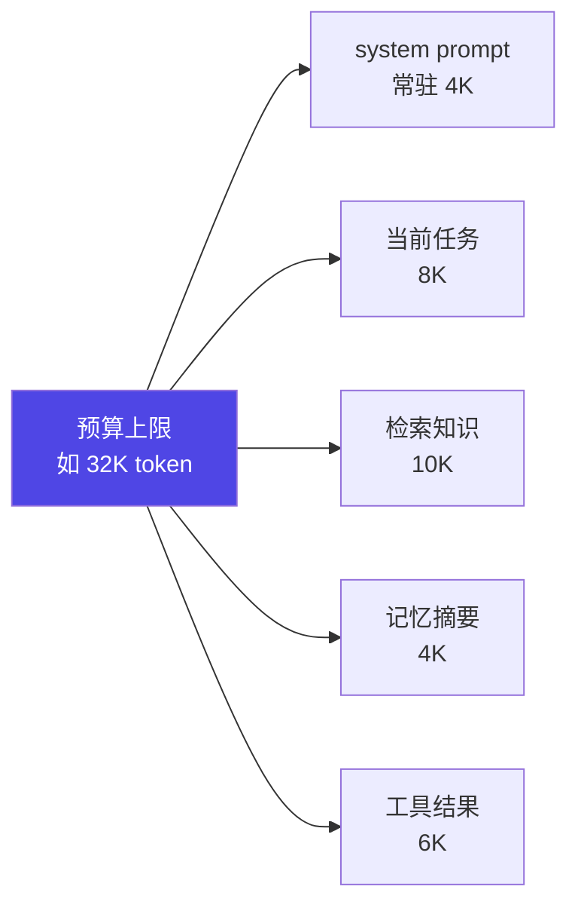
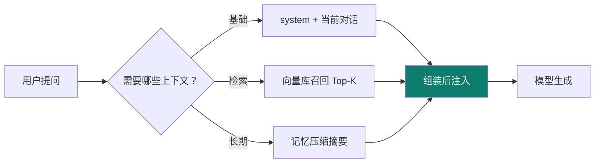
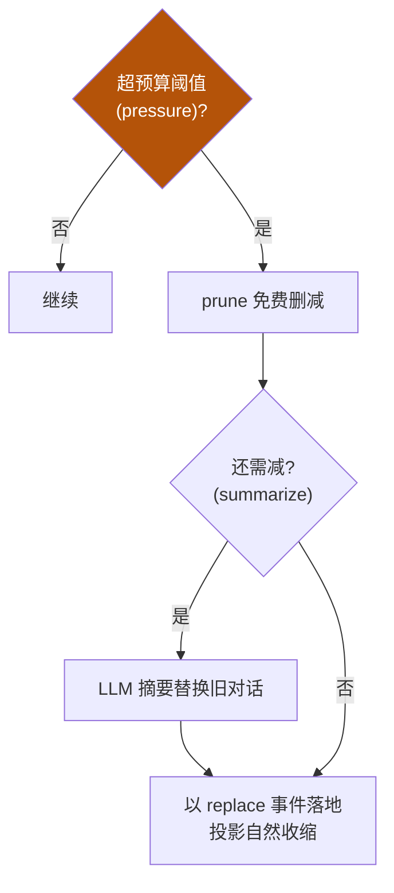

# 2-1 · context engineering 机制详解

本章把 02 的"预算观"落地成**可实现的机制**，并给一段可运行的最小预算控制骨架。读完你不仅能"说清"，还能"写出来"。

::: tip 承接 01
01 的 `basics/1-2` 讲过"分段拼装 + 渐进披露"是 prompt 层的做法。02 站在它之上，解决的是**"在窗口有限的前提下，如何分配、注入、压缩"**——渐进披露只是 02 众多机制之一，02 的增量在预算账本与压缩策略。
:::

## 机制一：预算分配（Budget Allocation）

上下文不是"有多少塞多少"，而是**按预算记账**。一次请求前，先算好每类信息的 token 配额：



**关键原则**：`system + 任务 + 检索 + 记忆 + 工具 ≤ 预算`。超了就要"降配"——优先砍可再生的检索、压缩记忆，而不是砍 system（常驻约束掉了，行为会漂移）。

## 机制二：分层注入 + 渐进披露

- **分层注入**：不同信息在不同时机进入（基础 → 检索 → 记忆），不一次性堆满。
- **渐进披露**：先给"目录/摘要"，模型要用时再注入"详情"。避免把整本手册塞进开头。



## 机制三：spill（超大结果挪出去）

工具返回超大结果（如整文件、长日志）会瞬间烧光预算。**spill** 的做法：超限内容不直接进上下文，而是存全文、只注入 **head/tail 预览 + 一个 locator（定位符）**；模型要全文时再用 locator 去取。

```
工具结果 500K token
  └─ 超过 maxInlineBytes
      ├─ 全文 → 存储（磁盘/向量）
      ├─ 注入上下文 → 前 2K + 后 2K 预览
      └─ 附带 locator: "file:///logs/app.log#L1-L500000"
```

## 机制四：compaction（历史压缩）触发条件

上下文不是"满了才处理"，而是**命中阈值就触发**。DeepSeek Harness 的工程实现给了两条触发（iceyao 源码解析，【事实】）：

| 触发 | 条件 | 策略 |
|---|---|---|
| `pressure` | 当前 token 超过预设阈值（预算水位） | 先免费 `prune`（删冗余），不够再 `summarize`（LLM 摘要替换） |
| `context-overflow` | 服务端返回"窗口溢出"错误 | 立即强制压缩后重试 |



## 机制五：记忆分层

- **短期记忆**：当前对话轮次（天然在窗口内，随 loop 增长而增长）。
- **长期记忆**：跨会话沉淀，存摘要/向量库，用时再召回。长期记忆**不进常驻预算**，按需注入。

## 最小可运行骨架：预算控制 + 触发压缩

```python
# context_budget.py —— 最小上下文预算控制器（示意，可直接改造成函数库）
MAX_BUDGET = 32_000        # 本轮上下文预算上限(token)
ALARM_RATIO = 0.85         # 水位 85% 触发 pressure

def build_context(system, task, retrieved, memory, tool_results):
    parts = {"system": system, "task": task,
             "retrieved": retrieved, "memory": memory, "tool_results": tool_results}
    usage = {k: len(v.split()) for k, v in parts.items()}   # 粗略 token 估算
    total = sum(usage.values())

    if total > MAX_BUDGET * ALARM_RATIO:
        # 触发 compaction 前的降配：先砍可再生的检索
        while total > MAX_BUDGET * ALARM_RATIO and usage["retrieved"] > 1000:
            usage["retrieved"] //= 2
            total = sum(usage.values())
        # 还不够 → 标记需 summarize 记忆
        if total > MAX_BUDGET:
            parts["memory"] = "[摘要] 已按上一轮压缩（占位）"
            total = sum(usage.values())

    assert total <= MAX_BUDGET, "预算超限，必须 spill 或 summarize"
    return "\n\n".join(parts[k] for k in ("system","task","retrieved","memory","tool_results") if parts[k])
```

::: warning 标注
spill / compaction（pressure / prune / summarize）机制参照 **【事实】** iceyao《DeepSeek Harness 源码深度解析》的 context / spill / compaction 三件套设计。上方 Python 骨架是**教学用简化实现（【建议】）**，生产需按实际 tokenizer 精确计数并接入存储。
:::

## 小测验

::: details 点击展开题目与答案
**Q1（选择）**：预算超限时，最先应砍哪类？  
A. system prompt　B. 可再生的检索知识　C. 全部一样  
✅ B。system 是常驻约束，砍了行为会漂移；检索可再生，优先降配。

**Q2（选择）**：spill 的做法是？  
A. 把所有结果硬塞进上下文　B. 存全文、注入 head/tail 预览 + locator　C. 直接丢弃  
✅ B。

**Q3（判断）**：compaction 只在"窗口溢出报错"时才触发。  
❌ 错。分 `pressure`（水位到阈值）与 `context-overflow`（服务端报错）两类触发。
:::

> 上一章：[02 context 总入口](/concepts/context) ｜ 下一节：[2-2 常见坑 + 自检](/concepts/context/pitfalls)
