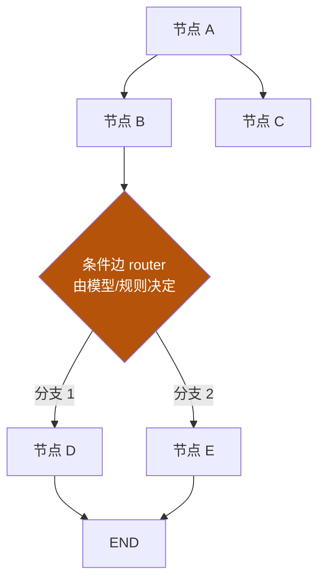

# 05 · graph engineering

主轴第五节：单个 loop 解决"一轮反复"，但当任务变成**多步骤、多角色、带分支**时，需要一个更上面的结构来编排——这就是 graph：把节点、边、状态reducer 组织成"多人协作流程"。

::: tip 类比
graph 就像**工厂的流水线 + 调度表**：单个工位（loop）很能干，但整车需要多个工位按图纸（图）串联、并联、甚至根据质检结果走不同分支。graph 就是那张工厂布局图。
:::

## 一句话概念

> **Graph Engineering**：用**有向图**显式编排多步骤 / 多 agent 的执行——节点（做什么）、边（走哪条）、状态（共享什么）、reducer（如何合并）。  
> 当流程**需要分支、并行、或中途由模型决策走哪条路**时，用 graph；单一线性反复用 loop 就够。

## 图示：一张最朴素的图

## 本章地图

| 子页 | 内容 | 对应工程动作 |
|---|---|---|
| [📐 5-1 机制详解](/concepts/graph/mechanism) | **StateGraph 完整可运行代码**、State 类型 / `Annotated` / `operator.add` reducer 语义、条件边、compile、checkpoint | 实现 |
| [⚠️ 5-2 常见坑 + 自检](/concepts/graph/pitfalls) | 滥用图、reducer 理解错、缺 checkpoint 等坑 + **产物化三档**（精通=提交含条件边的 StateGraph 并跑通） | 验证 + 自检 |
| [🧭 5-3 设计决策 + 验证](/concepts/graph/design) | reducer 三类对照、checkpointer 生产选型、**HITL 决策表**、**Send 并行归并**、**gate 验收脚本** | 设计 + 验证 |

::: info 承接关系
04 的 loop 反复解决一件事。05 把它升级为多节点编排：**graph 的每个节点可以是一个 loop**。当流程需要分支/并行/多角色时，用图把多个 loop 组织起来。
:::

::: warning 事实与边界
"StateGraph / Node / Edge / Conditional Edge / Reducer"术语与语义，依据 **【事实】** LangGraph 官方 Graph API 文档。具体"何时该上 graph、用哪种编排模式"是**架构选型（【建议】）**——很多场景单 loop 已足够。可运行实现见 [5-1 机制详解](/concepts/graph/mechanism)。
:::

> 上一章：[04 loop engineering](/concepts/loop) ｜ 下一章：[06 skill 体系架构](/concepts/skill)