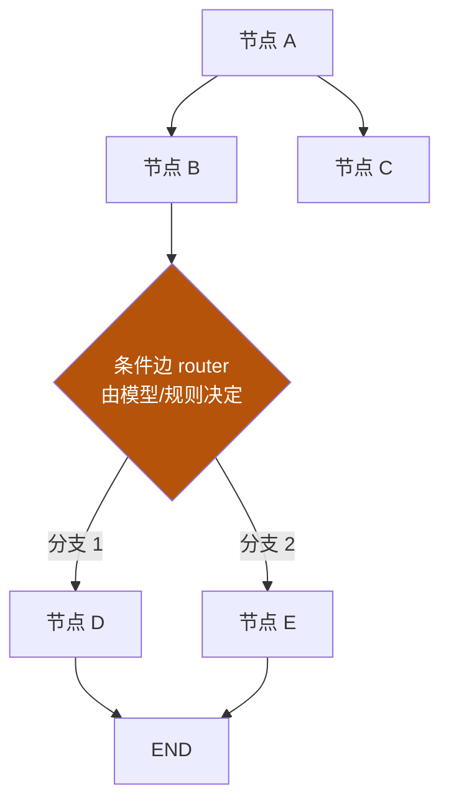
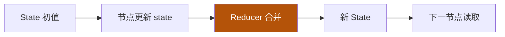
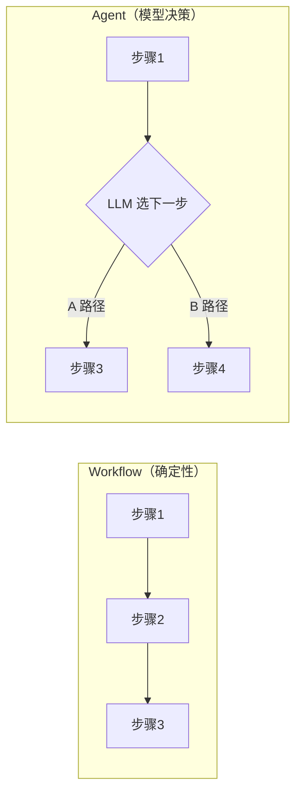

# 05 · graph engineering

主轴第五节：单个 loop 解决"一轮反复"，但当任务变成**多步骤、多角色、带分支**时，需要一个更上面的结构来编排——这就是 graph：把节点、边、状态reducer 组织成"多人协作流程"。

::: tip 类比
graph 就像**工厂的流水线 + 调度表**：单个工位（loop）很能干，但整车需要多个工位按图纸（图）串联、并联、甚至根据质检结果走不同分支。graph 就是那张工厂布局图。
:::

## 一句话概念

> **Graph Engineering**：用**有向图**显式编排多步骤 / 多 agent 的执行——节点（做什么）、边（走哪条）、状态（共享什么）、reducer（如何合并）。  
> 当流程**需要分支、并行、或中途由模型决策走哪条路**时，用 graph；单一线性反复用 loop 就够。

## 图示：一张最朴素的图

## 核心构件（按 LangGraph Graph API 命名）

依据 **【事实】** LangGraph 的 Graph API：StateGraph 由以下要素组成。

| 构件 | 含义 |
|---|---|
| **Node（节点）** | 一个执行单元（通常是函数 / 一个 agent / 一次 loop） |
| **Edge（边）** | 节点间的确定流转（A 做完必到 B） |
| **Conditional Edge（条件边）** | 由函数/模型决定下一步走哪条分支 |
| **State（状态）** | 跨节点共享的数据（如对话、中间结果） |
| **Reducer（归约器）** | 节点更新 state 时如何合并（覆盖 / 追加 / 取最大…） |

## workflow vs agent（先分清，再选型）

- **Workflow**：路径在写代码时就定死，适合固定流水线（如 ETL）。
- **Agent/Graph**：某条边由模型在运行时决定，适合需要灵活应对的任务。

## 常见编排模式

- **Routing（路由）**：入口按条件分派到不同子图。
- **Parallel（并行）**：多个独立节点同时跑，结果汇总。
- **Orchestrator-Worker（编排者–工人）**：一个中枢把任务拆给多个 worker，再收口。

::: warning 事实与边界
"StateGraph / Node / Edge / Conditional Edge / Reducer"术语与语义，依据 **【事实】** LangGraph 官方 Graph API 文档。具体"何时该上 graph、用哪种编排模式"是**架构选型（【建议】）**——很多场景单 loop 已足够，上 graph 是为应对分支与多角色。
:::

## 小测验

::: details 点击展开题目与答案
**Q1（选择）**：graph 中的 reducer 负责？  
A. 决定走哪条边　B. 合并节点对共享 state 的更新　C. 执行工具调用  
✅ B。

**Q2（判断）**：只要用到 LLM，就一定该用 graph 编排。  
❌ 错。单线性反复用 loop 即可；graph 用于需要分支/并行/多角色的复杂流程。

**Q3（选择）**：条件边（Conditional Edge）与普通的边区别在于？  
A. 速度更快　B. 下一步由函数/模型在运行时决定　C. 只能串行  
✅ B。
:::

## 三档自检（了解 / 熟悉 / 精通）

| 档位 | 你能做到 |
|---|---|
| 了解 | 区分 workflow 与 agent/grasph，说出 Node/Edge/State/Reducer 各自是什么 |
| 熟悉 | 能画一张含条件边的图，并解释 reducer 如何合并状态 |
| 精通 | 能为真实多 agent 任务选型（routing / parallel / orchestrator-worker），并判断它是否该降级为单 loop |

::: tip 本页要点
graph 是 loop 之上的编排层：用节点 + 边 + 状态 + reducer 把多步骤、多角色、带分支的流程**显式画出来**。先问"要不要上 graph"，再问"用哪种模式"。
:::

> 上一章：[04 loop engineering](/concepts/loop) ｜ 下一章：[06 skill 体系架构](/concepts/skill)
