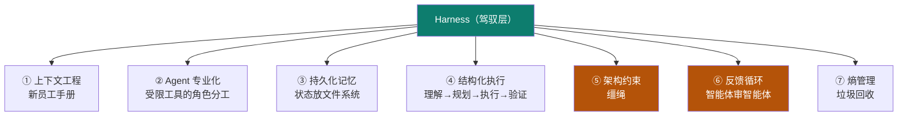

# 03 · harness engineering（驾驭工程）

> **难度**：3-1 机制（入门→熟悉） · 3-2 设计决策（熟悉→精通） · 3-3 坑与自检（全档复核）

主轴第三节。本节权威依据为用户提供的教材《Harness Engineering 从入门到精通实战》（51 页，见 [事实源 S11](/practice/sources)）。

## 一句话概念

> **Harness Engineering（驾驭工程）**：围绕 AI 智能体**设计和构建约束机制、反馈回路、工作流控制和持续改进循环**的系统工程实践。
>
> 它**不优化模型本身，而是优化模型运行的环境**。核心哲学八个字——**人类掌舵，智能体执行**（Human Steer, Agent Execute）。

"Harness"一词来自**马具**（缰绳、马鞍、嚼子）——一套引导强大但不可预测的动物的完整装备。**驾驭工程不是削弱 AI 的能力，而是为它打造一套黄金缰绳，让它跑得又快又稳。**

::: tip 概念起源（【事实】）
由 HashiCorp 联合创始人 **Mitchell Hashimoto 于 2026-02-05 首次提出**，六天后 OpenAI 在百万行代码实验报告中正式采用该术语，随后 Martin Fowler 撰文深度分析。原文定义：
> harness engineering is the idea that anytime you find an agent makes a mistake, you take the time to engineer a solution such that the agent will not make that mistake again in the future.

潜台词：**Agent 的每一次失败，都是环境设计不完善的信号**——正确的回应不是换个更强的模型，而是重新设计它运行的环境。
:::

## 三次范式跃迁（本站在这条主轴上）

| 范式 | 核心问题 | 优化对象 | 交互模式 |
|---|---|---|---|
| **提示词工程**（01 prompt） | 怎么把话说清楚 | Prompt 的措辞、格式、示例 | 一问一答 |
| **上下文工程**（02 context） | 怎么给 AI 喂信息 | 文档、代码片段、历史对话 | 信息注入 → 生成 |
| **驾驭工程**（03 harness，本节） | 怎么让 Agent 可靠工作 | **约束、反馈回路、控制系统** | **人类掌舵，Agent 执行** |

> 类比：Prompt = 对马喊话的技巧；Context = 给马看的地图；**Harness = 给马造一条高速公路，配上护栏、限速牌和加油站**。

## 与框架的关系：它是"上一层"，不是替代品

Harness **不是** SDK / 脚手架 / Agent 框架的替代品，而是**位于它们之上的一层**：

- 传统框架解决"**如何构建** AI 智能体"；驾驭层解决"智能体**如何可靠地运行**"。
- 模型正在吸收框架约 **80%** 的功能（智能体定义、消息路由、任务生命周期……），而剩下的 **20%**——**持久化、确定性重放、成本控制、可观测性、错误恢复**——正是驾驭层存在的价值。

## 七大核心组件

| # | 组件 | 解决什么 | 代表实践 |
|---|---|---|---|
| ① | **上下文工程** | Agent 不知道该看什么、怎么找 | AGENTS.md 活文档、三层上下文、按需检索 |
| ② | **Agent 专业化** | 通用 Agent 携带过多无关信息 | 角色分工（研究/规划/执行/审查/调试/清理）+ 受限工具 |
| ③ | **持久化记忆** | 每次新会话从零开始、不知前情 | 进度文件 + git log + feature list（JSON） |
| ④ | **结构化执行** | 一步到位导致上下文耗尽 | 理解 → 规划 → 执行 → 验证，人工审查计划 |
| ⑤ | **架构约束** | Agent 复制并放大坏模式 | 分层依赖 + 自定义 Linter + CI 强制阻断 |
| ⑥ | **反馈循环** | Agent 不知道自己做错了 | Agent-to-Agent Review、自动测试套件 |
| ⑦ | **熵管理** | 技术债与文档腐烂 | Doc-gardening Agent、持续小额垃圾回收 |

> 七大组件将在 [3-1 机制详解](/concepts/harness/mechanism) 中逐个展开为可实现机制，在 [3-2 设计决策](/concepts/harness/design) 中落成"三步走"配置。

## 三大失败模式（为什么要驾驭）

Anthropic 工程团队在长时间运行 Agent 中总结的典型翻车姿势（【事实】）：

1. **一步到位（One-shotting）**：想在一个会话里做完全部功能 → 上下文耗尽，留下一堆没文档的半成品，下个会话只能靠猜。
2. **过早宣布胜利**：项目后期看到已有进展就宣布完成——**即使还有大量功能未实现**。
3. **过早标记功能完成**：写完代码就标记完成，**没做端到端测试**（单测或 curl 通过 ≠ 功能可用）。

外加一个危险特性：**Agent 极擅长模式复制**——代码库里有什么模式就忠实复制并放大，**包括坏模式和架构漂移**。不加约束的 Agent 会以惊人速度积累技术债。

## 核心闭环（一句话记住）

> **约束 → 告知 → 验证 → 纠正**

记住：Harness Engineering 的核心**不是搭建复杂基础设施**，而是这个简单闭环。**从 `AGENTS.md` 和一条 ArchUnit 规则开始，比什么都不做强一百倍。**

## 业界证据（为什么值得投入）

| 团队 | 关键数据 |
|---|---|
| **OpenAI** | 3 名工程师 / 5 个月 / **约 100 万行代码** / **0 行手写** / 约 1500 个 PR / 人均日 3.5 PR / 效率约 10 倍 |
| **LangChain** | **不动模型**，仅改 Harness（文档结构、验证回路、追踪系统）→ Terminal Bench 2.0 得分 52.8% → **66.5%**，全球排名 **30 → 5** |
| **Anthropic（C 编译器）** | 16 个并行 Agent / 约 2 周 / 10 万行 Rust / GCC torture test **99%** 通过 / 150+ 真实项目可编译 / 总成本约 $20,000 |
| **Stripe（Minions）** | Slack 发任务 → Agent 写码到 PR 全包办，人只在最后审查介入；Toolshed MCP 提供近 500 个工具 |

> 五个独立团队得出同一结论：**瓶颈不在模型智能，而在基础设施。**

## 本章地图

| 子页 | 内容 |
|---|---|
| [📐 3-1 机制详解](/concepts/harness/mechanism) | 七大核心组件逐个展开：三层上下文、角色分工表、进度文件、四阶段执行、分层依赖、Agent 审 Agent、垃圾回收；含真实 AGENTS.md「地图模式」样例 |
| [🧭 3-2 设计决策 + 验证](/concepts/harness/design) | **落地三步走**（信息层/约束层/自动化层）+ 真实 ArchUnit / Checkstyle / enforcer / JaCoCo / CI 配置 + **"错误信息即 Prompt"三要素公式** + gate 验收 |
| [⚠️ 3-3 常见坑 + 自检](/concepts/harness/pitfalls) | 教材六条踩坑（AGENTS.md 过长 / Linter 规则过多死循环 / 版本飘移 / 约束过严 / doc-gardening 无人管 / 忘了审查环境）+ 产物化三档 |

::: info 承接关系
02 产出"受预算约束的上下文"。03 承接它：**AGENTS.md 等规则文件由 harness 管理、由 context 注入**。03 同时接住 01 埋的落点——"用验证守护不变量"正是 harness 的**机械化执行**思想。
:::

::: warning 事实与边界
本章概念、术语、案例数据与三步走方法均依据教材《Harness Engineering 从入门到精通实战》（【事实】，[S11](/practice/sources)），该教材自身汇整自 Mitchell Hashimoto、OpenAI、Anthropic、LangChain、Martin Fowler 等原始来源。**具体配置项与版本号以你的项目实际情况为准**（【建议】），落地方式见 [3-2 设计决策](/concepts/harness/design)。
:::

::: tip 生产落地 → Track D
本章讲的是"**机制是什么**"。如果你要把它用到真实交付里——**怎么排阶段、怎么举证、怎么判定能否放行**——见 [Track D · 生产级流程](/process/)（依据同一教材的生产级 SOP）。
:::

> 上一章：[02 context engineering](/concepts/context) ｜ 下一章：[04 loop engineering](/concepts/loop)
