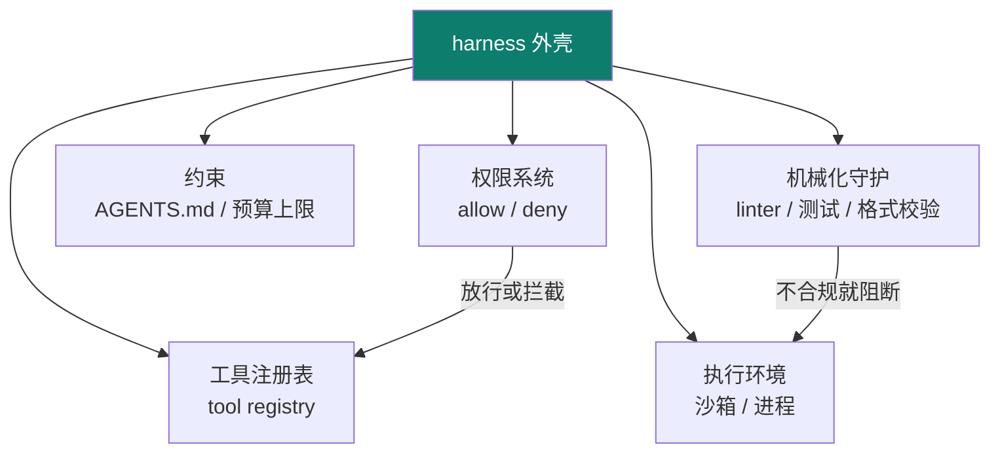

# 03 · harness engineering

主轴第三节：模型与上下文都有了，还需要一个**外壳**把它们装起来、管起来——这就是 harness：**承载 agent 的运行时**（工具、权限、执行环境、约束）。

::: tip 类比
harness 就像**赛车的底盘与安全带**：引擎再强（LLM），没有底盘你跑不起来，没有安全带你一拐弯就翻车。harness 不替模型思考，它负责"让模型安全地跑起来"。
:::

## 一句话概念

> **Harness Engineering**：设计与实现**承载 agent 的外壳/运行时**——把模型、上下文、工具**安全地接在一起**，并通过权限系统、机械化守护（linter/测试）、熵管理，让 agent 在受控环境里反复执行而不"跑飞"。

> prompt 决定"模型看到什么"，context 决定"额外喂什么"，而 **harness 决定"模型能做什么、被什么约束"**。

## 图示：主轴中 harness 的位置

## harness 内部由什么构成

## 关键机制

### 1. AGENTS.md 注入
把"项目宪法"常驻注入上下文——角色边界、技术栈、交付格式、禁止事项，让 agent 每次开工先读到规则。

### 2. 权限系统（Permission）
工具一旦授予就可能真改文件、真发请求、真花钱。harness 用 allow/deny 把"能做什么"明文限定，越权动作直接拦截。

### 3. 机械化执行（Mechanical Execution）
不靠模型"自觉"，而靠**确定的外部程序**兜底：linter 守护、自动化测试、格式校验在每步强制运行，出错就阻断——把可靠性从"模型概率"变成"工程保证"。

### 4. 熵管理（Entropy Management）
任务越跑越乱（上下文膨胀、目标漂移）。harness 通过"仓库即记录系统"、压缩、阶段归档，降低系统熵，让长任务可复现、可审计。

### 5. 仓库即记录系统（Repo as Record）
把决策、变更、日志留在仓库里（而非只存在对话里），使过程可追溯、可回放。

::: warning 事实与边界
本页对"harness"概念与机制的描述，依据 **【事实】** OpenAI《Harness Engineering》一文，以及 Mitchell Hashimoto 对该术语的推广使用、deusyu/harness-engineering 仓库总结的 AGENTS.md 注入 / 权限系统 / 机械化执行 / 熵管理 / 仓库即记录系统等原则。各框架的具体实现细节是**工程实践（【建议】）**，可按项目裁剪。
:::

## 小测验

::: details 点击展开题目与答案
**Q1（选择）**：harness 主要负责的是？  
A. 让模型看到更清晰的指令　B. 承载 agent 的运行时与权限约束　C. 训练模型参数  
✅ B。它不替模型思考，而是提供外壳与约束。

**Q2（判断）**：权限系统可以用"让模型自觉别乱改文件"来替代。  
❌ 错。harness 用确定的 allow/deny 拦截，而非依赖模型自觉。

**Q3（选择）**：机械化执行（linter/测试守护）的意义是？  
A. 让模型更聪明　B. 把可靠性从概率变成工程保证　C. 减少上下文长度  
✅ B。
:::

## 三档自检（了解 / 熟悉 / 精通）

| 档位 | 你能做到 |
|---|---|
| 了解 | 说清 harness 与 prompt/context 的区别，列举其 4–5 个构成（工具/权限/环境/约束/守护） |
| 熟悉 | 能解释 AGENTS.md 注入、权限系统、机械化守护各自解决什么问题 |
| 精通 | 能为真实项目设计 harness：权限矩阵 + linter/测试守护 + 熵管理，让 agent 长任务不跑飞 |

::: tip 本页要点
harness = 承载 agent 的外壳与运行时。它用**权限 + 机械化守护 + 熵管理**把"强大的模型"变成"可控可复现的系统"——这是从 prompt 走向可落地 agent 的必经一关。
:::

> 上一章：[02 context engineering](/concepts/context) ｜ 下一章：[04 loop engineering](/concepts/loop)
