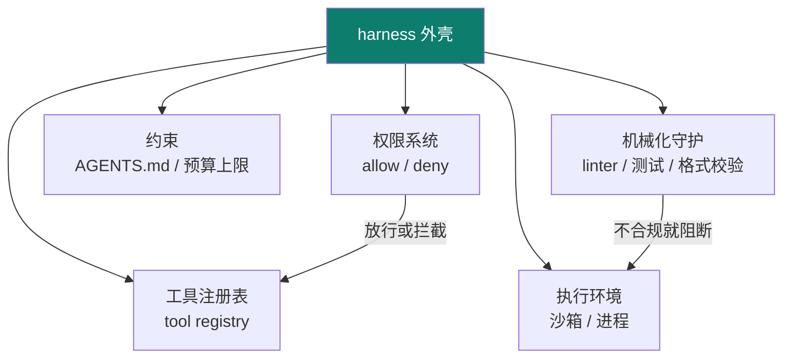

# 03 · harness engineering

> **难度**：3-1 机制（入门→熟悉） · 3-2 设计决策（熟悉→精通） · 3-3 坑与自检（全档复核）

主轴第三节：模型与上下文都有了，还需要一个**外壳**把它们装起来、管起来——这就是 harness：**承载 agent 的运行时**（工具、权限、执行环境、约束）。

::: tip 类比
harness 就像**赛车的底盘与安全带**：引擎再强（LLM），没有底盘你跑不起来，没有安全带你一拐弯就翻车。harness 不替模型思考，它负责"让模型安全地跑起来"。
:::

## 一句话概念

> **Harness Engineering**：设计与实现**承载 agent 的外壳/运行时**——把模型、上下文、工具**安全地接在一起**，并通过权限系统、机械化守护（linter/测试）、熵管理，让 agent 在受控环境里反复执行而不"跑飞"。

> prompt 决定"模型看到什么"，context 决定"额外喂什么"，而 **harness 决定"模型能做什么、被什么约束"**。

## 图示：主轴中 harness 的位置

## 本章地图

| 子页 | 内容 | 对应工程动作 |
|---|---|---|
| [📐 3-1 机制详解](/concepts/harness/mechanism) | AGENTS.md 样例、权限 allow/deny 矩阵、机械化执行门禁脚本、fail-closed 示例、熵管理 | 设计 + 实现 |
| [🧭 3-2 设计决策 + 验证](/concepts/harness/design) | **地图式 AGENTS.md**（~100 行反示范）、**agent 自纠门禁闭环**、熵扫描+质量评分、**吞吐量合并决策表**、gate 验收 | 设计 + 验证 |
| [⚠️ 3-3 常见坑 + 自检](/concepts/harness/pitfalls) | 权限过宽、靠模型自觉、缺机械化守护、熵失控等坑 + **产物化三档**（精通=交 AGENTS.md+权限表+验证门禁） | 自检 |

::: info 承接关系
02 产出"受预算约束的上下文"。03 承接它：**AGENTS.md 等规则文件由 harness 管理、由 context 注入**。同时 03 接住 01 `think-tools-test` 埋的落点——"用验证守护不变量"正是 harness 的**机械化执行**思想。
:::

## harness 内部由什么构成

::: warning 事实与边界
本页对"harness"概念与机制的描述，依据 **【事实】** OpenAI《Harness Engineering》一文，以及 Mitchell Hashimoto 对该术语的推广使用、deusyu/harness-engineering 仓库总结的 AGENTS.md 注入 / 权限系统 / 机械化执行 / 熵管理 / 仓库即记录系统等原则。各框架的具体实现细节是**工程实践（【建议】）**，可按项目裁剪，落地方式见 [3-1 机制详解](/concepts/harness/mechanism)。
:::

> 上一章：[02 context engineering](/concepts/context) ｜ 下一章：[04 loop engineering](/concepts/loop)
