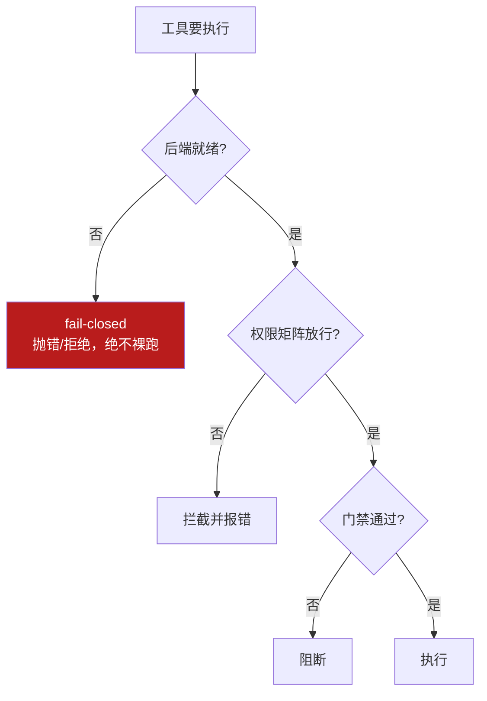

# 3-1 · harness engineering 机制详解

::: info 难度分层 · 本页 = L0→L1「机制层」
**读到哪算够**：L0 只需看懂每节开头与关系图；L1 需要把本页读完，并跑通 [本页 gate](/concepts/harness/gate/harness_gate)。
本页**不含** L2 的选型与取舍——那些放在 [下一步「设计决策」](/concepts/harness/design)。
:::

把 [03 总入口](/concepts/harness) 的"驾驭工程"落地成**可实现的机制**：七大核心组件逐个展开，每个都给出"解决什么 + 怎么落地 + 常见做法"。

::: tip 承接 02
02 讲 context 预算，03 讲"谁来管这些上下文 + 工具 + 约束"。**AGENTS.md 是 harness 管理的规则文件，由 context 注入**——二者在此交汇。
:::

## 起点：三大失败模式（为什么需要驾驭）

| 失败模式 | 表现 | 后果 |
|---|---|---|
| **一步到位**（One-shotting） | 想在一个会话内做完全部功能 | 上下文耗尽，留下一堆没文档的半成品；下个会话只能靠猜 |
| **过早宣布胜利** | 项目后期看到已有进展就宣布完成 | 大量功能未实现却被判定为"做完了" |
| **过早标记功能完成** | 写完代码即标记完成，不做端到端测试 | 单测/curl 通过 ≠ 功能可用 |

外加一个危险特性：**Agent 极擅长模式复制**——代码库里有什么模式就忠实复制并放大，**包括坏模式和架构漂移**。

> 这三个模式和"模式复制"就是七大组件要针对的靶子。

## 组件① 上下文工程（Context Engineering）——新员工手册

**核心原则：Agent 应当恰好获得当前任务所需的上下文——不多不少。**

`AGENTS.md` 是 AI 进入代码仓库时看到的第一份指南，但它**不是静态的 1000 页说明书**——上下文是稀缺资源，过多指导反而挤掉任务、代码和相关文档的空间，**变成陈旧规则的坟场**。

更好的做法：**提供一个稳定、小巧的入口点，然后教 Agent 按当前任务按需检索和拉取更多上下文。**

**三层上下文体系**（业界共识的分层）：

| 层级 | 加载时机 | 内容示例 | 上下文占用 |
|---|---|---|---|
| **Tier 1：会话常驻** | 每次会话自动加载 | `AGENTS.md` / `CLAUDE.md`、项目结构概览 | 最小 |
| **Tier 2：按需加载** | 特定子 Agent 或技能被调用时 | 专业化 Agent 的上下文、领域知识 | 中等 |
| **Tier 3：持久化知识库** | Agent 主动查询时 | 研究文档、规格说明、历史会话 | 按需 |

各家做法（【事实】）：
- **OpenAI**：`AGENTS.md` 作为**动态反馈循环文件**，每当 Agent 遇到失败就更新；
- **Anthropic**：大量 README + 每次会话频繁更新的**进度文件**；
- **Horthy**：倡导**"频繁有意识压缩"**（Frequent Intentional Compaction）；
- **Vasilopoulos（2026 论文）**：把上下文形式化为三层——热记忆 / 领域专家 / 冷记忆知识库。

::: tip 关键洞见
Mitchell Hashimoto 的 Ghostty 项目里，`AGENTS.md` **每一行都对应一个历史 Agent 失败案例**——**文档是活的反馈循环，不是静态制品**。
:::

## 组件② Agent 专业化（Agent Specialization）

**核心原则：专注于特定领域、拥有受限工具的 Agent，优于拥有全部权限的通用 Agent。**

专业化**本身就是上下文管理策略**——每个专家因为携带更少的无关信息，所以运行在 "Smart Zone"（智能区）内。

| Agent 角色 | 职责范围 | 工具权限 |
|---|---|---|
| **研究 Agent** | 探索代码库、分析实现细节 | 只读（Read, Grep, Glob） |
| **规划 Agent** | 将需求分解为结构化任务 | 只读，无写入权限 |
| **执行 Agent** | 实现单个具体任务 | 限定范围的读写权限 |
| **审查 Agent** | 审计完成的工作，标记问题 | 只读 + 标记权限 |
| **调试 Agent** | 修复审查发现的问题 | 限定范围的修复权限 |
| **清理 Agent** | 对抗熵积累，清理低质量代码 | 读写权限 |

实践案例：Carlini（Anthropic C 编译器项目）把 Agent 专业化为**编译器核心 / 去重 / 性能优化 / 文档**四类；Vasilopoulos 部署了 **19 个领域特定 Agent**；Huntley 用**子 Agent** 保持主 Agent 上下文清洁。

## 组件③ 持久化记忆（Persistent Memory）

**核心原则：进度持久化在文件系统上，而非上下文窗口中。** 每次新会话从零开始，通过**文件系统制品**重建上下文。

Anthropic 的两阶段方案（【事实】）：

| 阶段 | 做什么 |
|---|---|
| **初始化 Agent** | 首次会话用专门 prompt 建立初始环境：`init.sh` 脚本、`claude-progress.txt` 进度文件、初始 git 提交 |
| **编码 Agent** | 后续每次会话做出增量进展，并留下**结构化更新** |

每个编码 Agent 会话的**典型启动流程**：
1. 运行 `pwd` 查看工作目录
2. 读取 `git log` 和进度文件，了解最近的工作
3. 读取 **feature list 文件**，选择最高优先级的未完成功能
4. 启动开发服务器，运行基础端到端测试
5. 确认基本功能正常后，开始新功能开发

::: tip 关键发现
用 **JSON 格式**追踪 feature 状态比 Markdown 更有效——因为 **Agent 不太可能不恰当地修改或覆盖结构化数据**。（呼应 02 的 DSE：结构化即约束。）
:::

## 组件④ 结构化执行（Structured Execution）

**核心原则：将思考与执行分离。** 研究和规划在受控阶段进行，执行基于**验证过的计划**，验证通过自动化反馈（测试、Linter、CI）与人类审查完成。

所有团队都施加了刻意的执行序列：**理解 → 规划 → 执行 → 验证**。

- **OpenAI**：声明式 prompt + 反馈回路；轻量计划用于小变更，复杂工作用带进度与决策日志的执行计划，并**检入仓库**；
- **Huntley**：把**规划模式与构建模式分离**；
- **Horthy**：Research-Plan-Implement 工作流围绕上下文管理精心设计。

::: tip 人工检查点的价值
**审查计划远比审查代码快**。当规格正确时，实现自然可靠；当规格有误时，可以在 **500 行代码生成之前**及时纠正。
:::

## 组件⑤ 架构约束（Architecture Constraints）——缰绳

OpenAI 团队建立了严格的**层级依赖模型**：

```
Types → Config → Repo → Service → Runtime → UI
```

**下层不能反向依赖上层。** 所有架构规则被编码为**自定义 Linter 规则，违反即 CI 阻止合并**——无论代码是人写的还是 AI 写的。

::: tip 关键细节：Linter 的错误信息本身也是上下文工程
它不只说"你违反了规则 X"，而是**解释为什么这个规则存在、正确做法是什么**，这样 Agent 读到错误后就能自我理解并修正，**不需要人类介入**。三要素公式：

```
❌ [什么错了]
✅ FIX: [怎么改，给出代码片段]
📖 See: [哪个文档有详细说明]
```

> 落地配置（ArchUnit / Checkstyle / enforcer / JaCoCo / CI）见 [3-2 设计决策](/concepts/harness/design)。

## 组件⑥ 反馈循环（Feedback Loop）——智能体审智能体

传统开发里，人类工程师负责 Code Review；在驾驭工程中，这项工作变成**智能体对智能体**：Codex 在本地审核自身更改、请求额外审查，**循环往复直到通过**。

反馈循环中的钩子可以：
- 运行预定义测试套件，失败时**带着错误信息循环回到模型**；
- 提示模型**独立评估**自己的代码；
- 如果 AI 写的测试用例**能通过带有 Bug 的代码**，Harness 就判定**测试无效**，强迫它重新思考测试边界。

> 对应 [04 loop 的 Maker/Checker 分离](/concepts/loop/mechanism)——评估者必须独立。

## 组件⑦ 熵管理（Entropy Management）——垃圾回收

随着时间推移，软件系统逐渐混乱（熵增），技术债积累。OpenAI 采用**持续小额偿还**，而非等问题严重时集中处理——他们把方法称为**"垃圾回收"**，并认为**技术债务就像高息贷款**。

具体措施：
- **定期后台 Codex 任务**：扫描偏差、更新质量等级、发起针对性重构 PR；
- **Doc-gardening Agent（文档园丁）**：后台自动扫描文档与代码之间的不一致，发现过时内容就自动提交 PR 修复——**Agent 为 Agent 维护文档**。

> 这一点把 [02 的 compaction/审计](/concepts/context/design) 从"一次会话内"扩展到"跨会话、跨时间"。

## 贯穿机制：权限矩阵与 fail-closed

七大组件之外，工程上还要一条**确定性的门禁**：工具一授予就可能真改文件、真发请求、真花钱，harness 用规则拦截，**不靠模型自觉**。

| 动作 | 允许? | 条件 / 备注 |
|---|---|---|
| `read_file` | ✅ | 全仓库可读 |
| `write_file` | ⚠️ | 仅 `src/`、`tests/`；需审批 |
| `run_shell` | ⚠️ | 白名单命令（pytest/ruff/uv）；其余拦截 |
| `http_request` | ❌ | 默认拒绝 |
| `git_push` | ❌ | 需人工显式授权 |

**fail-closed**：拿不到可用后端就**直接失败，绝不降级裸跑**（如 DeepSeek Harness 的 `SandboxProvider` 抛 `SANDBOX_UNAVAILABLE`，【事实】）。



## 小测验

::: details 点击展开题目与答案
**Q1（选择）**：AGENTS.md 由谁管理、由谁注入？  
A. 模型自己管理　B. harness 管理、context 注入　C. 用户每次手写  
✅ B。

**Q2（选择）**：持久化记忆的核心原则是？  
A. 把进度塞进上下文窗口　B. 进度持久化在文件系统，新会话据此重建　C. 靠模型记住  
✅ B。且用 **JSON** 追踪状态比 Markdown 更不易被改坏。

**Q3（选择）**：Linter 错误信息为什么要写"FIX + See"？  
A. 好看　B. 让 Agent 读到即可自纠，无需人类介入　C. 省事  
✅ B——错误信息本身就是上下文工程。

**Q4（判断）**：Agent 专业化只是组织架构问题，与上下文无关。  
❌ 错。**专业化本身就是上下文管理策略**——每个专家携带更少无关信息，运行在 Smart Zone 内。
:::

::: info 【事实】来源
本页七大组件、失败模式、角色分工、进度文件流程、依赖方向、垃圾回收等，均出自教材《Harness Engineering 从入门到精通实战》第 6–13 页（[S11](/practice/sources)），该教材汇整自 Mitchell Hashimoto、OpenAI、Anthropic、LangChain、Martin Fowler。（【建议】具体实现按项目裁剪。）
:::

> 上一节：[03 harness 总入口](/concepts/harness) ｜ 下一节：[3-2 设计决策 + 验证](/concepts/harness/design)
