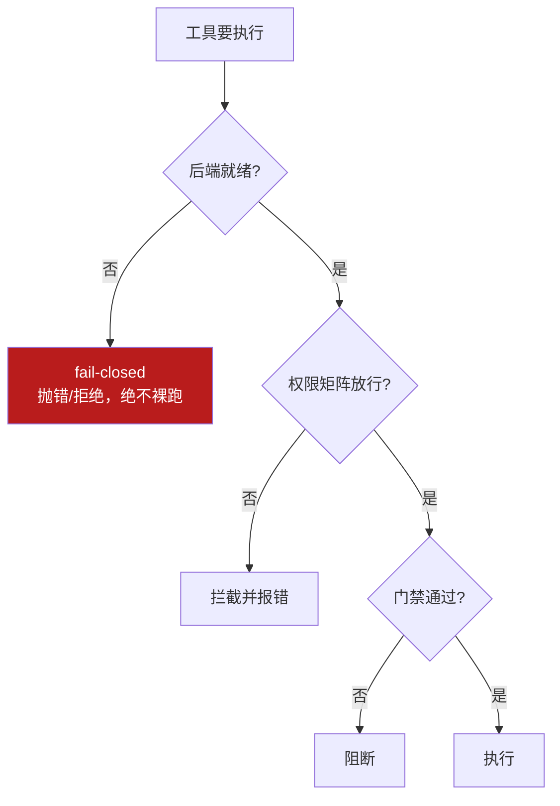

# 3-1 · harness engineering 机制详解

把 03 的"外壳"概念落地成**可实现的机制**：一个真实 `AGENTS.md`、一张权限矩阵、一段机械化执行门禁脚本、一个 fail-closed 示例。读完能"搭出来"，而不只是"说得出"。

::: tip 承接 02
02 讲 context 预算，03 讲"谁来管这些上下文 + 工具 + 约束"。**AGENTS.md 是 harness 管理的规则文件，由 context 注入**——二者在此交汇。同时接住 01 的机械化执行思想。
:::

## 机制一：AGENTS.md —— 项目宪法

`AGENTS.md`（或 Claude Code 的 `CLAUDE.md`）是放仓库根部的规则文件，**每次开工由 harness 注入 context**。一个最小真实样例：

```markdown
# AGENTS.md —— 项目宪法

## 角色与目标
- 你是本仓库的资深工程师；目标是交付可维护、可测试的代码。

## 技术栈与约束
- 语言：Python 3.12；包管理：uv。
- 禁止：不提交 node_modules、dist、*.log；不使用未经评审的第三方依赖。

## 交付格式
- 任何改动必须：通过 `pytest`、通过 `ruff check`、附变更说明。

## 禁止事项
- 禁止修改 lockfile 之外的安全敏感文件（.env、secrets/）。
- 禁止在未获授权时执行 git push。
```

## 机制二：权限系统 —— allow/deny 矩阵

工具一旦授予就可能真改文件、真发请求、真花钱。harness 用**确定性规则**拦截，不靠模型自觉。一张最小权限矩阵：

| 动作 | 允许? | 条件 / 备注 |
|---|---|---|
| `read_file` | ✅ | 全仓库可读 |
| `write_file` | ⚠️ | 仅 `src/`、`tests/`；需审批 |
| `run_shell` | ⚠️ | 白名单命令（pytest/ruff/uv）；其余拦截 |
| `http_request` | ❌ | 默认拒绝 |
| `git_push` | ❌ | 需人工显式授权 |

## 机制三：机械化执行 —— 门禁脚本

不靠模型"自觉守规矩"，而靠**确定的门禁脚本**在每步强制运行，不合规就阻断。最小示例：

```python
# gate.py —— 机械化执行门禁（示意）
import subprocess, sys

def run_gate(paths):
    checks = {
        "ruff":    ["ruff", "check", *paths],
        "pytest":  ["pytest", "-q", "--maxfail=1"],
    }
    for name, cmd in checks.items():
        r = subprocess.run(cmd, capture_output=True, text=True)
        if r.returncode != 0:
            print(f"[GATE FAIL] {name}:\n{r.stdout}\n{r.stderr}")
            return False
    print("[GATE PASS] 全部机械化检查通过")
    return True

if __name__ == "__main__":
    sys.exit(0 if run_gate(sys.argv[1:]) else 1)
```

## 机制四：fail-closed（默认拒绝，绝不裸跑）

安全设计统一遵循：**拿不到可用后端就直接失败，不降级裸跑**。DeepSeek Harness 的 `SandboxProvider` 无可用后端时抛 `SANDBOX_UNAVAILABLE`，绝不裸跑（iceyao 源码，【事实】）。



## 机制五：熵管理 + 仓库即记录系统

任务越跑越乱（上下文膨胀、目标漂移）。harness 通过：
- **仓库即记录系统**：决策、变更、日志落仓库（非只在对话里），可追溯、可回放；
- **阶段归档**：长任务分段落地 checkpoint，控制熵增。

## 小测验

::: details 点击展开题目与答案
**Q1（选择）**：AGENTS.md 由谁管理、由谁注入？  
A. 模型自己管理　B. harness 管理、context 注入　C. 用户每次手写  
✅ B。

**Q2（判断）**：权限系统可以用"让模型自觉别乱改文件"来替代。  
❌ 错。harness 用确定性的 allow/deny + 门禁拦截，不依赖模型自觉。

**Q3（选择）**：fail-closed 的核心是？  
A. 后端不可用就降级裸跑　B. 拿不到可用后端就失败，绝不裸跑　C. 跳过安全检查  
✅ B。
:::

> 上一节：[03 harness 总入口](/concepts/harness) ｜ 下一节：[3-2 常见坑 + 自检](/concepts/harness/pitfalls)
