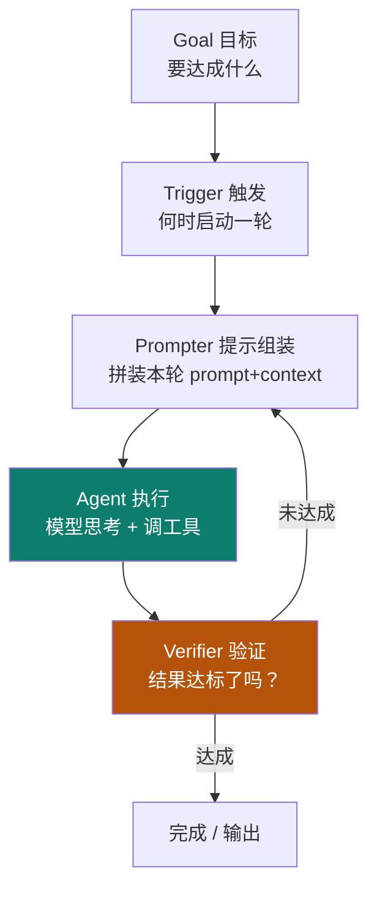

# 04 · loop engineering

主轴第四节：harness 把外壳搭好了，里面还得有个**反复运转的循环**——模型 ↔ 工具 ↔ 结果，加验证与重试。这就是 loop：agent 真正"干活"的地方。

::: tip 类比
loop 就像**厨房的出菜流程**：点单（Goal）→ 下锅（Agent 执行）→ 尝一口（Verifier 验证）→ 没熟就回锅（重试）→ 熟了才上桌（完成）。一遍不过就再来一遍，直到达标。
:::

## 一句话概念

> **Loop Engineering**：设计与实现 agent 的**迭代循环**——在一轮轮"思考→调用工具→拿到结果→验证"中逼近目标。loop **运行在 harness 内**，每轮读写 context，受 harness 的权限与预算约束。

> 人的工作从"每次写 prompt、等回复、查结果、再写"变成**设计循环本身**。（依据 【事实】 Addy Osmani《Loop Engineering》/"You design loops that prompt agents."）

## 图示：loop 五零件

## 本章地图

| 子页 | 内容 | 对应工程动作 |
|---|---|---|
| [📐 4-1 机制详解](/concepts/loop/mechanism) | Goal 布尔判定、Trigger 四类、Prompter 反馈式、Generator/Verifier 分离、Open/Closed loop、**三刹车可运行脚本**、失败重试案例 | 设计 + 实现 |
| [⚠️ 4-2 常见坑 + 自检](/concepts/loop/pitfalls) | 目标模糊、无刹车烧钱、自我评估、上下文膨胀等坑 + **产物化三档**（精通=交含三刹车的可运行脚本） | 验证 + 自检 |
| [🧭 4-3 设计决策 + 验证](/concepts/loop/design) | Open/Closed **决策表**、Maker-Checker **双实战案例**、**Ralph 六信条映射**、可运行闭环 + gate | 设计 + 验证 |

::: info 承接关系
01 的 `think-tools-test` 已埋"先推理后动手 → loop 雏形"。02 给预算、03 给外壳，04 把这个外壳里的**反复执行**机制做出来——loop 运行在 harness 内，每轮读写 context（02 的预算被多轮消耗 → 触发 compaction），由 Prompter 组装（01 的指令）。
:::

::: warning 事实与边界
"五零件 Goal/Trigger/Prompter/Agent/Verifier"拆解来自 **【事实】** cnblogs xiaobaiysf/21964451（Loop Engineering 完全指南）。"loop 运行在 harness 内、受权限与预算约束"是本体系的**结构化关系（【推断】）**。三刹车的阈值（N 轮 / ¥X）属于**工程调参（【建议】）**。
:::

> 上一章：[03 harness engineering](/concepts/harness) ｜ 下一章：[05 graph engineering](/concepts/graph)