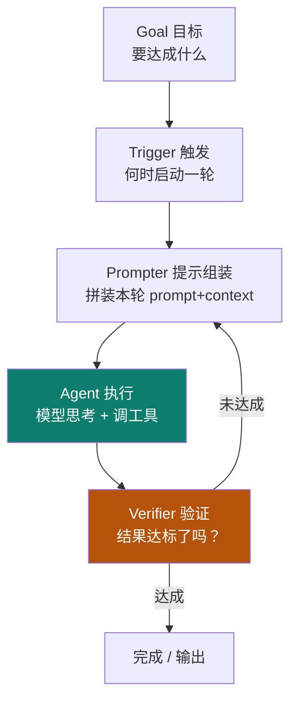
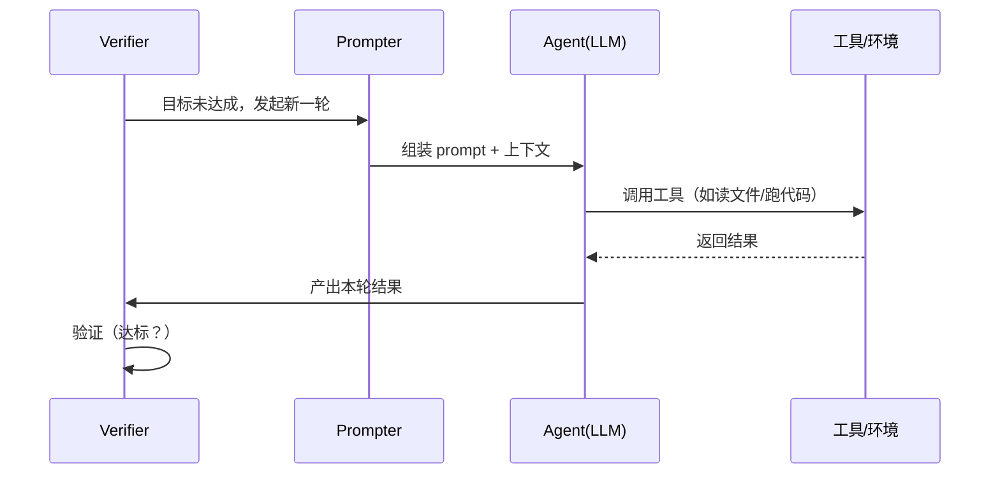
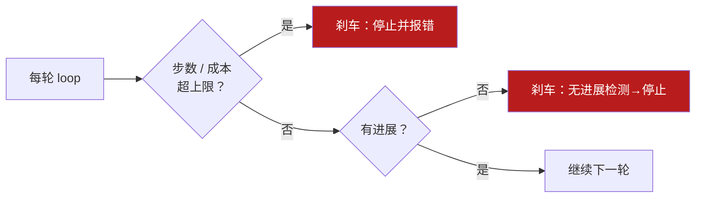

# 04 · loop engineering

主轴第四节：harness 把外壳搭好了，里面还得有个**反复运转的循环**——模型 ↔ 工具 ↔ 结果，加验证与重试。这就是 loop：agent 真正"干活"的地方。

::: tip 类比
loop 就像**厨房的出菜流程**：点单（Goal）→ 下锅（Agent 执行）→ 尝一口（Verifier 验证）→ 没熟就回锅（重试）→ 熟了才上桌（完成）。一遍不过就再来一遍，直到达标。
:::

## 一句话概念

> **Loop Engineering**：设计与实现 agent 的**迭代循环**——在一轮轮"思考→调用工具→拿到结果→验证"中逼近目标。loop **运行在 harness 内**，每轮读写 context，受 harness 的权限与预算约束。

## 图示：loop 五零件

依据 **【事实】** cnblogs xiaobaiysf/21964451 一文，一个完整 loop 可拆为五个零件：

| 零件 | 职责 |
|---|---|
| Goal | 定义本轮要达成的目标（来自用户或上层） |
| Trigger | 决定何时、因何启动一轮（事件/定时/上轮完成） |
| Prompter | 把目标 + 上下文 + 工具说明组装成可执行的 prompt |
| Agent | 模型推理 + 调用工具，产生动作与结果 |
| Verifier | 判断结果是否达标，决定重试还是收尾 |

## 一轮之内发生了什么

## 安全刹车（Safety Brakes）

无限循环 = 烧钱 + 卡死。loop 必须设"刹车"：

- **迭代/成本上限**：最多 N 轮或 ¥X 预算，触及即停。
- **无进展检测**：连续几轮结果无变化 / 无新信息，判定卡住并停止。
- **错误韧性**：单步工具失败可重试或降级，而非整轮崩溃。

## 常见变体

- **ReAct**：边推理边行动（Reason + Act 交替），Track 0 的 0-5 已铺垫。
- **Plan-then-execute**：先整体规划，再逐步执行（适合长任务、可解释性强）。

::: warning 事实与边界
"五零件 Goal/Trigger/Prompter/Agent/Verifier"拆解来自 **【事实】** cnblogs xiaobaiysf/21964451；"loop 运行在 harness 内、受权限与预算约束"是本体系的**结构化关系（【推断】）**。安全刹车的阈值（N 轮 / ¥X）属于**工程调参（【建议】）**。
:::

## 小测验

::: details 点击展开题目与答案
**Q1（选择）**：loop 中的 Verifier 做什么？  
A. 组装 prompt　B. 判断结果是否达标、决定重试或收尾　C. 真正执行工具  
✅ B。

**Q2（判断）**：loop 可以无限循环直到模型满意为止。  
❌ 错。必须设迭代/成本上限与无进展检测作为刹车。

**Q3（选择）**：loop 与 harness 的关系是？  
A. loop 独立于 harness 运行　B. loop 运行在 harness 内、受其约束　C. harness 是 loop 的一种  
✅ B。
:::

## 三档自检（了解 / 熟悉 / 精通）

| 档位 | 你能做到 |
|---|---|
| 了解 | 说出 loop 五零件（Goal/Trigger/Prompter/Agent/Verifier）及各自职责 |
| 熟悉 | 能画出一轮 loop 的时序，并解释为什么需要安全刹车 |
| 精通 | 能在 harness 内实现带"成本上限 + 无进展检测 + 错误重试"的 loop，并对比 ReAct 与 plan-then-execute |

::: tip 本页要点
loop = 在 harness 内反复"思考→工具→验证"逼近目标。五零件给骨架，安全刹车给边界——**没有刹车的 loop 不是 agents，是 runaway**。
:::

> 上一章：[03 harness engineering](/concepts/harness) ｜ 下一章：[05 graph engineering](/concepts/graph)
