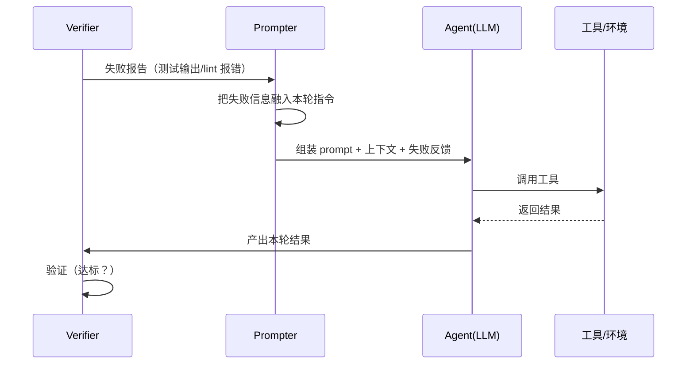
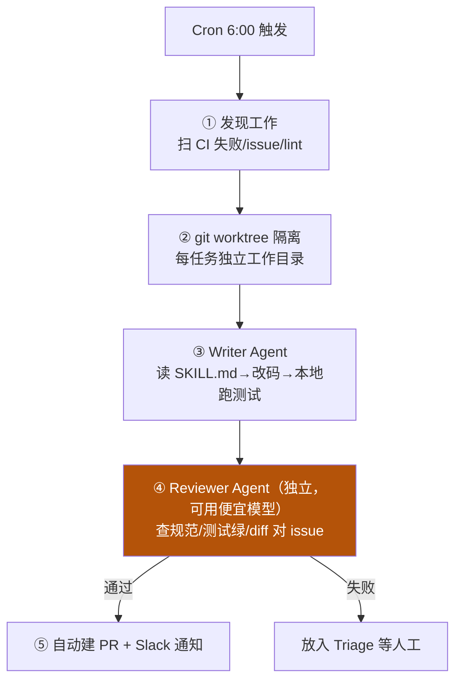

# 4-1 · loop engineering 机制详解

把 04 的"五零件"落地成**可实现的机制**：Goal 怎么可程序检验、Trigger 有哪四类、Prompter 如何反馈式重组、为什么 Generator/Verifier 必须分离、三刹车怎么写成脚本。读完能"写出来"。

::: tip 承接 01
01 的 `think-tools-test` 说过"先推理再动手是 loop 雏形"。本章把这个雏形做完整——并揭示 loop 最反直觉的一条铁律：**Verifier 必须独立于写代码的 Agent**。
:::

## 机制一：Goal —— 必须「可程序检验」

不能是"优化得更好"（程序无法判断），必须是能写成**布尔表达式**的目标。cnblogs 原文给了清晰对照：

| ❌ 不可检验 | ✅ 可检验 |
|---|---|
| "优化得更好" | `npm test` 全绿 且 `tsc --noEmit` 无报错 |
| "让代码更健壮" | 覆盖率从 72% 提升到 80% |
| "修一下 bug" | 修复 Issue #1234 且回归测试全过 |

> 判定标准：**"什么算完成"能写成一行返回 true/false 的代码**，这才是 Goal。

```python
def goal_is_met():
    return test_result == 0 and typecheck_result == 0   # 可程序检验
```

## 机制二：Trigger —— 四种触发源

没有触发器的循环要你手动启动——**那你还在循环里**。Trigger 四类：

| 类型 | 实现 | 场景 |
|---|---|---|
| 定时 Heartbeat | `cron` / 轮询间隔 | 盯 CI、定时检查 |
| Cron | 系统 cron / CI | 夜间批处理、每日报告 |
| 事件 Hook | Git hook / webhook | PR 创建即审查、CI 失败即修 |
| Goal 驱动 | `/goal` 命令 | 持续修到测试变绿 |

## 机制三：Prompter —— 反馈式重组（不是复读）

Prompter 不是"把同一段话反复发"，而是**根据上一轮验证结果调整下一轮指令**：

- 把失败信息（测试输出、lint 报错）**融入**新 prompt；
- 不让 Agent 每轮从零理解上下文；
- 让指令在一轮轮循环里**收敛**而不是原地打转。



## 机制四：Verifier —— 独立评估（loop 最有价值的一条）

::: warning 铁律
**Generator 绝对不能给自己的产出打分。** 写代码的 Agent 和审代码的 Agent 必须是两个 Agent。
:::

因为同一个 Agent 给自己打分，结果永远是"写得太好了"。Anthropic 工程团队发现：**调教一个独立的评估器让它保持怀疑，比让生成器对自己苛刻可行得多**（cnblogs/Anthropic，【事实】）。

附带收益：**Verifier 可以用更便宜的模型**——审代码要的不是"写出更好的代码"，而是"检查是否满足标准"，便宜模型足够。

```python
# 分离 Maker / Checker（cnblogs web-scraping 案例的思想）
def run_loop():
    attempt = 1
    while attempt <= MAX_ATTEMPTS:
        maker_result = maker.run(task)          # 生成器：写代码/爬数据
        report = checker.evaluate(maker_result) # 独立评估器：对照 rubric 打分
        if report.passed:
            return maker_result
        # 失败 → 把 report 喂回 maker 重试（prompter 反馈式）
        attempt += 1
```

## 机制五：Open vs Closed Loop

| 形态 | 特点 | 适用 |
|---|---|---|
| **Open Loop（开放）** | 不预设完整路径，给大方向自主探索 | 原型验证、未知领域调研；成本不可预测 |
| **Closed Loop（封闭）** | 预设完整步骤，每步验证通过才进入下一步 | 修特定 bug、固定流程；成本可控可预测 |

> 实践建议：先用 Open 探路，验证可行后固化成 Closed 上生产（【建议】）。

## 机制六：三个刹车（可运行）

没有刹车的循环 = Token 焚烧炉。三个必须设置的刹车（cnblogs 伪代码，转 Python）：

```python
# loop_with_brakes.py —— 带三刹车的最小 loop（示意）
MAX_ITERATIONS = 10      # 刹车1：最多跑 N 轮
MAX_COST_USD = 5         # 刹车2：最多花 X 美元
NO_PROGRESS_LIMIT = 3    # 刹车3：连续 N 轮无实质进展就停

def has_progress(new, old) -> bool:
    return new != old      # 示意：结果有变化算有进展

iterations = cost = no_progress = 0
last = None
while not goal_is_met() and iterations < MAX_ITERATIONS and cost < MAX_COST_USD:
    result = agent.run(task)
    cost += result.cost
    iterations += 1
    if not has_progress(result.output, last):
        no_progress += 1
        if no_progress >= NO_PROGRESS_LIMIT:
            print("[BRAKE] 连续无进展，停止")
            break
    else:
        no_progress = 0
    last = result.output
print(f"done: iterations={iterations}, cost={cost}, goal_met={goal_is_met()}")
```

## 机制七：失败重试 + 韧性

单步工具失败**不整轮崩溃**——重试或降级（如失败后改用更稳的备用工具/更简单的方案），并更新上下文后继续。

## 三个完整实战案例（均出自 cnblogs《Loop Engineering 完全指南》，【事实】）

### 案例 A · 夜间自动修 Bug（Claude Code 实现）

**Goal**：修复昨日 CI 失败 + 处理 `good-first-issue` 标签的 Issue。**Trigger**：每天 6:00 cron。

```bash
# 触发器：每天早 6 点跑一次
0 6 * * * cd /repo && claude-code --goal "Fix yesterday's CI failures"
```
```json
{
  "goal": "修复昨日 CI 失败 + 处理 good-first-issue 标签的 Issue",
  "stop_conditions": { "max_iterations": 20, "max_cost_usd": 10,
                        "target": "所有任务处理完 OR 测试全绿" }
}
```

执行流程（**关键：Maker/Checker 分离 + worktree 并行隔离**）：


```bash
# ② 隔离环境：多任务可并行、互不干扰
git worktree add ../fix-ci-123   -b fix/ci-123
git worktree add ../fix-issue-456 -b fix/issue-456
```

> **效果**：每天早上 2–3 个 PR 已在等你 review。你从"写修复的人"变"审修复的人"，**杠杆 3–5 倍**。这就是"人退出执行循环、只做设计者与验收者"。

### 案例 B · Web Scraping 自我修复（Maker/Checker 分离的最佳示范）

**为什么适合 Loop**：爬虫领域已有现成的质量评估框架（Spidermon），"成功标准"天然可验证。

**第 1 步 · 定义验证标准（Rubric）**：
```javascript
const rubric = {
  required_fields: ['name', 'price', 'url'],
  min_items: 5,
  min_fill_rate: 0.95,   // 95% 字段必须非空
  max_error_rate: 0.05
};
```

**第 2 步 · 分离 Maker（爬虫）与 Checker（独立评估程序）**——Generator **看不到**自己的评分，直到评估器报告结果。

**第 3 步 · 构建循环**：
```bash
#!/bin/bash
# 最小可运行的自我修复 Loop
MAX_ATTEMPTS=5; attempt=1
while [ $attempt -le $MAX_ATTEMPTS ]; do
    scrapy crawl my_spider -o output.json          # 1. 执行爬虫
    python evaluate.py output.json > eval_report.json  # 2. 独立评估
    if jq -e '.passed == true' eval_report.json > /dev/null; then
        echo "✅ 质量达标！"; break
    fi
    cat eval_report.json | claude-code --goal "Fix the spider based on this report"  # 4. 不达标→喂报告修爬虫
    attempt=$((attempt + 1))
done
```
> **效果**：模拟网站改版（重命名所有 CSS class、重组结构）后，字段填充率瞬间归零；Loop 立即触发，Claude 读新页面 HTML 把旧选择器映射到新等价物——**第一次尝试即达成修复目标**。一个关键细节：修复 Agent 试图验证自己的修复时被**拒绝**——独立 Rubric 重新运行在外部循环里，是判定的**唯一裁判**。

### 案例 C · opencode-loop 自我修正开发循环（测试 8 → 23）

**设计要点**：
- Goal：为某功能模块写完整实现，测试覆盖率不低于当前水平；
- Writer Agent + Reviewer Agent + Test Runner 三者分离；
- **Verifier 独立于 Writer 运行**；每次修改后自动跑完整测试套件；
- 设 **Checkpoint**：每轮迭代保存一次状态，防无限循环丢失进展。

> **结果**：约十几分钟后，**测试从 8 个变成 23 个，全部通过**。关键发现——不是 AI 变强了，而是 **Verifier + Checkpoint 的设计**让 Agent 在安全边界内反复试错，每次失败都转化为改进。

### 三案例共性（一句话提炼）

| 共性 | 体现 |
|---|---|
| Goal 可程序检验 | 测试全绿 / 覆盖率 / rubric 通过率 |
| Maker ≠ Checker | 写代码与审代码是两个 Agent，审的可用便宜模型 |
| 独立评估是唯一裁判 | 生成器不能给自己的产出打分 |
| 隔离 + 可恢复 | `git worktree` 并行；Checkpoint 每轮落地 |
| 人做闸门 | 人审 PR / 处理 Triage，不坐进循环里 |

## 小测验

::: details 点击展开题目与答案
**Q1（选择）**：下列哪个是"可程序检验"的 Goal？  
A. "让代码更好"　B. "npm test 全绿且 tsc --noEmit 无报错"　C. "尽量优化一下"  
✅ B。

**Q2（判断）**：让生成代码的 Agent 同时审自己的代码，是高效做法。  
❌ 错。Generator 不能给自家产出打分；Verifier 必须独立，且可用更便宜模型。

**Q3（选择）**：三刹车不包括以下哪项？  
A. 迭代上限　B. 成本上限　C. 提高模型温度　D. 无进展检测  
✅ C。

**Q4（选择）**：夜间自动修 Bug 案例里，多个任务如何并行而不互相干扰？  
A. 同一个工作目录排队　B. `git worktree` 各建独立工作目录　C. 关掉测试  
✅ B。
:::

> 上一节：[04 loop 总入口](/concepts/loop) ｜ 下一节：[4-2 设计决策 + 验证](/concepts/loop/design)