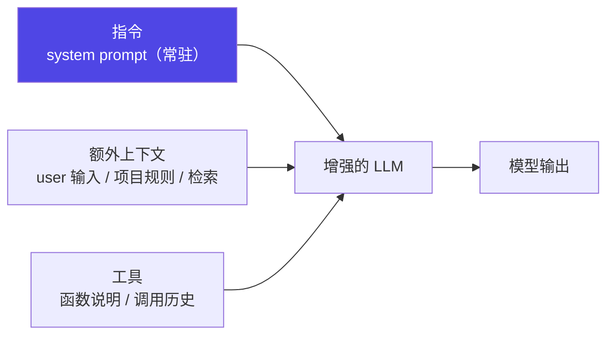

# 1-2 · system prompt 是如何决定 agent 行为的

system prompt 是"**常驻说明书**"，与每轮对话的临时内容分离；它决定 agent 的**人设、能力边界、纪律**。

## 一次请求里装了什么


> "**增强的 LLM = 指令 + 额外上下文 + 工具**" 出自 Anthropic《Building effective agents》。system prompt 只是其中"指令"那一块——**它是基座，但不是全部**。

## 四个角色分工

| 角色 | 作用 | 特点 |
|---|---|---|
| **system** | 常驻说明书：人设、规则、输出纪律、边界 | 每轮都带着；一次设定、长期生效 |
| **user** | 这一轮的请求 | 临时；每次不同 |
| **assistant** | 模型自己上一轮的回复 | 进入历史，供继续接话 |
| **tool result** | 工具调用后返回的执行结果 | 回灌进下一轮（loop 的种子） |

> 记忆口诀：**system 决定"它是谁 + 守什么规矩"（求稳），user 与工具结果决定"这次干什么"（求准）**。

## 一份真实 system prompt 的解剖

```text
# 1. 身份与视角（who）
你是本仓库的资深 Python 工程师，严格遵守 PEP8。

# 2. 任务与范围（what）
只负责修改 src/ 下的代码；不改测试与配置。

# 3. 硬性纪律（rules，机器可验证的才写）
- 改动必须通过 pytest 与 ruff，否则不得提交。
- 禁止新增第三方依赖。
- 输出代码时必须给出 diff，不要整文件重贴。

# 4. 输出格式（format）
先给一句话结论，再给 diff，最后列出风险点。

# 5. 工具与边界（tools）
可用工具：读文件、写 src/、运行 pytest/ruff；网络访问被禁止。

# 6. 不确定时的行为（fallback）
信息不足时先提问，不要臆测。
```
> 这 6 段就是 system prompt 的通用骨架：**who / what / rules / format / tools / fallback**。少了"fallback"，模型可能默默编造；少了"rules"，行为不可验证。

## 从"一句话"到"一套"：分段拼装

真实 agent 的 system prompt 通常**分段拼装**，核心是"**分块 + 按需 + 渐进披露**"：

1. 分段 `PromptSection` 按 `order` 排序拼接（DeepSeek Harness 的做法）；
2. 渐进式披露：入口只放"地图"，细节按需展开；
3. 规则文件（`AGENTS.md` / `CLAUDE.md`）注入为常驻段；
4. 每轮请求都带着这套指令执行。

```python
# 分段拼装示意：顺序决定优先级与稳定性
sections = [
    ("identity",  1, "你是本仓库的资深工程师…"),
    ("rules",     2, "改动必须通过 pytest…"),          # 稳定段：每轮都带
    ("project",   3, open("AGENTS.md").read()),          # 从规则文件注入
    ("task",     99, user_task),                         # 临时段：放最后
]
system_prompt = "\n\n".join(s for _, _, s in sorted(sections))
```

::: info 【事实】
"增强的 LLM = 指令 + 额外上下文 + 工具" 出自 Anthropic《Building effective agents》；"分段 / 渐进披露"分别示例自 DeepSeek Harness（PromptSection 按 order 分段）与 harness engineering 的"地图而非手册"。详见 [事实源](/practice/compare)。
:::

## 小测验

::: details 点击展开题目与答案
**Q1（选择）**：system prompt 里最容易被忽略、却必须写的是哪段？  
A. 身份　B. 不确定时的行为（fallback）　C. 输出格式  
✅ B。缺了它模型可能默默编造。

**Q2（判断）**：system prompt 一次写好就永远不用改。  
❌ 错。它要随项目规则演进，且改完应跑评估集回归（见 [1-5](/concepts/prompt/think-tools-test)）。

**Q3（选择）**：分段拼装时，"临时任务"段应放在？  
A. 最前　B. 最后　C. 无所谓  
✅ B。稳定段在前、临时段在后。
:::

> 上一节：[1-1 入门](/concepts/prompt/intro) ｜ 下一节：[1-3 策略① 清晰指令](/concepts/prompt/clarity)
