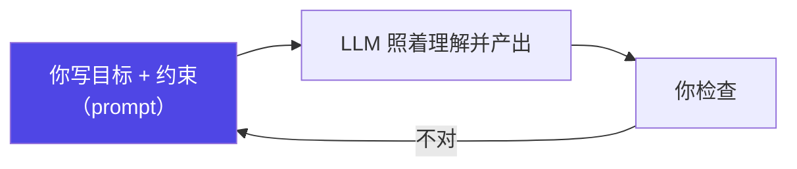
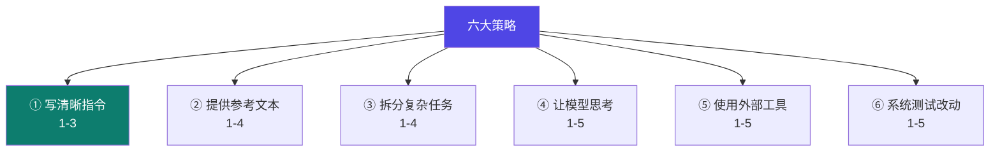

# 1-1 · prompt engineering 入门

::: info 难度分层 · 本页 = L0→L1（prompt 基础层）
L0 看懂概念与类比；L1 能照本页示例手写出可用 prompt。读完 1-1 ~ 1-7 即达成 Track A 的 L1 基线。
:::

prompt engineering 就是"**设计给模型的指令，让它按你的意图稳定地干活**"。它是一切 agent 工程的基座。

::: tip 先打个比方
把大语言模型（LLM）想成一位**非常聪明、但很容易误会你意思的实习生**。它知识渊博、反应快，可你不说清楚，它就自由发挥。prompt engineering 就是把"给这位实习生的任务说明书"写清楚。
:::

## 一个最小闭环

> 注意那条**回环箭头**：prompt engineering 从来不是"一次写对"，而是"写—看—改"的迭代。这条回环在 [04 loop](/concepts/loop) 里会被放大成 agent 的自动迭代。

## 为什么是基座

在整条主轴 `prompt → context → harness → loop → graph` 里，prompt 在最前面：后面所有工程（上下文管理、工具权限、迭代循环）最终都要**通过一段文字**送到模型面前。**连 prompt 都写不对，后面做得再花哨也白搭。**

## 我们在优化什么

prompt engineering 不是"学咒语"，而是同时优化三件事：

| 维度 | 含义 | 反问 |
|---|---|---|
| **准确性** | 输出对不对、有没有编造 | 信息给够了吗？要求引述依据了吗？ |
| **稳定性** | 同样输入，多次调用是否一致 | 输出格式写死了吗？有 few-shot 吗？ |
| **可控性** | 能否约束边界、失败可预期 | 禁止项写了吗？不确定时该问还是该猜？ |

> 判断标准：**"换个人拿着这份 prompt，能得到差不多质量的结果吗？"** 能，才是工程；不能，还是玄学。

## 本章六条策略（总览）

> 前三条约束"怎么问"，后三条把 prompt 升级为"搭系统"——推理、工具、验证。**六条都服务于准确 / 稳定 / 可控这三个目标。**

## 烂 vs 好

> ✕ **太含糊**："帮我改改这段代码，优化一下。" —— 优化什么？速度还是可读性？改哪里？

> ✓ **说得清**："这段代码有性能问题。请把 `for` 循环改成用 map 实现，保持对外行为不变，并给 3 行注释说明改了什么。"

::: tip 好在哪里 · 逐条对照
「这段代码有性能问题」→ **目标**；「把 for 改成 map」→ **对象 + 方法**；「保持对外行为不变」→ **边界**；「给 3 行注释」→ **产出格式**。每一条都对应"清晰指令"的一个维度——教的是规则，不是一句魔法重写。
:::

同一模型、只靠写得更清楚，输出质量会**明显**更稳——这正是"把玄学变工程"的第一步。

## 小测验

::: details 点击展开题目与答案
**Q1（选择）**：prompt engineering 的本质是？  
A. 背一组魔法咒语　B. 把"目标/约束/产出格式"写清楚，并迭代改进　C. 把 prompt 写得很长  
✅ B。

**Q2（判断）**：prompt 写完一次就不用再动了。  
❌ 错。它是"写—看—改"的迭代闭环。

**Q3（选择）**：判断 prompt 是否"工程化"的标准是？  
A. 字数多少　B. 换个人持同一 prompt 能得到差不多质量的结果　C. 用了多少技巧  
✅ B。
:::

::: info 关联前置
还不熟悉 token、system prompt、工具调用的同学，先回看 [「0 新手前置」](/start/)。
:::

> 下一节：[1-2 system prompt 机制](/concepts/prompt/basics)
