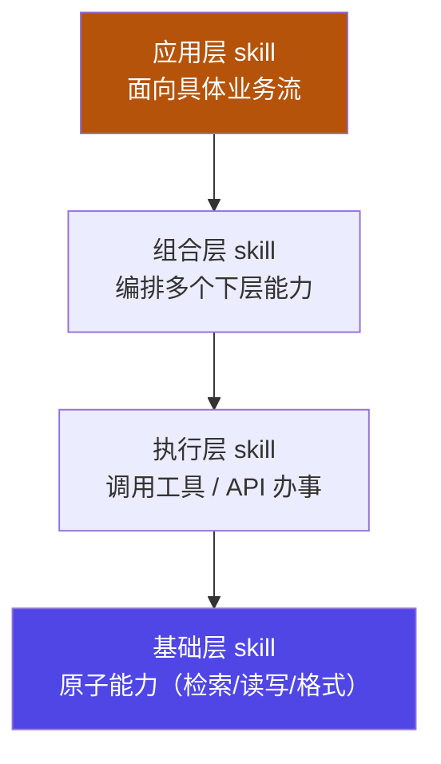
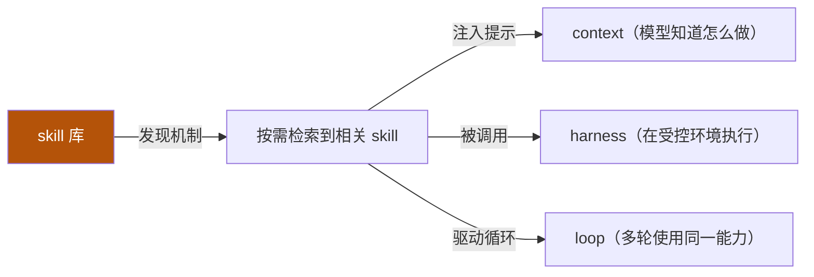

# 06 · skill 体系架构

横切支柱：前面五节是**主轴**（递进深化），skill 是**横贯其间的能力扩展**——一个可复用、按需注入的"能力单元"，让 agent 不重复造轮子。

::: tip 类比
skill 就像**工具箱里可插拔的"功能模块"**：拧螺丝用螺丝刀模块、量尺寸用尺模块。需要时抽出来装上（注入上下文），用完归位。它不像工具那样"直接执行"，而是先告诉模型"这件事该怎么做"，由模型带着它干活。
:::

## 一句话概念

> **Skill 体系架构**：把可复用能力封装为独立单元（典型形如 `SKILL.md`），**按需被发现、被注入上下文、被 agent 调用**。它横切 context（提示）/ harness（执行）/ loop（驱动），是主轴之上"能力复用"的横切支柱。

> skill ≠ tool。tool 是"模型下令、外部执行"的确定函数；skill 是"教模型怎么做某类事"的能力说明，可包含调用 tool 的步骤、注意事项、范例。

## 图示：skill 的四层架构

依据 **【事实】** 腾讯云开发者社区文章（cloud.tencent.com/developer/article/2646885）对 skill 的分层思路：

## skill 如何横切主轴

## 关键设计点

### 1. 边界：skill vs tool / context / plugin
| 对比 | 本质 | 谁执行 |
|---|---|---|
| tool | 确定函数（输入→输出） | 外部程序 |
| context | 喂给模型的原始信息 | 模型读取 |
| plugin | 更大粒度的集成包 | 宿主环境 |
| **skill** | "怎么做某类事"的能力说明 | 模型带着它干活 |

### 2. 三种常见模式
- **组合模式（Composition）**：一个 skill 调用多个下层 skill，形成能力树。
- **策略模式（Strategy）**：同一目标有多种做法，运行时按情境选一种。
- **装饰器模式（Decorator）**：在不改原 skill 的前提下，叠加"前置检查/后置校验"等横切逻辑。

### 3. 发现与注入机制
- **发现（Discovery）**：按任务语义从 skill 库检索最相关者（如关键词/向量匹配）。
- **注入（Injection）**：只把命中的 skill 提示进上下文，避免上下文被无关 skill 撑爆（呼应 02 context 的预算观）。

### 4. 版本与评审
skill 是会被反复调用的"公共能力"，需有版本号、变更记录与评审流程，防止改坏依赖它的 agent。

::: warning 事实与边界
"skill 四层架构 / 与 tool·context·plugin 的边界 / 发现与注入策略"等描述，依据 **【事实】** 腾讯云开发者社区相关文章（article/2646885）。具体你的项目用哪几层、用哪种发现算法，属于**落地选型（【建议】）**。
:::

## 小测验

::: details 点击展开题目与答案
**Q1（选择）**：skill 与 tool 的关键区别是？  
A. skill 更快　B. skill 是"教模型怎么做"的能力说明，tool 是确定函数　C. 两者完全相同  
✅ B。

**Q2（判断）**：应该把所有 skill 一次性注入上下文，方便模型随时用。  
❌ 错。会撑爆窗口预算（见 02）。应按需发现、命中才注入。

**Q3（选择）**：装饰器模式在 skill 体系中常用于？  
A. 把 skill 分成两层　B. 不改原 skill 而叠加前置/后置横切逻辑　C. 加速向量检索  
✅ B。
:::

## 三档自检（了解 / 熟悉 / 精通）

| 档位 | 你能做到 |
|---|---|
| 了解 | 说清 skill 与 tool/context/plugin 的边界，知道它"横切"主轴 |
| 熟悉 | 能画出四层架构，并解释发现/注入机制为何要"按需" |
| 精通 | 能为团队设计 skill 库：分层 + 组合/策略/装饰器模式 + 版本评审流程 |

::: tip 本页要点
skill 是横切主轴的"可复用能力单元"（典型为 `SKILL.md`）：按需发现、命中才注入、被模型带着用。它把 context / harness / loop 串成可复用的能力网——**主轴让你"会造"，skill 让你"不重复造"**。
:::

> 上一章：[05 graph engineering](/concepts/graph) ｜ 进入实例：见 [Track B · 框架实例专项](/instances/hermes)
