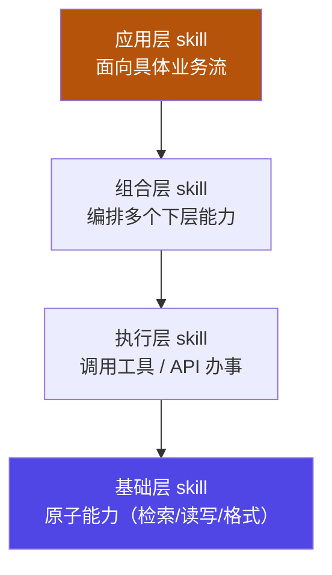

# 06 · skill 体系架构

横切支柱：前面五节是**主轴**（递进深化），skill 是**横贯其间的能力扩展**——一个可复用、按需注入的"能力单元"，让 agent 不重复造轮子。

::: tip 类比
skill 就像**工具箱里可插拔的"功能模块"**：拧螺丝用螺丝刀模块、量尺寸用尺模块。需要时抽出来装上（注入上下文），用完归位。它不像工具那样"直接执行"，而是先告诉模型"这件事该怎么做"，由模型带着它干活。
:::

## 一句话概念

> **Skill 体系架构**：把可复用能力封装为独立单元（典型形如 `SKILL.md`），**按需被发现、被注入上下文、被 agent 调用**。它横切 context（提示）/ harness（执行）/ loop（驱动），是主轴之上"能力复用"的横切支柱。

> skill ≠ tool。tool 是"模型下令、外部执行"的确定函数；skill 是"教模型怎么做某类事"的能力说明，可包含调用 tool 的步骤、注意事项、范例。

## 图示：skill 的四层架构

依据 **【事实】** 腾讯云开发者社区文章（cloud.tencent.com/developer/article/2646885）对 skill 的分层思路：

## 本章地图

| 子页 | 内容 | 对应工程动作 |
|---|---|---|
| [📐 6-1 机制详解](/concepts/skill/mechanism) | **最小 `SKILL.md` 真实结构**、目录、discovery 流程、注入时机、tool/context/plugin/skill 边界、版本评审 + **装饰器示例** | 实现 |
| [⚠️ 6-2 常见坑 + 自检](/concepts/skill/pitfalls) | 全量注入撑爆、skill 写太薄、无版本评审等坑 + **产物化三档**（精通=交付可发现可注入可版本化的 SKILL.md） | 验证 + 自检 |
| [🧭 6-3 设计决策 + 验证](/concepts/skill/design) | **统一接口规范**（id/name/version/execute）、**六阶段生命周期**、业务化三模式代码、并发/缓存/资源 + gate 验收 | 设计 + 验证 |

::: info 承接关系
01 的 `basics` 已讲过 `PromptSection` 分段、渐进披露。05 的 graph 节点可以是一个 loop。skill 作为横切支柱，**把可复用能力按需注入被 node/loop 消费**——它贯穿 context/harness/loop，是"能力复用"的横切层。
:::

::: warning 事实与边界
"skill 四层架构 / 与 tool·context·plugin 的边界 / 发现与注入策略"等描述，依据 **【事实】** 腾讯云开发者社区相关文章（article/2646885）。具体用几层、用什么发现算法属**落地选型（【建议】）**，见 [6-1 机制详解](/concepts/skill/mechanism)。
:::

> 上一章：[05 graph engineering](/concepts/graph) ｜ 进入实例：见 [Track B · 框架实例专项](/instances/hermes)