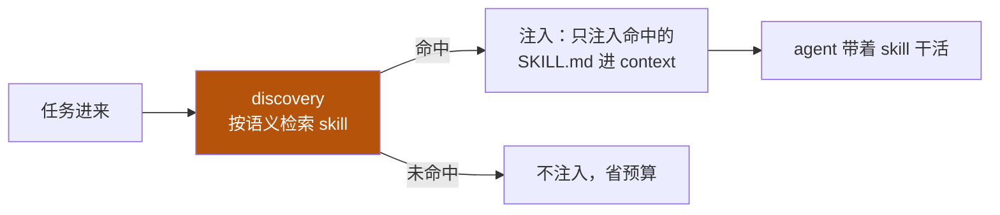

# 6-1 · skill 体系机制详解

把 06 的"横切能力"落地成**可实现的机制**：一个最小真实 `SKILL.md`、skill 目录结构、discovery 流程、注入时机、边界、版本评审。读完能"建一个真能用的 skill"。

::: tip 承接 01
01 的 `basics` 讲过 `PromptSection` 按 order 分段、渐进披露。skill 是"能力"层面的复用单元——**一个 skill 本质上是一段被按需注入的指令 + 步骤**，正好复用 02 的预算观（命中才注入，不撑爆窗口）。
:::

## 机制一：最小真实 SKILL.md

一个 `SKILL.md` 是"教模型怎么做某类事"的能力说明。最小可用结构：

```markdown
---
name: code-review-agent          # 全局唯一标识
description: 审查代码改动并给出结构化反馈。
trigger: 用户请求 review / 提交 diff 时被命中
version: 1.2.0
---

# 代码审查 Skill

## 触发条件
当用户要求 review 代码、提交 PR、或给出 diff 时使用。

## 执行步骤
1. 读取提供的 diff / 文件。
2. 用独立 Verifier 心态检查：正确性 / 可读性 / 边界 / 安全隐患。
3. 输出格式：
   - **问题清单**（严重程度：P0/P1/P2）
   - **建议**（附可运行代码）
   - **结论**（approve / request-changes）

## 边界与约束
- 只读审查，不改文件。
- 发现敏感操作（写文件/发请求）→ 交给 harness 权限系统处理。

## 失败处理
- 若无法定位问题所在，主动提问，不猜测。
```

## 机制二：skill 目录结构

一个可交付的 skill 通常带自己的脚本/资源：

```
skills/
└─ code-review-agent/
   ├─ SKILL.md          # 能力说明（入口）
   ├─ scripts/
   │  └─ analyze.py     # 可调用工具/脚本
   └─ assets/
      └─ checklist.md   # 审查清单（按需注入）
```

## 机制三：discovery（发现）+ injection（注入）

**发现**：按任务语义从 skill 库检索最相关者（关键词 / 向量匹配）。**注入**：只把命中的 skill 提示进上下文——避免无关 skill 撑爆窗口（呼应 02 预算观）。



## 机制四：边界 —— tool / context / plugin / skill

| 对比 | 本质 | 谁执行 |
|---|---|---|
| tool | 确定函数（输入→输出） | 外部程序 |
| context | 喂给模型的原始信息 | 模型读取 |
| plugin | 更大粒度的集成包 | 宿主环境 |
| **skill** | "怎么做某类事"的能力说明 | 模型带着它干活 |

## 机制五：版本与评审

skill 是会被反复调用的"公共能力"，需有版本号、变更记录与评审流程，防止改坏依赖它的 agent。**装饰器模式**在不改原 skill 的前提下叠加横切逻辑：

```python
# decorator 示例：给 skill 加"前置检查 + 后置校验"（不改原逻辑）
def with_guard(original_fn):
    def wrapper(*args, **kwargs):
        # 前置：输入合法性检查
        if not valid_input(args):
            raise ValueError("前置校验失败")
        result = original_fn(*args, **kwargs)
        # 后置：校验输出格式
        assert valid_output(result), "后置校验失败"
        return result
    return wrapper

@with_guard
def code_review(diff):
    ...  # 原 skill 逻辑，不受装饰器影响
```

## 小测验

::: details 点击展开题目与答案
**Q1（选择）**：skill 与 tool 的关键区别是？  
A. skill 更快　B. skill 是"教模型怎么做"的能力说明，tool 是确定函数　C. 完全相同  
✅ B。

**Q2（判断）**：应把所有 skill 一次性注入上下文，方便随时用。  
❌ 错。会撑爆窗口预算（见 02）。应按需 discovery、命中才注入。

**Q3（选择）**：装饰器模式在 skill 体系常用于？  
A. 分成两层　B. 不改原 skill 而叠加前置/后置横切逻辑　C. 加速向量检索  
✅ B。
:::

> 上一节：[06 skill 总入口](/concepts/skill) ｜ 下一节：[6-2 设计决策 + 验证](/concepts/skill/design)