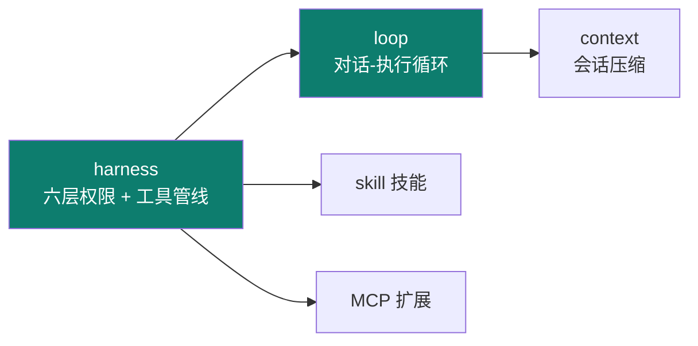
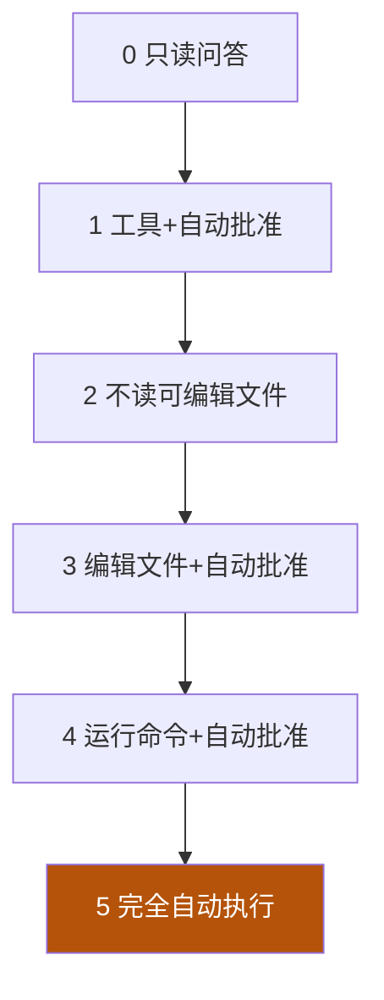
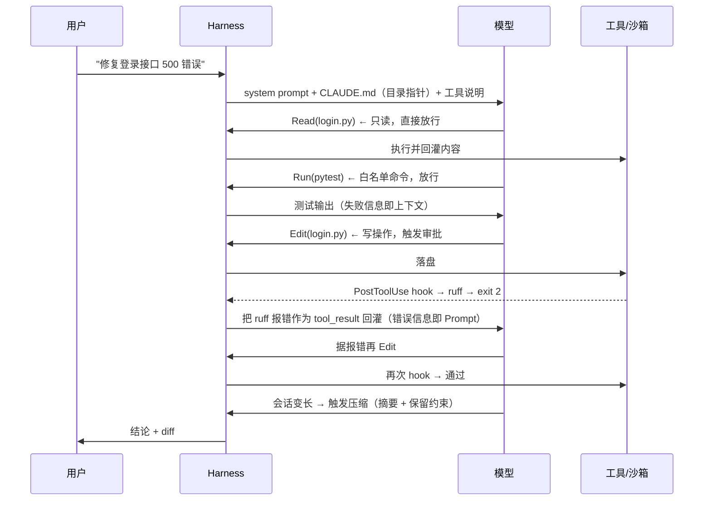

# Claude Code

Track B 第四个实例：**Anthropic 的 CLI agent**。工程上极有代表性——用**六层权限**把"工具能被做什么"管得清清楚楚，正是 03 harness 权限系统的工业级范本。

::: tip 一句话
Claude Code 是把 harness 的"权限"做到六层级的代表：从"随便问"到"自动执行"再到"完全手控"，每一层都决定工具能否真的动手、改文件、跑命令。
:::

## 精确映射：本实例 × 主轴机制

Claude Code 最凸显的工程层是 **harness + loop**：



| 本实例的具体件 | 对应主轴机制 | 章节 |
|---|---|---|
| `CLAUDE.md` 项目宪法 | 常驻段注入 + 渐进披露（目录指针） | [2-1](/concepts/context/mechanism) |
| 长会话压缩摘要 | compaction（prune / summarize） | [2-2](/concepts/context/design) |
| `settings.json` `permissions.allow/deny` | 权限 allow/deny 矩阵 | [3-1](/concepts/harness/mechanism) |
| `defaultMode` 权限层级 | 权限取舍（越权越危险） | [3-2](/concepts/harness/design) |
| `PostToolUse` hook 跑 ruff + `exit 2` | 机械化门禁（声明 ≠ 执行） | [3-1](/concepts/harness/mechanism) |
| 对话-执行循环（读→改→验） | loop 五零件 | [4-1](/concepts/loop/mechanism) |
| Skill / MCP | 能力扩展（横切） | [06](/concepts/skill) |

## 六层权限 / 工具管线



| 层级 | 能力 | 典型权限 |
|---|---|---|
| 0 | 只读问答 | 不许动文件/命令 |
| 1 | 工具 + 自动批准 | 可调工具，逐个批准 |
| 2 | 不读可编辑文件 | 允许读，禁编辑 |
| 3 | 编辑文件 | 改文件，自动批准 |
| 4 | 运行命令 | 可跑命令，自动批准 |
| 5 | 完全自动 | 全自动执行 |

权限越高，越能办事，风险越大——**是 harness 权限取舍的直观缩影**。

## 会话压缩

长任务里 Claude Code 会对历史会话做**压缩摘要**，释放上下文窗口——正是 02 context 的"压缩/总结策略"落地。

## 真机配置：三份可直接抄用的真实文件

> **【示意实现】**：以下三份为依据源码剖析归纳的**格式示意**（键名与结构以 [官方文档](https://docs.anthropic.com/en/docs/claude-code) 为准），可直接作为模板起手，但照抄前请对照你安装版本的官方字段。

下面三份配置是 Claude Code harness 的**核心可运行资产**（格式依据 sawzhang《deep-dive-claude-code》与 Anthropic 官方设置，【事实】；具体键名以你安装的版本为准）。

### ① 项目级 `CLAUDE.md`（等价 AGENTS.md，由 harness 注入 context）

```markdown
# CLAUDE.md

## 项目
- 类型：FastAPI + React；包管理 uv / pnpm。
- 测试：`uv run pytest`；lint：`uv run ruff check .`

## 纪律（只写机器可验证的）
- 改动必须通过 pytest + ruff，否则不得提交。
- 禁止直接修改 lockfile 与 .env。
- 提交信息用 Conventional Commits。

## 目录指针（渐进披露，不展开全文）
- 架构 → docs/architecture.md
- 接口约定 → docs/api.md
```

### ② 权限配置 `settings.json`（六层权限的工程落点）

```json
{
  "permissions": {
    "allow": [
      "Read(**)",
      "Bash(uv run pytest:*)",
      "Bash(uv run ruff:*)",
      "Bash(git diff:*)"
    ],
    "deny": [
      "Bash(rm -rf:*)",
      "Bash(curl:*)",
      "Write(.env)",
      "Write(**/*.lock)"
    ],
    "defaultMode": "acceptEdits"
  }
}
```
> `defaultMode` 对应权限层级：只读 → 接受编辑 → 完全自动执行。越往上越能办事、风险越大（呼应 [03 harness](/concepts/harness) 的权限取舍）。

### ③ Hook：机械化守护（改文件即跑门禁）

```json
{
  "hooks": {
    "PreToolUse": [
      { "matcher": "Bash",
        "hooks": [{ "type": "command",
                    "command": "test \"$CLAUDE_TOOL_INPUT\" != \"rm -rf /\" || exit 2" }] }
    ],
    "PostToolUse": [
      { "matcher": "Edit|Write",
        "hooks": [{ "type": "command", "command": "uv run ruff check . || exit 2" }] }
    ]
  }
}
```
> Hook 让"机械化执行"落地：`PostToolUse` 在每次改文件后**自动跑 ruff**，不合规 `exit 2` 阻断——把可靠性从"模型自觉"变成"工程保证"。这正是 [3-1 门禁](/concepts/harness/mechanism) 的真实范例。

**上手顺序**：① 建 `CLAUDE.md` → ② 配 `settings.json` 权限 → ③ 挂 hook 门禁 → ④ 按需加 Skill / MCP。

::: info 【事实】
> 来源：[sawzhang/deep-dive-claude-code](https://github.com/sawzhang/deep-dive-claude-code)（[S4](/practice/sources)，multi-part 结构已确认，25 章 + 2 附录；许可证按 MIT 处理）；配置格式另参 [Anthropic 官方文档](https://docs.anthropic.com/en/docs/claude-code)（覆盖：Claude Code 实例 · 1-6）。上述配置为**依据来源归纳的示意实现**；"凸显 harness+loop"是本体系的结构化定位（【推断】）。
:::

## 端到端 trace：一次"修 Bug"任务的完整生命周期

把前面各层串起来看——**同一个任务，各层在什么时候介入**：



**关键观察**：任务被拆成 **9 个可观察节点**，其中 **4 个是 harness 主动介入点**（权限放行/审批、hook 阻断、错误回灌、会话压缩）。这就是"驾驭"的含义——**模型负责决策，harness 负责每个节点的把关**。

## 源码级深挖：三处关键实现

### ① Hook 生命周期（四类事件）

Hook 是 Claude Code 把"纪律"从提示词变成**可执行代码**的机制。四类事件覆盖了会话的关键节点：

| 事件 | 触发时机 | 典型用途 | 阻断方式 |
|---|---|---|---|
| `UserPromptSubmit` | 用户提交 prompt 后、送模型前 | 注入上下文、拦截违规提问 | `exit 2` + stderr |
| `PreToolUse` | 工具执行**前** | 参数校验、危险命令拦截 | `exit 2` 阻断调用 |
| `PostToolUse` | 工具执行**后** | 格式化、lint、测试 | `exit 2` 把报错回灌模型 |
| `Stop` | 模型准备结束回答时 | 强制"没跑测试不许停" | `exit 2` 要求继续 |

```json
// 【示意实现】四类 hook 的完整配置
{
  "hooks": {
    "PreToolUse": [
      { "matcher": "Bash",
        "hooks": [{ "type": "command", "command": "python .claude/hooks/guard_bash.py" }] }
    ],
    "PostToolUse": [
      { "matcher": "Edit|Write",
        "hooks": [{ "type": "command", "command": "uv run ruff check --fix $CLAUDE_FILE_PATHS" }] }
    ],
    "Stop": [
      { "hooks": [{ "type": "command", "command": "uv run pytest -q || exit 2" }] }
    ]
  }
}
```
> **`Stop` hook 是最容易被忽略、但价值最高的一环**：它把"改完就跑测试"从模型的自觉变成**会话结束的硬门禁**——测试没过，模型不许停。

```python
# 【示意实现】PreToolUse 守卫脚本：危险命令直接阻断
import json, sys, re

event = json.load(sys.stdin)                    # hook 从 stdin 拿事件
cmd = event.get("tool_input", {}).get("command", "")
BLOCK = [r"\brm\s+-rf\s+/", r"\bgit\s+push\b", r"curl\s+.*\|\s*sh"]
if any(re.search(p, cmd) for p in BLOCK):
    print(f"❌ 命令被拦截：{cmd}\n✅ FIX: 危险命令需人工执行。\n📖 See: docs/conventions/safety.md", file=sys.stderr)
    sys.exit(2)                                  # exit 2 = 阻断并把 stderr 回灌模型
sys.exit(0)
```

### ② 六层权限的判定顺序

权限不是"一次开关"，而是**从宽到严逐层收敛**：

```python
# 【示意实现】权限判定：六层递进，任一层否决即拦
def permit(tool_name, args, mode):
    # ① 全局默认模式（只读 → 可写 → 全权）
    if mode == "read-only" and tool_name in WRITE_TOOLS:
        return False, "read-only 模式禁止写操作"
    # ② 组织级策略（企业管控，优先级高于本地）
    if violates_org_policy(tool_name, args):
        return False, "违反组织策略"
    # ③ 项目级 deny（黑名单，最高优先级否决）
    if matches_any(args, settings["permissions"]["deny"]):
        return False, f"命中 deny 规则"
    # ④ 项目级 allow（白名单，命中即放行）
    if matches_any(args, settings["permissions"]["allow"]):
        return True, "命中 allow 规则"
    # ⑤ require_approval：交人工确认
    if matches_any(args, settings["permissions"].get("require_approval", [])):
        return ask_human(tool_name, args), "等待人工审批"
    # ⑥ 兜底：fail-closed（未声明即拒绝）
    return False, "未授权动作，默认拒绝"
```
> 注意第 ⑥ 层：**未命中 allow 且未命中 deny 时是"拒绝"而非"允许"**——这正是 [03 harness 的 fail-closed](/concepts/harness/mechanism) 在真实产品里的落地。

### ③ 会话压缩：保真优先于压缩

长会话触发压缩时，最容易丢的是**约束类信息**（一旦丢了，后续轮次就开始违背边界）：

```python
# 【示意实现】压缩策略：不可再生信息原文保留
KEEP_KINDS = {"constraint", "interface", "decision", "user_instruction"}

def compact(messages, budget):
    if estimate(messages) <= budget:
        return messages
    keep = [m for m in messages if m.kind in KEEP_KINDS]      # 不可再生 → 原文保留
    proc = [m for m in messages if m.kind not in KEEP_KINDS]  # 过程性 → 摘要
    summary = llm_summarize(proc, keep_hint=[m.text for m in keep])
    return keep + [summary]
```
> 这与 [02 context 的决策三 DSE](/concepts/context/design) 是同一思路：**能结构化保留的绝不摘要**。

## 深入问答：为什么这样设计

**Q1：hook 为什么用 `exit 2` 而不是 `exit 1`？**
约定区分了"报错"与"阻断"：`exit 1` 只记录不阻断，`exit 2` 才是**阻断并把 stderr 回灌模型**。这个区分让 hook 能表达两种语义——"提醒一下"与"不许继续"。

**Q2：权限为什么要"六层"而不是一层？**
因为规则的**来源优先级不同**：组织策略 > 项目 `deny` > 项目 `allow` > 审批 > 兜底。单层无法表达优先级，也无法同时满足"企业统一管控"与"项目自主定制"两个需求。

**Q3：会话压缩为什么不能被"向量检索"替代？**
两者解决不同问题：**检索解决"找相关"，压缩解决"装得下"**。关键差别是约束类信息必须**在场**（每轮都在上下文里），而不是"需要时能检索到"——因为模型不知道"自己该检索什么"。

**Q4：为什么测试不能交给模型自评？**
生成者对自己天然宽容（[04 loop 的 Maker/Checker 必须分离](/concepts/loop/mechanism)）。机械化测试是**独立裁判**：它不看理由，只看退出码。这也是 hook 存在的意义——**把"应该跑测试"从自觉变成门禁**。

## 局限与不适用场景

| 局限 | 说明 | 何时别用 |
|---|---|---|
| 商用闭源 | 无法自托管、无法改内核；六层权限与 hook 只能"用"，不能"换实现" | 需要完全自托管 / 离线部署时 |
| 模型绑定 | 能力与成本绑定 Anthropic 模型，无法替换为本地/其他 Provider | 有私有化模型要求时 |
| 强依赖官方运行时 | 配置键名与 hook 事件随版本演进，升级需跟随 | 需要长期冻结接口时 |

**替代方案**：需要可自托管 + 可换模型 → [OpenClaw](/instances/openclaw) / [Hermes](/instances/hermes) / [DeepSeek Harness](/instances/deepseek-harness)。

## 常见坑与反模式

- **坑① 把 `CLAUDE.md` 写成手册**：塞进全部规范会**稀释指令**、抬高每轮预算。正解是"地图 + 目录指针"，细则放 `docs/` 按需读取。
- **坑② hook 里做重活**：`PostToolUse` **每次改文件都会触发**，把 `pytest` 全量跑塞进去会拖垮整个循环。应跑"快检查"（lint / 单测子集），全量留给提交前。
- **坑③ 权限开太宽**：`allow` 里写 `Bash(*)` 等于**放弃六层权限的意义**；应按最小必要授权，危险动作留在 `deny` 或审批层。
- **坑④ 把"会话压缩"当免费**：压缩会丢信息，必须保证不可再生的约束/决策**不进入摘要**（见 [2-2 compaction](/concepts/context/design)）。

## 执行循环骨架（读 → 改 → 验）

Claude Code 宣称 harness+loop 最完整，前文给了 harness 配置，这里补 **loop 的执行逻辑**——每轮"模型决策 → 工具执行（过权限）→ 结果回填 → 验证"：

```python
# 【示意实现】执行循环骨架：harness（权限/门禁）嵌在 loop 里
def agent_loop(task, harness, max_turns=25):
    messages = [sys(harness.agents_md), user(task)]        # ① CLAUDE.md 常驻注入
    for turn in range(max_turns):                          # 刹车：轮次上限
        resp = llm.chat(messages, tools=harness.tool_specs)
        if not resp.tool_calls:                            # 模型不再要工具 → 收尾
            return resp.content
        for call in resp.tool_calls:
            # ② 六层权限：每次工具调用都过 allow/deny，越权直接拒
            if not harness.permit(call.name, call.args):
                messages.append(tool_result(call, "DENIED by permission"))
                continue
            result = harness.run(call)                     # ③ 按是否写文件决定是否走沙箱
            messages.append(tool_result(call, result))
            # ④ PostToolUse hook：改了文件就跑检查，不合规 exit 2 阻断
            if call.name in {"Edit", "Write"}:
                if harness.hook_post_tool_use() != 0:
                    messages.append(sys("检查未通过，请修复后再继续"))
    return "达到轮次上限，停止"
```
> 三个要点：**权限在循环内逐次判定**（不是一次性）、**hook 是循环的一部分**（改文件即验）、**轮次上限是硬刹车**。这与 [04 loop 三刹车](/concepts/loop/mechanism) 一一对应。

## 架构决策与取舍

| 决策 | 做法 | 放弃了什么 |
|---|---|---|
| **六层权限递进** | `defaultMode` + allow/deny + hook 三层叠加 | 配置复杂度：要理解层级关系才能调对 |
| 项目规则**按目录层级加载** | 子目录 `CLAUDE.md` 就近覆盖 | 全局一致性：不同目录规则可能不同 |
| **hook 机械化门禁** | 改文件即跑检查、`exit 2` 阻断 | 循环速度：每次编辑都触发检查 |
| 会话**压缩摘要** | 长历史摘要化以省窗口 | 信息保真：摘要会丢细节（须保约束类） |

## 性能、成本与横向对比

| 维度 | Claude Code | 参照对象 |
|---|---|---|
| token 开销 | 较高：常驻工具说明 + CLAUDE.md + hook 反馈 | 高于 [Hermes](/instances/hermes) |
| 延迟 | 中：hook 每次编辑触发检查 | 慢于无 hook 的 [OpenClaw](/instances/openclaw) |
| 成本模型 | 中-高：轮次 × 工具 × 检查 | 与 [Codex](/instances/codex) 同量级 |
| 定位 | 软件工程（闭源、体验最好） | vs [Codex](/instances/codex)：同域，CC 更重工程化、Codex 更重沙箱隔离 |

## 小测验

::: details 点击展开题目与答案
**Q1（选择）**：Claude Code 的六层权限，核心管控的是？  
A. 模型参数　B. 工具/文件/命令能被执行到什么程度　C. 界面主题  
✅ B。它管"工具能真的动手到什么层级"。

**Q2（判断）**：层级越高，agent 越安全。  
❌ 错。层级越高越能办事，风险越大，需要按任务取舍。

**Q3（选择）**：项目根的 CLAUDE.md 属于主轴哪一层的落地？  
A. graph　B. harness（常驻上下文注入）　C. 仅 prompt 层  
✅ B。它是 harness 把"项目宪法"注入常驻上下文的实现。
:::

## 三档自检

| 档位 | 你能做到 | 判据（怎么算达标） |
|---|---|---|
| 了解 | 说出 Claude Code 凸显 harness+loop，有六层权限与会话压缩 | 说得出"六层权限"与"会话压缩"各属 harness 还是 context |
| 熟悉 | 能画六层权限递进图，并说明会话压缩对应 context 哪一策略 | 能指出压缩属 [02 的 compaction](/concepts/context/design)，且知道它必须保留约束类信息 |
| 精通 | 在真实项目配好 CLAUDE.md + hook + skill + MCP，并按风险调权限层级 | 故意让 hook 检查失败时**命令被 exit 2 阻断**；`git push` 类动作被 deny 拦下 |

> 上一实例：[OpenClaw](./openclaw) ｜ 相关概念：[03 harness](/concepts/harness) · [04 loop](/concepts/loop) · [06 skill](/concepts/skill) ｜ 下一实例：[Codex](./codex)