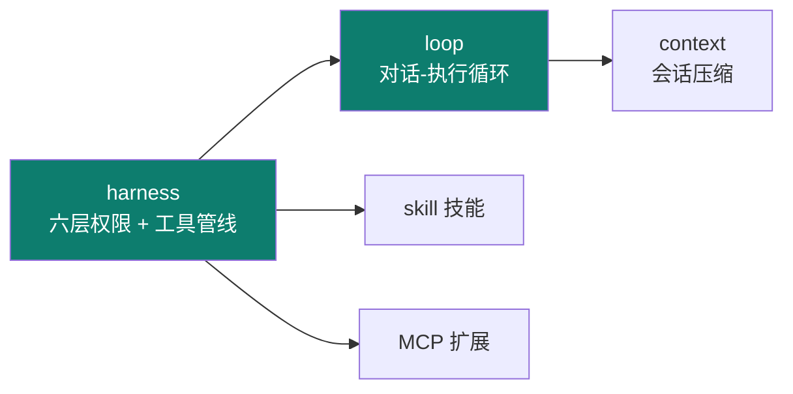
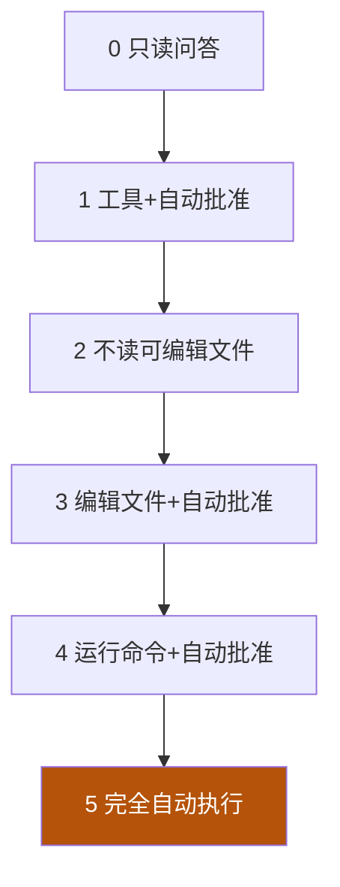

# Claude Code

Track B 第四个实例：**Anthropic 的 CLI agent**。工程上极有代表性——用**六层权限**把"工具能被做什么"管得清清楚楚，正是 03 harness 权限系统的工业级范本。

::: tip 一句话
Claude Code 是把 harness 的"权限"做到六层级的代表：从"随便问"到"自动执行"再到"完全手控"，每一层都决定工具能否真的动手、改文件、跑命令。
:::

## 实例 × 工程层映射

Claude Code 最凸显的工程层是 **harness + loop**：

| 主轴层 | Claude Code 里的落地 |
|---|---|
| context | 会话压缩、CLAUDE.md 注入 |
| harness | 六层权限、工具管线、hook |
| loop | 对话-执行循环 |
| skill | 技能（Skill） |
| （跨层） | MCP、CLAUDE.md |

## 六层权限 / 工具管线

| 层级 | 能力 | 典型权限 |
|---|---|---|
| 0 | 只读问答 | 不许动文件/命令 |
| 1 | 工具 + 自动批准 | 可调工具，逐个批准 |
| 2 | 不读可编辑文件 | 允许读，禁编辑 |
| 3 | 编辑文件 | 改文件，自动批准 |
| 4 | 运行命令 | 可跑命令，自动批准 |
| 5 | 完全自动 | 全自动执行 |

权限越高，越能办事，风险越大——**是 harness 权限取舍的直观缩影**。

## 会话压缩

长任务里 Claude Code 会对历史会话做**压缩摘要**，释放上下文窗口——正是 02 context 的"压缩/总结策略"落地。

## 真机配置（CLAUDE.md / hook / skill / MCP）

1. 项目根建 `CLAUDE.md`，写项目宪法（角色、技术栈、禁止事项）——harness 注入的常驻上下文。
2. 用 hook 挂机械化守护（提交前 lint/测试）。
3. 按需加 Skill（能力扩展）与 MCP（外部服务）。
4. 调权限层级，观察工具在每层能做什么。

::: info 【事实】
来源：github.com/sawzhang/deep-dive-claude-code（multi-part 结构已确认，25 章 + 2 附录；许可证按 MIT 处理）。"六层权限"语义以该仓库与官方文档核对为准；"凸显 harness+loop"是本体系的结构化定位（【推断】）。
:::

## 小测验

::: details 点击展开题目与答案
**Q1（选择）**：Claude Code 的六层权限，核心管控的是？  
A. 模型参数　B. 工具/文件/命令能被执行到什么程度　C. 界面主题  
✅ B。它管"工具能真的动手到什么层级"。

**Q2（判断）**：层级越高，agent 越安全。  
❌ 错。层级越高越能办事，风险越大，需要按任务取舍。

**Q3（选择）**：项目根的 CLAUDE.md 属于主轴哪一层的落地？  
A. graph　B. harness（常驻上下文注入）　C. 仅 prompt 层  
✅ B。它是 harness 把"项目宪法"注入常驻上下文的实现。
:::

## 三档自检

| 档位 | 你能做到 |
|---|---|
| 了解 | 说出 Claude Code 凸显 harness+loop，有六层权限与会话压缩 |
| 熟悉 | 能画六层权限递进图，并说明会话压缩对应 context 哪一策略 |
| 精通 | 能在真实项目配好 CLAUDE.md + hook + skill + MCP，并按风险调权限层级 |

> 上一实例：[OpenClaw](./openclaw) ｜ 相关概念：[03 harness](/concepts/harness) · [04 loop](/concepts/loop) · [06 skill](/concepts/skill) ｜ 下一实例：[Codex](./codex)