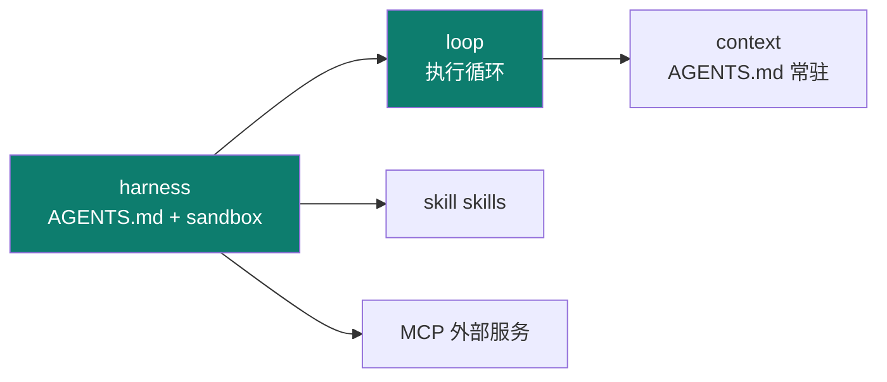
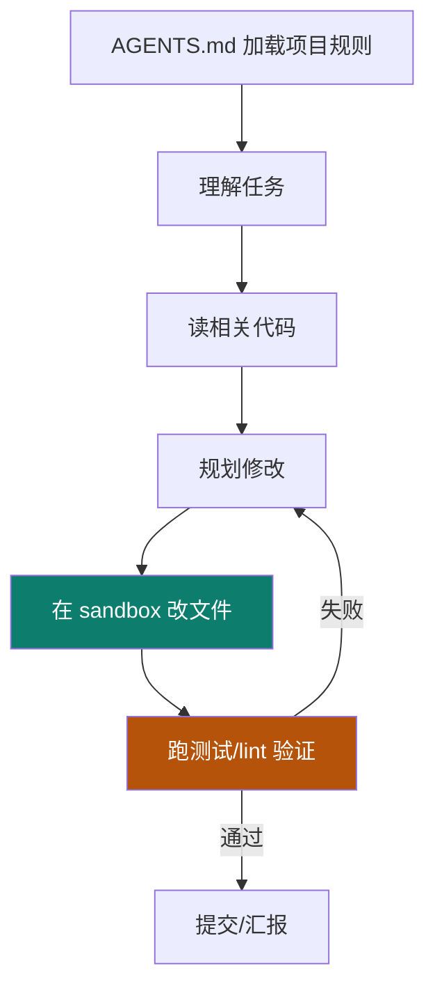

# Codex

Track B 第五个实例：**OpenAI 的本地软件工程 agent**（Rust 核心）。工程上最值得学的，是把 **AGENTS.md + skills + MCP + sandbox** 组合成一个"能真在仓库里干活"的 harness。

::: tip 一句话
Codex 是"软件工程型 agent"的标杆：它不光会聊天，还能在一个**受控沙箱**里读仓库、改代码、跑验证——用 AGENTS.md 定规则、skills 扩能力、MCP 接服务。
:::

## 精确映射：本实例 × 主轴机制

Codex 最凸显的工程层是 **harness + loop**：



| 本实例的具体件 | 对应主轴机制 | 章节 |
|---|---|---|
| `AGENTS.md` | 常驻规则 + 目录指针（渐进披露） | [2-1](/concepts/context/mechanism) |
| `config.toml` `sandbox_mode` | 权限取舍（read-only→workspace-write→full） | [3-2](/concepts/harness/design) |
| `network_access=false` + `inherit="core"` | fail-closed + 环境变量隔离 | [3-1](/concepts/harness/mechanism) |
| `approval_policy="on-request"` | 审批粒度（部分操作需许可） | [3-1](/concepts/harness/mechanism) |
| 执行循环（读码→沙箱改→验证→重试） | loop 三刹车 + 反馈重试 | [4-1](/concepts/loop/mechanism) |
| skills / MCP | 能力扩展（横切） | [06](/concepts/skill) |

## 执行循环：改代码不是一次动作，是一个 loop



## 源码级：三份可直接抄用的真实配置

下面三份配置是 Codex harness 的核心资产（格式依据 [smartloli《Codex 剖析》](https://www.cnblogs.com/smartloli/p/20684447) 与 OpenAI 官方文档，【事实】；具体键名以你安装的版本为准）。

### ① `AGENTS.md`（项目宪法，由 harness 常驻注入 context）

```markdown
# AGENTS.md

## 项目
- 语言：Rust + Python 辅助脚本；构建：cargo / uv。
- 测试：`cargo test`；lint：`cargo clippy -- -D warnings`。

## 纪律（只写机器可验证的）
- 任何改动必须通过 cargo test + clippy，否则不得提交。
- 禁止改动 Cargo.lock 之外的依赖清单；禁止直接写 .env。

## 目录指针（渐进披露）
- 架构 → docs/architecture.md
- 贡献流程 → CONTRIBUTING.md
```

### ② `~/.codex/config.toml`（沙箱与审批策略）

```toml
# 模型与沙箱：默认在沙箱内执行、改动需审批
model = "gpt-5-codex"
sandbox_mode = "workspace-write"      # read-only | workspace-write | danger-full-access
approval_policy = "on-request"        # on-request | on-failure | never

[sandbox_workspace_write]
network_access = false                # 默认禁网，防越权外联
writable_roots = ["."]                # 仅当前仓库可写

[shell_environment_policy]
inherit = "core"                      # 只继承最小环境变量，隔离凭据
```
> `sandbox_mode` 对应 03 harness 的权限取舍：`read-only`（只读）→ `workspace-write`（可改仓库）→ `danger-full-access`（全权）。越往上越能办事、风险越大。`network_access=false` + `inherit="core"` 是 **fail-closed** 思路的落地。

### ③ 执行循环：不是"一次改完"，是"改—验—再改"

```python
# Codex 软件工程循环的骨架（依据其"读码→改→跑验证→再改"语义，【事实】）
def codex_loop(task, repo, max_iter=15):
    rules = repo.read("AGENTS.md")                      # ① 常驻规则注入 context
    messages = [sys(rules), sys(f"任务：{task}")]
    for i in range(max_iter):                           # harness 设迭代上限
        plan = llm.plan(messages, tools=["read","edit","shell"])
        for act in plan.actions:
            if act.tool == "read":   messages.append(repo.read(act.path))
            elif act.tool == "edit": sandbox.write(repo, act.path, act.content)  # ② 沙箱内改
            elif act.tool == "shell":messages.append(sandbox.run(act.cmd))       # ③ 沙箱内跑
        if verify(repo):                                # ④ 机械化验证（cargo test/clippy）
            return "done"
        # ⑤ 验证失败 → 把报错喂回，进入下一轮（prompter 反馈式）
        messages.append(sys(f"验证失败：\n{last_error()}\n请修复后重试"))
    return "达到迭代上限，停止"
```

## 上手顺序
① 写 `AGENTS.md` → ② 配 `config.toml`（沙箱 + 审批 + 环境隔离）→ ③ 在仓库跑一个真实工程任务，观察"改—验—再改"循环。

::: info 【事实】
来源：cnblogs.com/smartloli/p/20684447（Codex 剖析）+ OpenAI 官方文档。上述配置键名与沙箱语义以官方为准；"凸显 harness+loop"是本体系的结构化定位（【推断】）。
:::

## 小测验

::: details 点击展开题目与答案
**Q1（选择）**：Codex 的执行循环里，谁决定"改动是否合格"？  
A. 模型自我感觉　B. 机械化验证（测试/lint）　C. 用户手动逐个确认每行  
✅ B。它跑测试/lint 做确定性验证。

**Q2（判断）**：AGENTS.md 只影响 prompt 一层的措辞。  
❌ 错。它是 harness 常驻注入的"项目宪法"，贯穿 context 与后续执行。

**Q3（选择）**：sandbox 在 Codex 里的作用是？  
A. 加速模型推理　B. 隔离执行，防止改动/命令越界　C. 代替模型思考  
✅ B。它是 harness 的执行环境约束。
:::

## 三档自检

| 档位 | 你能做到 |
|---|---|
| 了解 | 说出 Codex 是本地软件工程 agent（Rust），凸显 harness+loop |
| 熟悉 | 画出"AGENTS.md → 读码 → 规划 → 沙箱改 → 验证"的执行循环 |
| 精通 | 能在仓库配好 AGENTS.md + skills + sandbox 并跑通一个真实工程任务 |

> 上一实例：[Claude Code](./claude-code) ｜ 相关概念：[02 context](/concepts/context) · [03 harness](/concepts/harness) · [04 loop](/concepts/loop) ｜ 下一实例：[DeepSeek Harness](./deepseek-harness)