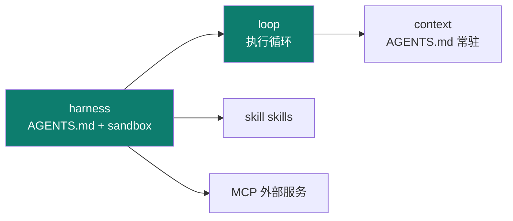
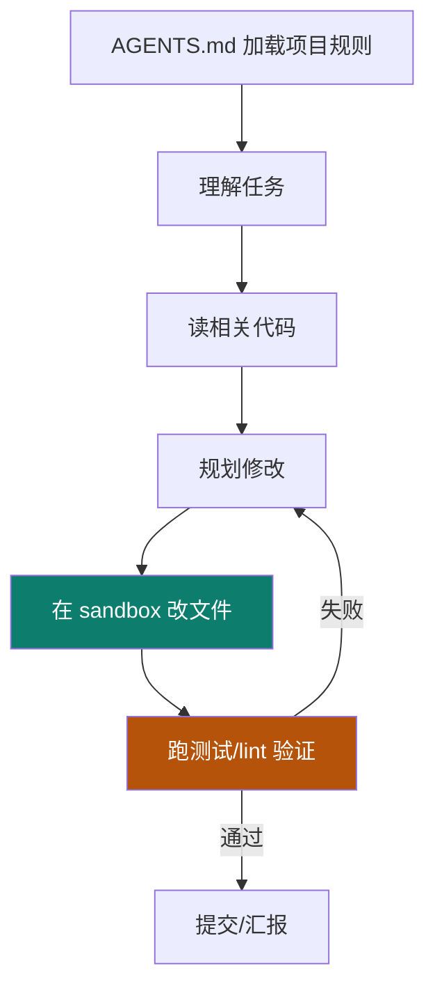

# Codex

Track B 第五个实例：**OpenAI 的本地软件工程 agent**（Rust 核心）。工程上最值得学的，是把 **AGENTS.md + skills + MCP + sandbox** 组合成一个"能真在仓库里干活"的 harness。

::: tip 一句话
Codex 是"软件工程型 agent"的标杆：它不光会聊天，还能在一个**受控沙箱**里读仓库、改代码、跑验证——用 AGENTS.md 定规则、skills 扩能力、MCP 接服务。
:::

## 实例 × 工程层映射

Codex 最凸显的工程层是 **harness + loop**：

| 主轴层 | Codex 里的落地 |
|---|---|
| context | AGENTS.md 常驻注入 |
| harness | sandbox 沙箱、命令执行 |
| loop | 软件工程执行循环 |
| skill | skills 能力扩展 |
| （跨层） | MCP |

## 执行循环：改代码不是一次动作，是一个 loop

## 配置 AGENTS.md + skills + sandbox 跑通工程任务

1. 仓库根写 `AGENTS.md`，定义技术栈、命名规范、禁止事项。
2. 装 skills 扩能力，接 MCP 拉外部服务（API/数据库）。
3. 开 sandbox 隔离执行，让 Codex 在受控环境改代码、跑验证。

::: info 【事实】
来源：cnblogs.com/smartloli（Codex 剖析）。具体配置项、沙箱/命令语义以 OpenAI 官方文档与源码为准；"凸显 harness+loop"是本体系的结构化定位（【推断】）。
:::

## 小测验

::: details 点击展开题目与答案
**Q1（选择）**：Codex 的执行循环里，谁决定"改动是否合格"？  
A. 模型自我感觉　B. 机械化验证（测试/lint）　C. 用户手动逐个确认每行  
✅ B。它跑测试/lint 做确定性验证。

**Q2（判断）**：AGENTS.md 只影响 prompt 一层的措辞。  
❌ 错。它是 harness 常驻注入的"项目宪法"，贯穿 context 与后续执行。

**Q3（选择）**：sandbox 在 Codex 里的作用是？  
A. 加速模型推理　B. 隔离执行，防止改动/命令越界　C. 代替模型思考  
✅ B。它是 harness 的执行环境约束。
:::

## 三档自检

| 档位 | 你能做到 |
|---|---|
| 了解 | 说出 Codex 是本地软件工程 agent（Rust），凸显 harness+loop |
| 熟悉 | 画出"AGENTS.md → 读码 → 规划 → 沙箱改 → 验证"的执行循环 |
| 精通 | 能在仓库配好 AGENTS.md + skills + sandbox 并跑通一个真实工程任务 |

> 上一实例：[Claude Code](./claude-code) ｜ 相关概念：[02 context](/concepts/context) · [03 harness](/concepts/harness) · [04 loop](/concepts/loop) ｜ 下一实例：[DeepSeek Harness](./deepseek-harness)