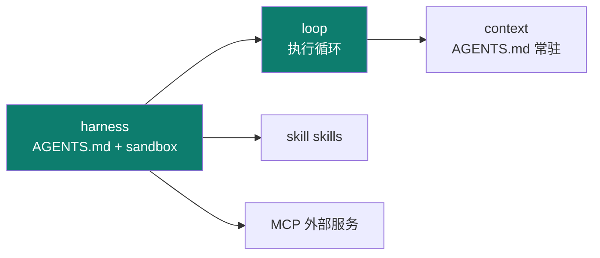
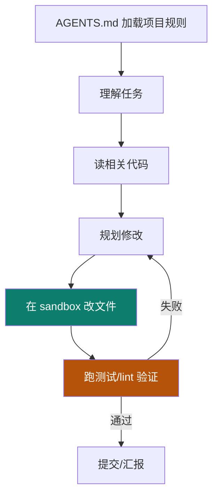
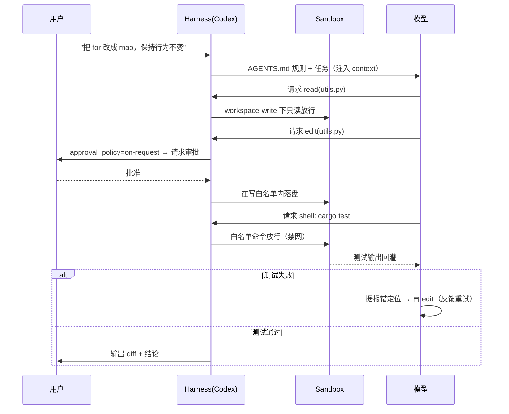

# Codex

Track B 第五个实例：**OpenAI 的本地软件工程 agent**（Rust 核心）。工程上最值得学的，是把 **AGENTS.md + skills + MCP + sandbox** 组合成一个"能真在仓库里干活"的 harness。

::: tip 一句话
Codex 是"软件工程型 agent"的标杆：它不光会聊天，还能在一个**受控沙箱**里读仓库、改代码、跑验证——用 AGENTS.md 定规则、skills 扩能力、MCP 接服务。
:::

## 精确映射：本实例 × 主轴机制

Codex 最凸显的工程层是 **harness + loop**：



| 本实例的具体件 | 对应主轴机制 | 章节 |
|---|---|---|
| `AGENTS.md` | 常驻规则 + 目录指针（渐进披露） | [2-1](/concepts/context/mechanism) |
| `config.toml` `sandbox_mode` | 权限取舍（read-only→workspace-write→full） | [3-2](/concepts/harness/design) |
| `network_access=false` + `inherit="core"` | fail-closed + 环境变量隔离 | [3-1](/concepts/harness/mechanism) |
| `approval_policy="on-request"` | 审批粒度（部分操作需许可） | [3-1](/concepts/harness/mechanism) |
| 执行循环（读码→沙箱改→验证→重试） | loop 三刹车 + 反馈重试 | [4-1](/concepts/loop/mechanism) |
| skills / MCP | 能力扩展（横切） | [06](/concepts/skill) |

## 执行循环：改代码不是一次动作，是一个 loop



## 三份可直接抄用的配置

下面三份配置是 Codex harness 的核心资产（格式依据 [smartloli《Codex 剖析》](https://www.cnblogs.com/smartloli/p/20684447) 与 OpenAI 官方文档，【事实】；具体键名以你安装的版本为准）。

### ① `AGENTS.md`（项目宪法，由 harness 常驻注入 context）

```markdown
# AGENTS.md

## 项目
- 语言：Rust + Python 辅助脚本；构建：cargo / uv。
- 测试：`cargo test`；lint：`cargo clippy -- -D warnings`。

## 纪律（只写机器可验证的）
- 任何改动必须通过 cargo test + clippy，否则不得提交。
- 禁止改动 Cargo.lock 之外的依赖清单；禁止直接写 .env。

## 目录指针（渐进披露）
- 架构 → docs/architecture.md
- 贡献流程 → CONTRIBUTING.md
```

### ② `~/.codex/config.toml`（沙箱与审批策略）

```toml
# 模型与沙箱：默认在沙箱内执行、改动需审批
model = "gpt-5-codex"
sandbox_mode = "workspace-write"      # read-only | workspace-write | danger-full-access
approval_policy = "on-request"        # on-request | on-failure | never

[sandbox_workspace_write]
network_access = false                # 默认禁网，防越权外联
writable_roots = ["."]                # 仅当前仓库可写

[shell_environment_policy]
inherit = "core"                      # 只继承最小环境变量，隔离凭据
```
> `sandbox_mode` 对应 03 harness 的权限取舍：`read-only`（只读）→ `workspace-write`（可改仓库）→ `danger-full-access`（全权）。越往上越能办事、风险越大。`network_access=false` + `inherit="core"` 是 **fail-closed** 思路的落地。

### ③ 执行循环：不是"一次改完"，是"改—验—再改"

```python
# Codex 软件工程循环的骨架（依据其"读码→改→跑验证→再改"语义，【事实】）
def codex_loop(task, repo, max_iter=15):
    rules = repo.read("AGENTS.md")                      # ① 常驻规则注入 context
    messages = [sys(rules), sys(f"任务：{task}")]
    for i in range(max_iter):                           # harness 设迭代上限
        plan = llm.plan(messages, tools=["read","edit","shell"])
        for act in plan.actions:
            if act.tool == "read":   messages.append(repo.read(act.path))
            elif act.tool == "edit": sandbox.write(repo, act.path, act.content)  # ② 沙箱内改
            elif act.tool == "shell":messages.append(sandbox.run(act.cmd))       # ③ 沙箱内跑
        if verify(repo):                                # ④ 机械化验证（cargo test/clippy）
            return "done"
        # ⑤ 验证失败 → 把报错喂回，进入下一轮（prompter 反馈式）
        messages.append(sys(f"验证失败：\n{last_error()}\n请修复后重试"))
    return "达到迭代上限，停止"
```

## 上手顺序
① 写 `AGENTS.md` → ② 配 `config.toml`（沙箱 + 审批 + 环境隔离）→ ③ 在仓库跑一个真实工程任务，观察"改—验—再改"循环。

::: info 【事实】
> 来源：[smartloli《Codex 剖析》](https://www.cnblogs.com/smartloli/p/20684447)（[S5](/practice/sources)）+ [openai/codex](https://github.com/openai/codex)（官方仓库，配置键名与沙箱语义以其为准）（覆盖：Codex 实例 · 3-1）。上述配置为**依据来源归纳的示意实现（【示意实现】）**；"凸显 harness+loop"是本体系的结构化定位（【推断】）。
:::

## 端到端 trace：一次"改代码并跑通测试"的生命周期



**与 Claude Code 的关键差异**：Codex 把把关重心放在 **沙箱隔离 + 审批**（执行环境层），Claude Code 放在 **hook 门禁 + 六层权限**（工程纪律层）。**同一目标，两种取舍。**

## 源码级深挖：三处关键实现

### ① 审批策略三态：自动化与安全的旋钮

`approval_policy` 决定"哪些动作需要人点头"，三种取值的实际行为差异很大：

| 取值 | 行为 | 适用 | 风险 |
|---|---|---|---|
| `on-request` | 模型判断需要时才请求审批 | 生产 / 团队协作 | 依赖模型自判（可能少问） |
| `on-failure` | 先执行，**失败后**才请求审批 | 本地开发、快速迭代 | 失败前的副作用已发生 |
| `never` | 从不请求审批，全部自动执行 | 完全可信的隔离环境 | ⚠️ 危险动作无人拦 |

```toml
# ~/.codex/config.toml
approval_policy = "on-request"      # 推荐生产用

# 进阶：按命令模式细粒度配置审批（危险命令强制问人）
[approval_policy.on_request]
dangerous_commands = ["git push", "rm -rf", "docker", "kubectl"]
```
> 选择逻辑：**沙箱越松，审批就要越严**。若 `sandbox_mode = "danger-full-access"`，`approval_policy` 必须收紧到 `on-request`，否则等于无防护。

### ② 沙箱实现：三平台不同后端

`sandbox_mode` 是**策略**，具体隔离能力由**平台后端**提供（能力并不对等）：

| 平台 | 隔离机制 | 能力边界 |
|---|---|---|
| macOS | `seatbelt`（Sandbox.framework） | 成熟：可限文件/网络/进程 |
| Linux | `landlock` + `seccomp` | 较强：需内核支持（5.13+） |
| Windows | 受限令牌 / 作业对象 | **较弱**：隔离粒度粗，能力受限 |

```python
# 【示意实现】启动前探测沙箱后端能力，能力不足即降级或拒绝
def resolve_sandbox(mode):
    backend = detect_backend()            # seatbelt / landlock / windows-job
    caps = BACKEND_CAPS[backend]          # 该后端支持哪些限制
    need = ["fs_write", "network_block"]
    if mode == "workspace-write" and not caps.get("fs_write"):
        raise RuntimeError("SANDBOX_UNSUPPORTED: 当前平台不支持写隔离，拒绝执行")  # fail-closed
    return Sandbox(backend, mode)
```
> **重要提醒**：跨平台时不要假设隔离能力一致。**能力不足应 fail-closed，而不是"降级裸跑"**（见 [3-1 fail-closed](/concepts/harness/mechanism)）。

### ③ 命令输出治理：防上下文污染

命令输出（尤其测试/构建）极易灌满上下文——这是 [02 context](/concepts/context/mechanism) 在 harness 侧的落点：

```python
# 【示意实现】输出治理三招（参考 Anthropic C 编译器的做法）
def run_command(cmd, log_path="/tmp/app.log"):
    with open(log_path, "w") as f:        # ① 全量写文件，不塞进上下文
        proc = subprocess.run(cmd, stdout=f, stderr=subprocess.STDOUT)
    # ② 只回灌"grep 友好"的摘要行：单行、带前缀、可机器解析
    matched = grep(log_path, r"^(ERROR|FAIL|error\[E\d+\]):")
    return {
        "exit_code": proc.returncode,
        "summary": matched[:20],          # ③ 预计算聚合，不输出原始数据
        "full_log": log_path,             # 给模型一个 locator，需要时再读
    }
```
> 三招对应教材里 Anthropic 的**上下文窗口污染缓解**：**最小化控制台输出、日志写文件、grep 友好格式、预计算聚合**。

## 深入问答：为什么这样设计

**Q1：为什么网络默认禁用？**
网络是**最大的外泄面**（凭据、内网数据），同时也会引入不确定性——Agent 联网拉依赖可能导致版本漂移，进而破坏构建。默认禁用是"最小权限"原则的直接体现。

**Q2：`approval_policy` 为什么默认 `on-request` 而不是 `never`？**
`never` 等于**没有审批层**——危险动作无人拦。`on-request` 保留了人工闸门，同时避免每个动作都打扰人。默认值的选择本身就是"安全优先"的立场。

**Q3：沙箱三档为什么不直接给 `danger-full-access`？**
隔离强度与干活便利性成反比。**默认给最小权限、需要时显式放开**（fail-safe 默认），而不是给全权再靠自觉收敛。

**Q4：`AGENTS.md` 为什么必须限制行数？**
每一行都占 token 预算。过长会**挤掉任务本身的空间**，表现就是"Agent 开始忽略部分规则"——它**不是不听话，而是没地方看了**（见 [3-3 坑①](/concepts/harness/pitfalls)）。

## 局限与不适用场景

| 局限 | 说明 | 何时别用 |
|---|---|---|
| 偏代码域 | 为软件工程任务优化；客服、运营、多轮闲聊类适配弱 | 非工程类对话助手场景 |
| 沙箱依赖本地环境 | `sandbox_mode` 的实际隔离能力随平台而异（Windows 下与 Linux 有差异） | 需要强隔离且平台支持不足时 |
| 模型绑定 OpenAI | 与 Claude Code 同样存在 Provider 绑定 | 要求可替换模型时 |

**替代方案**：需要多通道/对话式助手 → [OpenClaw](/instances/openclaw)；需要插件化自研 → [DeepSeek Harness](/instances/deepseek-harness)。

## 常见坑与反模式

- **坑① 图省事开 `danger-full-access`**：等于**放弃隔离**，任何越权命令都会真执行。默认应停在 `workspace-write`，只在可信仓库临时放开。
- **坑② `network_access=true` + `inherit="all"`**：把全部环境变量（含凭据）暴露给沙箱进程，**存在外联泄露风险**。用 `inherit="core"` 最小继承。
- **坑③ 把 `AGENTS.md` 写成百科全书**：与 CLAUDE.md 同病——**越厚越稀释**。只留"地图 + 机器可验证的硬纪律"。
- **坑④ 忘了审批策略**：`approval_policy="never"` 会跳过所有人工确认，危险动作无人拦；生产环境建议 `on-request`。

## 架构决策与取舍

| 决策 | 做法 | 放弃了什么 |
|---|---|---|
| **沙箱三档** `sandbox_mode` | read-only → workspace-write → danger-full-access | 便利性：越隔离越难干活，需按风险手动切换 |
| **网络默认禁用** | `network_access=false` | 需联网的任务（拉依赖、查文档）须临时放开 |
| **AGENTS.md 常驻宪法** | 每仓库一份，注入 context | 跨项目复用：换仓库就要重写 |
| **审批策略可调** | `on-request` / `on-failure` / `never` | 自动化程度：越保守越需要人介入 |

> 取向与 [Claude Code](/instances/claude-code) 不同：Codex 把**隔离与审批**放在便利性之前（fail-closed 优先）。

## 性能、成本与横向对比

| 维度 | Codex | 参照对象 |
|---|---|---|
| token 开销 | 中：AGENTS.md 精简 + 命令输出回灌 | 低于 [Claude Code](/instances/claude-code) 的完整工具说明 |
| 延迟 | 中：沙箱进程启动有开销 | 沙箱越严格越慢 |
| 成本模型 | 中：轮次 × 验证（cargo test/clippy） | 与 [Claude Code](/instances/claude-code) 同量级 |
| 定位 | 软件工程（Rust 核心、沙箱隔离强） | vs [Claude Code](/instances/claude-code)：同域，Codex 更重"隔离"，CC 更重"权限+门禁" |

## 小测验

::: details 点击展开题目与答案
**Q1（选择）**：Codex 的执行循环里，谁决定"改动是否合格"？  
A. 模型自我感觉　B. 机械化验证（测试/lint）　C. 用户手动逐个确认每行  
✅ B。它跑测试/lint 做确定性验证。

**Q2（判断）**：AGENTS.md 只影响 prompt 一层的措辞。  
❌ 错。它是 harness 常驻注入的"项目宪法"，贯穿 context 与后续执行。

**Q3（选择）**：sandbox 在 Codex 里的作用是？  
A. 加速模型推理　B. 隔离执行，防止改动/命令越界　C. 代替模型思考  
✅ B。它是 harness 的执行环境约束。
:::

## 三档自检

| 档位 | 你能做到 | 判据（怎么算达标） |
|---|---|---|
| 了解 | 说出 Codex 是本地软件工程 agent（Rust），凸显 harness+loop | 说得出它靠"沙箱 + AGENTS.md"约束，而非仅靠模型自觉 |
| 熟悉 | 画出"AGENTS.md → 读码 → 规划 → 沙箱改 → 验证"的执行循环 | 能指出循环里哪一步是**机械化验证**（cargo test/clippy），而非模型自评 |
| 精通 | 在仓库配好 AGENTS.md + skills + sandbox 并跑通一个真实工程任务 | 把 `sandbox_mode` 调成 `danger-full-access` 时你能说出**风险差异**；网络默认关闭下任务仍能完成 |

> 上一实例：[Claude Code](./claude-code) ｜ 相关概念：[02 context](/concepts/context) · [03 harness](/concepts/harness) · [04 loop](/concepts/loop) ｜ 下一实例：[DeepSeek Harness](./deepseek-harness)