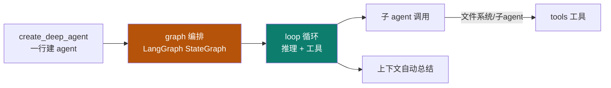
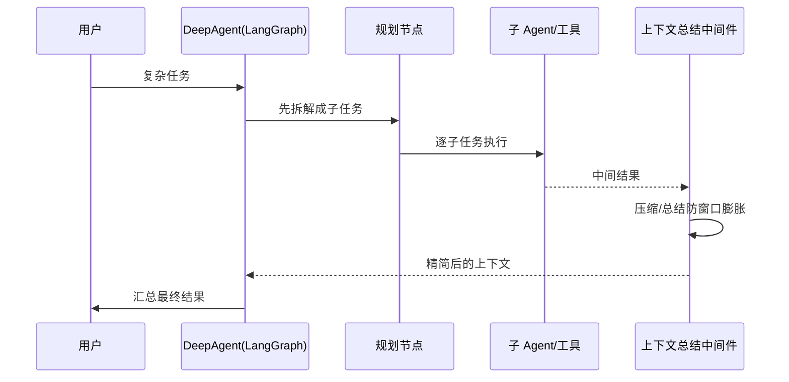

# DeepAgent

Track B 第二个实例：**LangChain `deepagents`**——基于 LangGraph + 中间件，`create_deep_agent` 一行建 agent。它是主轴里 **graph + loop** 的活教材。

::: tip 一句话
DeepAgent 证明"图编排"不只是概念：用 LangGraph 的状态图把**规划、子 agent、上下文总结**串起来，复杂 agent 也能声明式建出来。
:::

## 实例 × 工程层映射

DeepAgent 最凸显的工程层是 **graph + loop**：

| 主轴层 | DeepAgent 里的落地 |
|---|---|
| loop | 推理循环、工具往返 |
| graph | LangGraph 状态图、多节点编排 |
| context | 上下文自动总结（防膨胀） |
| tool | 文件系统工具、子 agent 作为工具 |

## 中间件时序：一次带规划的执行

## 中间件机制（LangChain deepagents，【事实】）

`create_deep_agent` 通过 **middleware** 在 agent 节点前后挂载横切能力，用 `MiddlewareReturn.state_update` 写回 LangGraph 状态：

| 中间件 | 作用 |
|---|---|
| `ContextSummarizationMiddleware` | 消息超阈值（默认 30）时，对旧消息分组生成摘要并以 `SystemMessage` 替换，防窗口膨胀 |
| `ContextExtractionMiddleware` | 从对话提取结构化实体/状态写入 context（确定性，呼应 [02 DSE](/concepts/context/design)） |
| `SubAgentMiddleware` | 把子 agent 包装成 `StructuredTool`，父 agent 推理时看到"工具形式的子 agent" |
| `AsyncToolsMiddleware` | 把同步工具包装为异步，避免阻塞 |

**工具注册**：`create_deep_agent` 的 `tools` 参数接受三个预置 toolkit（`langchain_agentic_toolkits`）：

| Toolkit | 包含工具 |
|---|---|
| `fs_toolkit()` | read_file / write_file / list_directory / file_search |
| `interactive_bash_toolkit()` | 交互式 bash（持久 shell 会话） |
| `safe_code_interpreter_toolkit()` | 沙箱化 Python 执行（stdout/stderr） |

**手动上下文工具**：DeepAgent 暴露 `add_context(content, key)` / `delete_context(key)` 供 agent 跨轮次保留重要信息（写进 `context_manager`）。

**状态 channel**（与 [05 graph 的 reducer](/concepts/graph/mechanism) 互链，【事实】）：
- `messages: Annotated[list[BaseMessage], add_messages]` — 对话累积；
- `intermediate_steps: Annotated[list, operator.add]` — 工具执行记录累积；
- `context_manager` — 持久化工作记忆。

> 这说明 05 讲的 reducer（`operator.add`/`add_messages`）在真实框架里就是 `messages`、`intermediate_steps` 等键的合并规则——抽象概念落到真实现。

## 可跑工程：规划 + 子 agent + 上下文总结

1. 安装 `langchain-deepagents`，用 `create_deep_agent` 建 agent。
2. 给它配一个"规划节点"（拆任务）与若干子 agent/工具。
3. 开启上下文自动总结中间件，观察窗口不因长任务膨胀。

::: info 【事实】
来源：csdn 博客《LangChain deepagents》。具体 API（`create_deep_agent`、中间件配置）以 LangChain 官方文档 / 源码为准；"凸显 graph+loop"是本体系的结构化定位（【推断】）。
:::

## 小测验

::: details 点击展开题目与答案
**Q1（选择）**：DeepAgent 是基于哪个图框架构建的？  
A. React　B. LangGraph　C. Next.js  
✅ B。它用 LangGraph 的 StateGraph 做编排。

**Q2（判断）**：DeepAgent 的上下文自动总结，是为了把窗口撑得更大。  
❌ 错。是为了**防止窗口被长任务膨胀**，压缩后保住预算（呼应 02 context）。

**Q3（选择）**：`create_deep_agent` 的价值是？  
A. 必须手写所有节点　B. 一行建出基于图的复杂 agent　C. 只能做单循环  
✅ B。
:::

## 三档自检

| 档位 | 你能做到 |
|---|---|
| 了解 | 说出 DeepAgent 基于 LangGraph，凸显 graph+loop |
| 熟悉 | 能解释"规划节点 → 子 agent → 上下文总结"的中间件时序 |
| 精通 | 能建一个带规划 + 子 agent + 上下文总结的可跑工程 |

> 上一实例：[Hermes](./hermes) ｜ 相关概念：[04 loop](/concepts/loop) · [05 graph](/concepts/graph) ｜ 下一实例：[OpenClaw](./openclaw)
