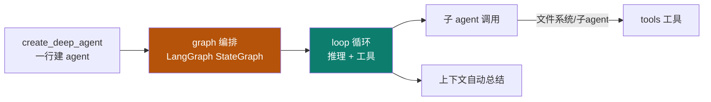
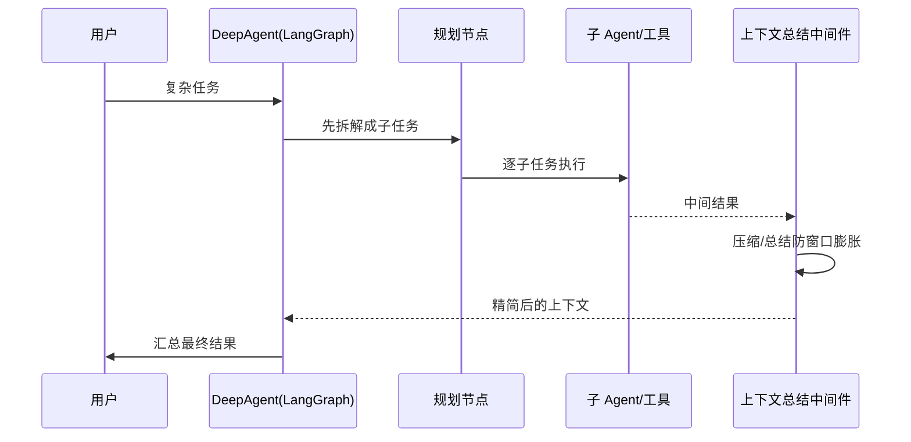
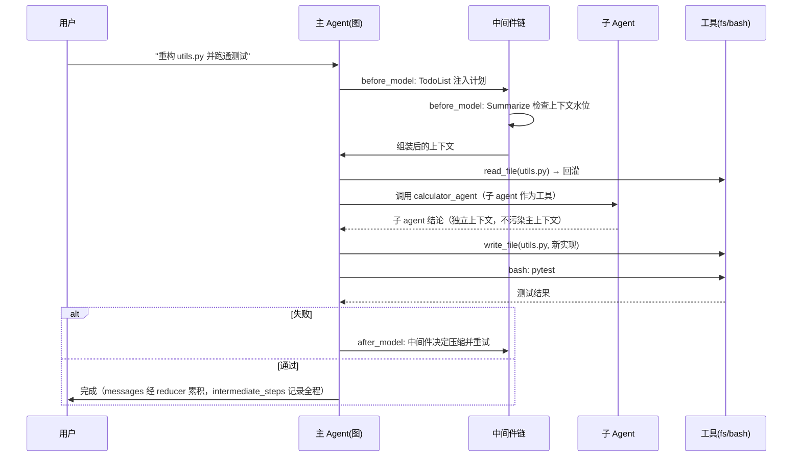

# DeepAgent

Track B 第二个实例：**LangChain `deepagents`**——基于 LangGraph + 中间件，`create_deep_agent` 一行建 agent。它是主轴里 **graph + loop** 的活教材。

::: tip 一句话
DeepAgent 证明"图编排"不只是概念：用 LangGraph 的状态图把**规划、子 agent、上下文总结**串起来，复杂 agent 也能声明式建出来。
:::

## 精确映射：本实例 × 主轴机制

DeepAgent 最凸显的工程层是 **graph + loop**：



| 本实例的具体件 | 对应主轴机制 | 章节 |
|---|---|---|
| `ContextSummarizationMiddleware(max_messages=30)` | compaction（超阈值压缩，防窗口膨胀） | [2-2](/concepts/context/design) |
| `subagents=[SubAgent(...)]` 包装成工具 | 子 agent 作为节点 / 工具 | [5-2](/concepts/graph/design) |
| `messages` / `intermediate_steps` 的 reducer | graph reducer（`add_messages` / `operator.add`） | [5-1](/concepts/graph/mechanism) |
| 推理循环 + 工具往返 | loop 五零件 | [4-1](/concepts/loop/mechanism) |
| 三 toolkit（fs / bash / interpreter） | 工具能力 + 沙箱执行 | [3-1](/concepts/harness/mechanism) |

## 中间件时序：一次带规划的执行



## 中间件机制（LangChain deepagents，【事实】）

`create_deep_agent` 通过 **middleware** 在 agent 节点前后挂载横切能力，用 `MiddlewareReturn.state_update` 写回 LangGraph 状态：

| 中间件 | 作用 |
|---|---|
| `ContextSummarizationMiddleware` | 消息超阈值（默认 30）时，对旧消息分组生成摘要并以 `SystemMessage` 替换，防窗口膨胀 |
| `ContextExtractionMiddleware` | 从对话提取结构化实体/状态写入 context（确定性，呼应 [02 DSE](/concepts/context/design)） |
| `SubAgentMiddleware` | 把子 agent 包装成 `StructuredTool`，父 agent 推理时看到"工具形式的子 agent" |
| `AsyncToolsMiddleware` | 把同步工具包装为异步，避免阻塞 |

**工具注册**：`create_deep_agent` 的 `tools` 参数接受三个预置 toolkit（`langchain_agentic_toolkits`）：

| Toolkit | 包含工具 |
|---|---|
| `fs_toolkit()` | read_file / write_file / list_directory / file_search |
| `interactive_bash_toolkit()` | 交互式 bash（持久 shell 会话） |
| `safe_code_interpreter_toolkit()` | 沙箱化 Python 执行（stdout/stderr） |

**手动上下文工具**：DeepAgent 暴露 `add_context(content, key)` / `delete_context(key)` 供 agent 跨轮次保留重要信息（写进 `context_manager`）。

**状态 channel**（与 [05 graph 的 reducer](/concepts/graph/mechanism) 互链，【事实】）：
- `messages: Annotated[list[BaseMessage], add_messages]` — 对话累积；
- `intermediate_steps: Annotated[list, operator.add]` — 工具执行记录累积；
- `context_manager` — 持久化工作记忆。

> 这说明 05 讲的 reducer（`operator.add`/`add_messages`）在真实框架里就是 `messages`、`intermediate_steps` 等键的合并规则——抽象概念落到真实现。

## `create_deep_agent` 可运行调用

以下代码依据 LangChain `deepagents` 公开 API（【事实】；具体签名以官方为准）。

```python
# 安装：pip install deepagents langchain
from deepagents import create_deep_agent, fs_toolkit, interactive_bash_toolkit
from deepagents.middleware import ContextSummarizationMiddleware, SubAgent
from langchain.chat_models import init_chat_model

model = init_chat_model("openai:gpt-4o")

# ① 三个预置 toolkit 直接解包进 tools
tools = [
    *fs_toolkit(),                 # 文件系统读写
    *interactive_bash_toolkit(),   # 持久 shell 会话
    # *safe_code_interpreter_toolkit(),  # 沙箱化 Python（可选）
]

# ② 子 agent：包装成"工具"供父 agent 调用
sub_calculator = create_deep_agent(
    model=model, tools=[],
    system_prompt="你是计算专家，只做数学计算。",
)

agent = create_deep_agent(
    model=model,
    tools=tools,
    # ③ 中间件：上下文自动总结（超 30 条消息即压缩，防窗口膨胀）
    middleware=[ContextSummarizationMiddleware(max_messages=30)],
    subagents=[SubAgent(
        name="calculator_agent",
        agent=sub_calculator,
        description="用于复杂数学计算。输入应是清晰的问题陈述。",
    )],
    system_prompt="你是主 agent，负责拆解任务并调度子 agent。",
)

# ④ 直接可 invoke（内部是 LangGraph 图）
result = agent.invoke({"messages": [("user", "帮我重构 utils.py 并跑通测试")]})
print(result["messages"][-1].content)
```

**这段代码印证了三条主轴机制**：

| 代码里的东西 | 对应主轴机制 |
|---|---|
| `middleware=[ContextSummarizationMiddleware(30)]` | 02 context 的 compaction（超阈值压缩） |
| `subagents=[SubAgent(...)]` 被包装成工具 | 04/05 的"子 agent 作为节点/工具" |
| `messages` / `intermediate_steps` 用 reducer 合并 | 05 graph 的 reducer 落真实键 |

**手动上下文管理**：agent 可调用 `add_context(content, key)` / `delete_context(key)` 跨轮次保留信息（写进 `context_manager`）。

### 上下文策略：它属于哪一类

DeepAgent 同时提供两条路径，恰好是 [2-2 决策三](/concepts/context/design) 中两种策略的分工示范：

| 机制 | 做法 | 对应策略 | 风险 |
|---|---|---|---|
| `add_context(content, key)` / `delete_context(key)` | 显式把**不可再生信息**（约束、决策、接口约定）以 key 存进 `context_manager`，**不进摘要** | **手动 DSE**（结构化保留、可断言） | 需人工判断"什么该留"；漏了没人提醒 |
| `ContextSummarizationMiddleware(max_messages=30)` | 超阈值时对旧消息**分组生成摘要**，以 `SystemMessage` 替换 | **LLM 摘要**（纯摘要，**无残余剔除**） | 默认形态接近 `llm_only`——只挂它、不用 `add_context`，约束类信息会被摘要掉（见 [2-2 坑③](/concepts/context/pitfalls)） |

> **正确用法**：`add_context` 先（把约束/决策/接口约定以 key 钉住）→ `SummarizationMiddleware` 只处理剩下的过程性消息。这正是 `hybrid` 的**手工版**：**先抽结构、再凝练残余**；颠倒过来（只靠摘要）就会踩坑③——两件事的默认值谁先谁后，直接决定约束保不保得住。

### 中间件链配置（+1 真实代码块）

多个中间件按注册顺序**环绕**每次模型调用（onion 模型），顺序决定横切行为：

```python
# 【示意实现】中间件链：顺序 = 横切执行顺序
from deepagents.middleware import (
    ContextSummarizationMiddleware,   # 超阈值压缩上下文
    TodoListMiddleware,               # 注入/维护待办清单
)

agent = create_deep_agent(
    model=model,
    tools=tools,
    middleware=[
        TodoListMiddleware(),                      # ① 先进：注入计划
        ContextSummarizationMiddleware(max_messages=30),  # ② 后进：临近调用前压缩
    ],
)
# 调用链：before_model(TodoList) → before_model(Summarize) → LLM
#         → after_model(Summarize) → after_model(TodoList)
```

### 子 agent 编排（LangGraph 视角，+1 真实代码块）

DeepAgent 内部就是一张 LangGraph 图：主 agent 是"规划+调度"节点，子 agent 被包装成可调用工具。

```python
# 【示意实现】把子 agent 显式接成图的节点（概念示意，API 以官方为准）
from langgraph.graph import StateGraph, START, END
from typing import Annotated, TypedDict
from langgraph.graph.message import add_messages

class State(TypedDict):
    messages: Annotated[list, add_messages]   # reducer：消息累积，不是覆盖
    todo: list                                 # 计划清单

def planner(state: State):
    return {"todo": ["读 utils.py", "重构", "跑测试"]}

def executor(state: State):
    # 内部可调用 calculator_agent（子 agent 作为工具）
    return {"messages": [("assistant", "executed step")]}

g = StateGraph(State)
g.add_node("planner", planner)
g.add_node("executor", executor)
g.add_edge(START, "planner")
g.add_conditional_edges("planner", lambda s: "executor" if s["todo"] else END,
                        {"executor": "executor", END: END})
g.add_edge("executor", END)
app = g.compile(checkpointer=MemorySaver())   # 挂 checkpointer 可续跑
```

::: info 【事实】
来源：[CSDN《LangChain deepagents 实践》](https://blog.csdn.net/weixin_44733966/article/details/156938858)（[S10](/practice/sources)）+ [LangChain 官方 API 文档](https://docs.langchain.com/oss/python/deepagents/overview)。上述调用为 **【示意实现】**（依来源归纳，非原文逐字复制，签名以官方为准）；"凸显 graph+loop"是本体系的结构化定位（【推断】）。详见 [事实源清单](/practice/sources)。
:::

## 端到端 trace：一次"重构 + 跑通测试"的生命周期



**三个可观察点**：① **子 agent 有独立上下文**（返回的只有结论，不带过程噪声）；② **中间件在每次模型调用前后环绕**（压缩、计划注入都在此发生）；③ **状态由 reducer 累积**（`messages`/`intermediate_steps` 不会互相覆盖）。

## 源码级深挖：三处关键实现

### ① 中间件接口：横切的统一挂载点

中间件是 DeepAgent 做"横切关注点"的机制——每个中间件可以在模型调用前后插入逻辑：

```python
# 【示意实现】自定义中间件：上下文水位监控 + 自动压缩
from deepagents.middleware import Middleware, ModelRequest, ModelResponse

class BudgetGuardMiddleware(Middleware):
    def __init__(self, warn: int = 20000, hard: int = 28000):
        self.warn, self.hard = warn, hard

    def before_model(self, req: ModelRequest) -> ModelRequest:
        """模型调用前：检查水位，超硬阈值就压缩。"""
        tokens = count_tokens(req.messages)
        if tokens >= self.hard:
            req.messages = compact(req.messages)       # 触发压缩（见 02）
        elif tokens >= self.warn:
            req.messages.append(system("提示：上下文接近上限，请尽快收敛任务。"))
        return req

    def after_model(self, resp: ModelResponse) -> ModelResponse:
        """模型调用后：记录用量，供成本控制。"""
        record_usage(resp.usage)
        return resp
```

```python
# 【示意实现】注册顺序 = 环绕顺序（洋葱模型）
agent = create_deep_agent(
    model=model, tools=tools,
    middleware=[
        BudgetGuardMiddleware(),                    # 最外层：先看到请求、最后看到响应
        TodoListMiddleware(),
        ContextSummarizationMiddleware(max_messages=30),  # 最内层：贴近模型
    ],
)
```
> **顺序陷阱**：洋葱模型下，**越靠后的中间件越贴近模型**。把"压缩"放在"注入计划"之后，会**把刚注入的计划一起压掉**——这是最常见的配置错误。

### ② 子 agent 的上下文隔离

子 agent 最大的价值不是"并行"，而是**上下文隔离**——它把一堆探索过程留在自己的窗口里，只把结论带回主 Agent：

```python
# 【示意实现】子 agent 封装：隔离上下文 + 限定工具 + 只回结论
def make_subagent(name, system_prompt, tools, model="cheap-model"):
    """子 agent 用更便宜的模型 + 更小的工具集，且返回摘要而非全量历史。"""
    inner = create_deep_agent(model=model, tools=tools, system_prompt=system_prompt)

    def call(task: str) -> str:
        result = inner.invoke({"messages": [("user", task)]})
        # 关键：只把"最终结论"带回主上下文，中间 20 轮探索全部丢弃
        return result["messages"][-1].content
    return {"name": name, "fn": call, "description": f"专门用于：{system_prompt[:40]}"}
```
> 这呼应 [03 harness 的 Agent 专业化](/concepts/harness/mechanism)：**专业化本身就是上下文管理策略**——子 agent 携带更少无关信息，运行在 Smart Zone 内。

### ③ 文件系统抽象：虚拟 FS 与真实 FS

`fs_toolkit()` 背后可以挂不同的后端——**后端选择直接决定"深任务"能否安全跑**：

| 后端 | 落地位置 | 适用 |
|---|---|---|
| 内存虚拟 FS | 进程内存 | 短任务、测试（进程结束即丢） |
| 本地磁盘（沙箱内） | 容器/沙箱目录 | 常规工程任务 |
| 带 checkpointer 的持久化 | 外部存储 | 长任务、需要续跑 |

```python
# 【示意实现】文件系统后端 + checkpoint 组合（长任务必需）
from langgraph.checkpoint.postgres import PostgresSaver

with PostgresSaver.from_conn_string(DB_URL) as cp:
    cp.setup()
    agent = create_deep_agent(
        model=model, tools=[*fs_toolkit(root="/workspace")],   # 沙箱内磁盘
        checkpointer=cp,                                        # 关键：可续跑
    )
    agent.invoke({"messages": [("user", task)]},
                 config={"configurable": {"thread_id": "task-42"}})
```
> 传 `checkpointer` 与固定 `thread_id` 后，**进程中断也能从断点续跑**——这正是 [03 harness 组件③ 持久化记忆](/concepts/harness/mechanism) 的框架级实现。

## 深入问答：为什么这样设计

**Q1：中间件为什么用"环绕"（before/after）而不是"钩子列表"？**
环绕保证**成对**——有 `before_model` 就一定有 `after_model`，资源申请与释放天然配对。钩子列表容易出现"有进无出"（记录开始了却没记录结束）。

**Q2：子 agent 为什么要用更便宜的模型？**
子任务通常**更聚焦、链路更短**，用最强模型是浪费；而且子 agent 可重试——一次失败的成本远低于主 agent。这是"把算力花在刀刃上"的成本结构设计。

**Q3：`messages` 为什么必须显式声明 reducer？**
图执行下**可能有多个节点并发写同一个键**。没有 reducer 时后写覆盖先写（历史丢失）；`add_messages` 把它变成"追加合并"。不声明 reducer 是隐性 bug（见 [5-1 reducer](/concepts/graph/mechanism)）。

**Q4：长任务为什么必须挂 checkpointer？**
图执行可能因中断、超时、崩溃而终止。没有 checkpoint，**已完成的全部工作与花费一起作废**；挂了之后可按 `thread_id` 从断点续跑。

## 局限与不适用场景

| 局限 | 说明 | 何时别用 |
|---|---|---|
| 生态耦合 | 构建在 LangChain / LangGraph 之上，版本一并演进，升级需整体跟 | 想避开 LangChain 依赖时 |
| 抽象层较多 | middleware / subagent / toolkit 多层嵌套，**调试链路长** | 简单单循环任务 |
| 嵌套放大成本 | 子 agent 作为工具会带来额外模型调用，**token 与延迟随嵌套层数放大** | 成本敏感或低延迟场景 |

**替代方案**：轻量单循环 → 直接用 [05 graph](/concepts/graph) 的 StateGraph 或裸 loop；需要完整权限外壳 → [Claude Code](/instances/claude-code) / [Codex](/instances/codex)。

## 常见坑与反模式

- **坑① 不挂 checkpointer 跑长任务**：进程中断即**全部丢失**，无法续跑。`compile(checkpointer=...)` 是长任务的必需品。
- **坑② 中间件顺序随手放**：中间件按注册顺序环绕调用，**顺序错会逻辑错**——例如把压缩放在"注入待办"之后，会把刚注入的计划一起压掉。
- **坑③ 子 agent 无节制嵌套**：subagent 里再开 subagent，token 指数上升。应限制嵌套深度并给每层设预算。
- **坑④ `messages` 忘了声明 reducer**：用普通 `list` 字段会被**整体覆盖**（历史丢失），必须 `Annotated[list, add_messages]`（见 [5-1 reducer](/concepts/graph/mechanism)）。

## 架构决策与取舍

| 决策 | 做法 | 放弃了什么 |
|---|---|---|
| **构建在 LangGraph 之上** | 直接复用图/状态/reducer/checkpoint | 独立性：绑定 LangChain 生态与版本 |
| **子 agent 包装成工具** | 主 agent 通过工具调用调度子 agent | 可控性：嵌套后调用链变长、难追踪 |
| **中间件环绕模型调用** | 压缩/待办等横切关注点插件化 | 调试复杂度：出错要穿透多层中间件 |
| **预置 toolkit** | fs / bash / interpreter 开箱可用 | 定制性：特殊工具仍需自己写 |

> 与 [Claude Code](/instances/claude-code) 的差异：DeepAgent 把"编排"做重（graph），Claude Code 把"约束"做重（harness）。

## 性能、成本与横向对比

| 维度 | DeepAgent | 参照对象 |
|---|---|---|
| token 开销 | 高：中间件 + 子 agent 嵌套放大 | 高于 [Hermes](/instances/hermes) / [OpenClaw](/instances/openclaw) |
| 延迟 | 高：每层子 agent 是一次额外模型往返 | 高于单循环框架 |
| 成本模型 | 随**嵌套深度**上升，需设预算上限 | 对应 [04 loop 三刹车](/concepts/loop/mechanism) |
| 定位 | 复杂编排（多 agent、多步骤） | vs [DeepSeek Harness](/instances/deepseek-harness)：都强扩展，DeepAgent 走"图编排"、DSH 走"插件化" |

## 小测验

::: details 点击展开题目与答案
**Q1（选择）**：DeepAgent 是基于哪个图框架构建的？  
A. React　B. LangGraph　C. Next.js  
✅ B。它用 LangGraph 的 StateGraph 做编排。

**Q2（判断）**：DeepAgent 的上下文自动总结，是为了把窗口撑得更大。  
❌ 错。是为了**防止窗口被长任务膨胀**，压缩后保住预算（呼应 02 context）。

**Q3（选择）**：`create_deep_agent` 的价值是？  
A. 必须手写所有节点　B. 一行建出基于图的复杂 agent　C. 只能做单循环  
✅ B。
:::

## 三档自检

| 档位 | 你能做到 | 判据（怎么算达标） |
|---|---|---|
| 了解 | 说出 DeepAgent 基于 LangGraph，凸显 graph+loop | 说得出它用"图"承载编排、用"中间件"承载横切 |
| 熟悉 | 解释"规划节点 → 子 agent → 上下文总结"的中间件时序 | 能指出中间件**顺序**如何影响结果（先注入 vs 先压缩） |
| 精通 | 建一个带规划 + 子 agent + 上下文总结的可跑工程 | `messages` 属性定义**忘写 reducer 时会丢失历史**，你能识别并修正；长任务挂上 checkpointer 后可续跑 |

> 上一实例：[Hermes](./hermes) ｜ 相关概念：[04 loop](/concepts/loop) · [05 graph](/concepts/graph) ｜ 下一实例：[OpenClaw](./openclaw)
