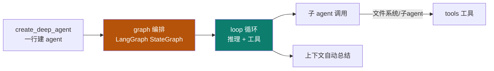
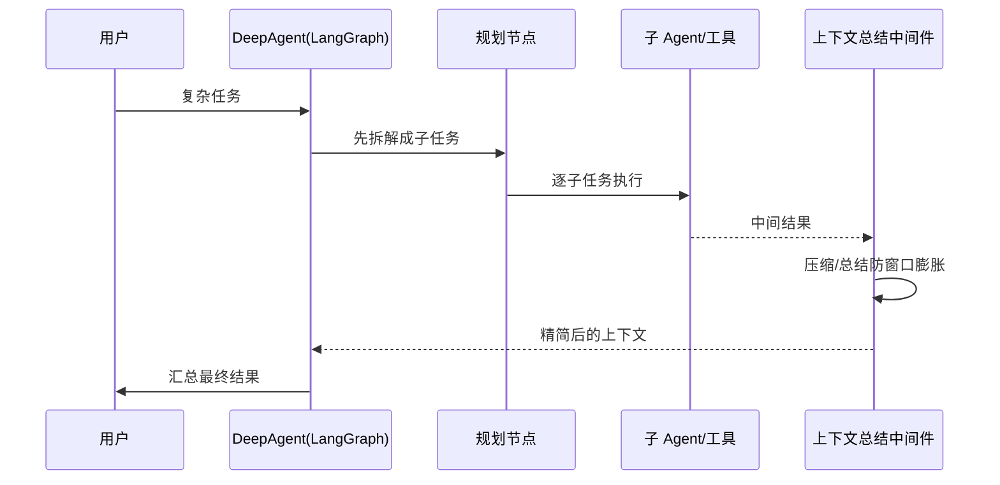

# DeepAgent

Track B 第二个实例：**LangChain `deepagents`**——基于 LangGraph + 中间件，`create_deep_agent` 一行建 agent。它是主轴里 **graph + loop** 的活教材。

::: tip 一句话
DeepAgent 证明"图编排"不只是概念：用 LangGraph 的状态图把**规划、子 agent、上下文总结**串起来，复杂 agent 也能声明式建出来。
:::

## 实例 × 工程层映射

DeepAgent 最凸显的工程层是 **graph + loop**：

| 主轴层 | DeepAgent 里的落地 |
|---|---|
| loop | 推理循环、工具往返 |
| graph | LangGraph 状态图、多节点编排 |
| context | 上下文自动总结（防膨胀） |
| tool | 文件系统工具、子 agent 作为工具 |

## 中间件时序：一次带规划的执行

## 可跑工程：规划 + 子 agent + 上下文总结

1. 安装 `langchain-deepagents`，用 `create_deep_agent` 建 agent。
2. 给它配一个"规划节点"（拆任务）与若干子 agent/工具。
3. 开启上下文自动总结中间件，观察窗口不因长任务膨胀。

::: info 【事实】
来源：csdn 博客《LangChain deepagents》。具体 API（`create_deep_agent`、中间件配置）以 LangChain 官方文档 / 源码为准；"凸显 graph+loop"是本体系的结构化定位（【推断】）。
:::

## 小测验

::: details 点击展开题目与答案
**Q1（选择）**：DeepAgent 是基于哪个图框架构建的？  
A. React　B. LangGraph　C. Next.js  
✅ B。它用 LangGraph 的 StateGraph 做编排。

**Q2（判断）**：DeepAgent 的上下文自动总结，是为了把窗口撑得更大。  
❌ 错。是为了**防止窗口被长任务膨胀**，压缩后保住预算（呼应 02 context）。

**Q3（选择）**：`create_deep_agent` 的价值是？  
A. 必须手写所有节点　B. 一行建出基于图的复杂 agent　C. 只能做单循环  
✅ B。
:::

## 三档自检

| 档位 | 你能做到 |
|---|---|
| 了解 | 说出 DeepAgent 基于 LangGraph，凸显 graph+loop |
| 熟悉 | 能解释"规划节点 → 子 agent → 上下文总结"的中间件时序 |
| 精通 | 能建一个带规划 + 子 agent + 上下文总结的可跑工程 |

> 上一实例：[Hermes](./hermes) ｜ 相关概念：[04 loop](/concepts/loop) · [05 graph](/concepts/graph) ｜ 下一实例：[OpenClaw](./openclaw)
