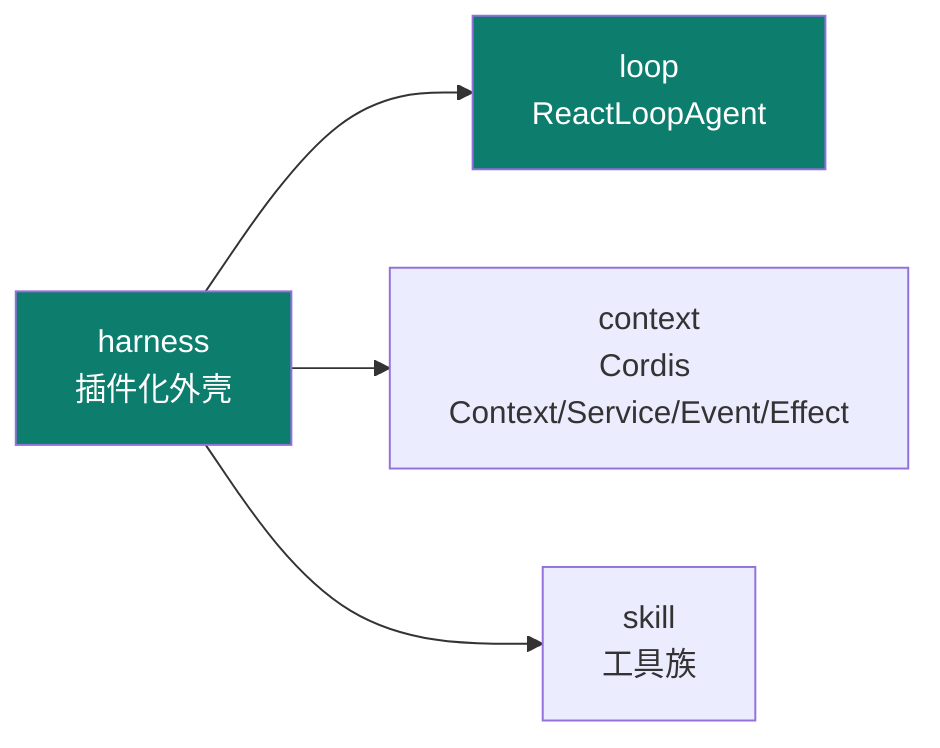
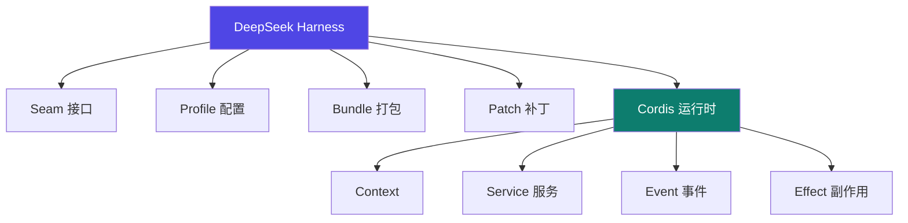

# DeepSeek Harness

Track B 第六个实例：**deepseek-ai 的插件化 Agent Harness**（基于 Cordis）。它把"**一切皆插件**"做到极致——Context / Service / Event / Effect 全是可插拔单元，是 06 skill 体系架构的工程化范本。

::: tip 一句话
DeepSeek Harness 告诉你 harness 可以"长满插件"：连上下文、服务、事件、副作用都插件化。改能力不是改核心，而是**插一个插件**。
:::

## 实例 × 工程层映射

DeepSeek Harness 最凸显的工程层是 **harness + loop**：

| 主轴层 | DeepSeek Harness 里的落地 |
|---|---|
| context | Cordis Context / Service / Event / Effect |
| harness | 一切皆插件、Seam/Profile/Bundle/Patch |
| loop | ReactLoopAgent |
| skill | 工具族 |

## 插件树 / Cordis 结构

- **Context / Service / Event / Effect**：context 承载状态，service 提供能力，event 响应事件，effect 处理副作用——四者皆可插件化。
- **Seam / Profile / Bundle / Patch**：接口、配置、打包、补丁四个扩展维度。

## 三阶段工具流水线

## 安装并搭一个插件化 agent

1. 按官方文档安装 DeepSeek Harness 与 Cordis 运行时。
2. 新建一个最小插件（实现一个 Service），观察其被 Cordis 自动装配。
3. 用 ReactLoopAgent 驱动，挂上工具族，跑一个多轮任务。

::: info 【事实】
来源：官方 github.com/deepseek-ai/deepseek-harness（everything-is-a-plugin、Cordis、developer preview、MIT）；iceyao 源码解析（辅）。ReactLoopAgent 等实现细节以官方文档/源码核对为准；"凸显 harness+loop"是本体系的结构化定位（【推断】）。
:::

## 小测验

::: details 点击展开题目与答案
**Q1（选择）**：DeepSeek Harness 的核心设计哲学是？  
A. 一切写死在核心　B. 一切皆插件　C. 只支持一种 IM  
✅ B。基于 Cordis，把能力全插件化。

**Q2（选择）**：Cordis 的四个基本元素是？  
A. Context/Service/Event/Effect　B. CPU/GPU/TPU/NPU　C. Node/Edge/State/Reducer  
✅ A。

**Q3（判断）**：改 DeepSeek Harness 的能力必须改核心代码。  
❌ 错。用插件扩展即可，核心不动。
:::

## 三档自检

| 档位 | 你能做到 |
|---|---|
| 了解 | 说出 DeepSeek Harness 基于 Cordis、"一切皆插件"，凸显 harness+loop |
| 熟悉 | 能画出 Context/Service/Event/Effect 与 Seam/Profile/Bundle/Patch 结构 |
| 精通 | 能新建一个 Cordis 插件并搭出插件化 agent，理解核心-外挂的扩展模型 |

> 上一实例：[Codex](./codex) ｜ 相关概念：[02 context](/concepts/context) · [03 harness](/concepts/harness) · [04 loop](/concepts/loop) · [06 skill](/concepts/skill) ｜ 进阶：见 [Track C · 统一对比矩阵](/practice/compare)