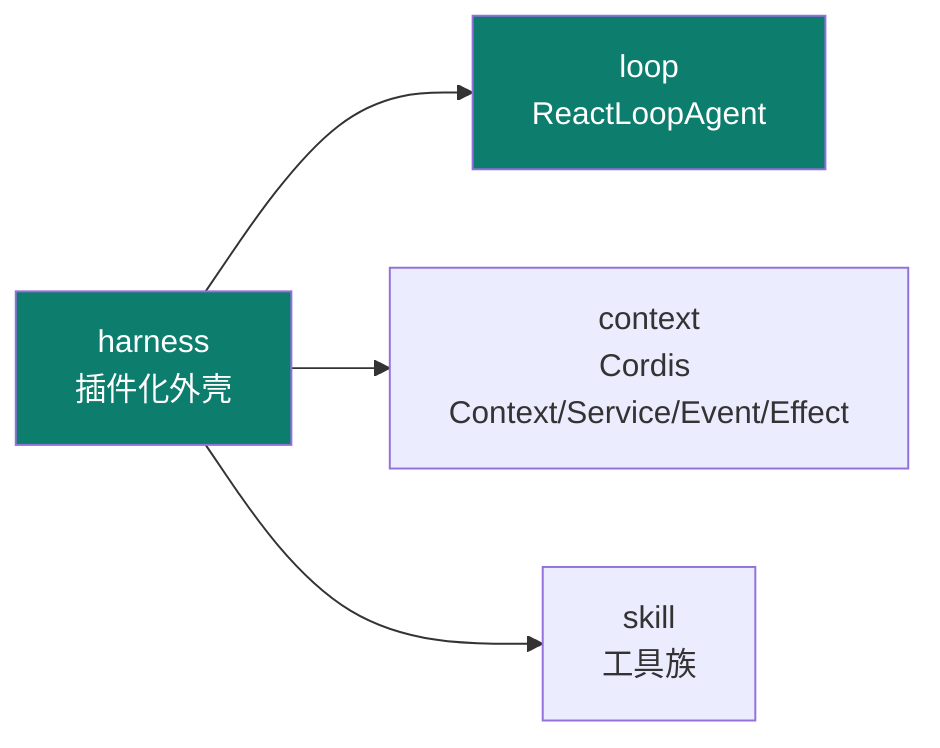
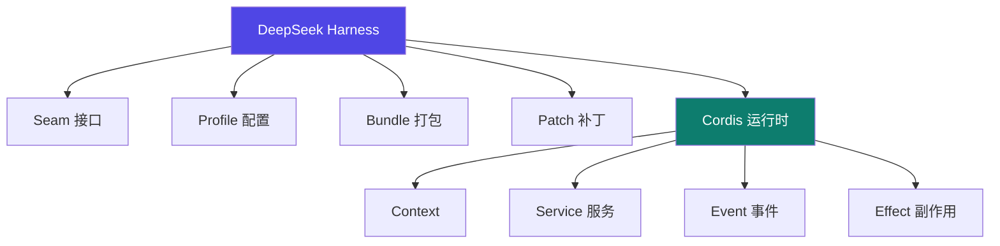
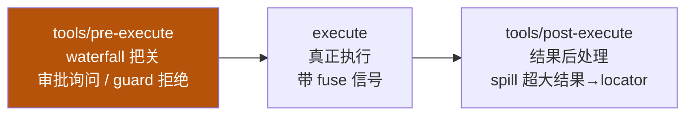

# DeepSeek Harness

Track B 第六个实例：**deepseek-ai 的插件化 Agent Harness**（基于 Cordis）。它把"**一切皆插件**"做到极致——Context / Service / Event / Effect 全是可插拔单元，是 06 skill 体系架构的工程化范本。

::: tip 一句话
DeepSeek Harness 告诉你 harness 可以"长满插件"：连上下文、服务、事件、副作用都插件化。改能力不是改核心，而是**插一个插件**。
:::

## 实例 × 工程层映射

DeepSeek Harness 最凸显的工程层是 **harness + loop**：



| 主轴层 | DeepSeek Harness 里的落地 |
|---|---|
| context | Cordis Context / Service / Event / Effect |
| harness | 一切皆插件、Seam/Profile/Bundle/Patch |
| loop | ReactLoopAgent |
| skill | 工具族 |

## 插件树 / Cordis 结构



- **Context / Service / Event / Effect**：context 承载状态，service 提供能力，event 响应事件，effect 处理副作用——四者皆可插件化。
- **Seam / Profile / Bundle / Patch**：接口、配置、打包、补丁四个扩展维度。

## 工具流水线（真实三阶段，源码为准）

::: warning 勘误
此前本站把流水线写成"声明/注册 → 组装/绑定 → 执行/回填"，那是**自创的**，与源码不符。iceyao 源码解析给出的真实三阶段如下（【事实】）：
:::



| 阶段 | 事件 | 作用 |
|---|---|---|
| `tools/pre-execute` | waterfall | 审批服务在此询问、guard 在此**拒绝** |
| `execute` | — | 真正执行工具，带 fuse 中断信号 |
| `tools/post-execute` | — | 结果后处理；**spill** 把超大结果替换成 locator |

## 源码级：`ReactLoopAgent` 主循环

最小执行单元定义精确：**一个 step = 一次模型请求 + 它调用的工具**；一个 **turn 包含 0..n 个 step**，在领取首条输入时打开、不再欠工作时关闭（iceyao 源码，【事实】）。

```ts
// packages/core/agent-loop/src/agent.ts（简化）
private async kick() {
  while (await this.turn()) {}          // turn 返回 false 即收敛
}

private async turn(): Promise<boolean> {
  this.session.append('turn/start', { turn })
  while (true) {
    const decision = await this.preStep(target, { turn, step })  // agent/pre-step 瀑布
    this.session.append('step/start', { turn, step })
    await this.step(decision.assembly)                            // 模型调用 + 工具执行
    this.session.append('step/end', { turn, step })
    // 工具欠一个请求、或新输入到达 → 继续下一 step；否则 break
  }
  this.session.append('turn/end', { turn, reason })
}
```
> 关键顺序：**每一拍先写日志再执行**——这是"模型可见即已记录"不变量的根基（呼应 [02 context 的可审计压缩](/concepts/context/design)）。

## 源码级：事件溯源 + 投影（session 即唯一事实来源）

```ts
// packages/core/session/src/types.ts（简化）
export type SessionEvent = {
  type: SessionEventType
  seq: number          // 严格等于数组下标
  time: number
  data: SessionEventMap[typeof type]
  ignorable?: true
}

// deriveMessages()：增量投影（简化）
for (const seq of nodes.slice(this.derivedNodes)) {
  const msg = this.deriveEventMessage(this.log[seq]!)
  if (msg) this.derived.push(msg)       // 只投影 surface 消息进模型历史
}
```
> 模型历史**不是另存一份数据**，而是从 append-only 日志**投影**出来的：只有 `user/message`、`assistant/message`、`tool/result` 三类 surface 事件进上下文；流式 `assistant/chunk` 只用于回放保真，不占上下文预算。

## 安装并搭一个插件化 agent

1. 按官方文档安装 DeepSeek Harness 与 Cordis 运行时（`npx @deepseek-ai/dsh web`，默认仅回环 `127.0.0.1:3080`）。
2. 新建一个最小插件（实现一个 Service），观察其被 Cordis 自动装配。
3. 用 `ReactLoopAgent` 驱动，挂上工具族，跑一个多轮任务并观察 session 事件流。

::: info 【事实】
来源：官方 github.com/deepseek-ai/deepseek-harness（everything-is-a-plugin、Cordis、developer preview、MIT）+ iceyao《DeepSeek Harness 源码深度解析》（上述 `ReactLoopAgent` / session 事件 / 工具流水线代码均引自该文对源码的拆解，已核对）。"凸显 harness+loop"是本体系的结构化定位（【推断】）。
:::

## 小测验

::: details 点击展开题目与答案
**Q1（选择）**：DeepSeek Harness 的核心设计哲学是？  
A. 一切写死在核心　B. 一切皆插件　C. 只支持一种 IM  
✅ B。基于 Cordis，把能力全插件化。

**Q2（选择）**：Cordis 的四个基本元素是？  
A. Context/Service/Event/Effect　B. CPU/GPU/TPU/NPU　C. Node/Edge/State/Reducer  
✅ A。

**Q3（判断）**：改 DeepSeek Harness 的能力必须改核心代码。  
❌ 错。用插件扩展即可，核心不动。
:::

## 三档自检

| 档位 | 你能做到 |
|---|---|
| 了解 | 说出 DeepSeek Harness 基于 Cordis、"一切皆插件"，凸显 harness+loop |
| 熟悉 | 能画出 Context/Service/Event/Effect 与 Seam/Profile/Bundle/Patch 结构 |
| 精通 | 能新建一个 Cordis 插件并搭出插件化 agent，理解核心-外挂的扩展模型 |

> 上一实例：[Codex](./codex) ｜ 相关概念：[02 context](/concepts/context) · [03 harness](/concepts/harness) · [04 loop](/concepts/loop) · [06 skill](/concepts/skill) ｜ 进阶：见 [Track C · 统一对比矩阵](/practice/compare)