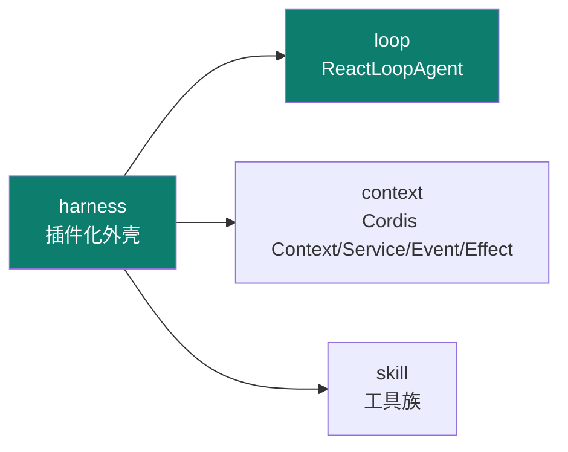
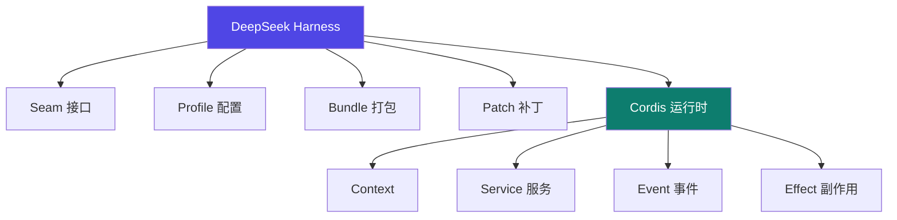
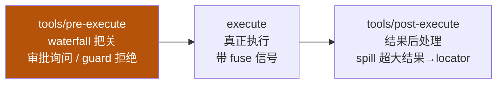

# DeepSeek Harness

Track B 第六个实例：**deepseek-ai 的插件化 Agent Harness**（基于 Cordis）。它把"**一切皆插件**"做到极致——Context / Service / Event / Effect 全是可插拔单元，是 06 skill 体系架构的工程化范本。

::: tip 一句话
DeepSeek Harness 告诉你 harness 可以"长满插件"：连上下文、服务、事件、副作用都插件化。改能力不是改核心，而是**插一个插件**。
:::

## 精确映射：本实例 × 主轴机制

DeepSeek Harness 最凸显的工程层是 **harness + loop**：



| 本实例的具体件 | 对应主轴机制 | 章节 |
|---|---|---|
| `session` 事件溯源 + `deriveMessages` 投影 | 可审计压缩（append-only + `surfaceOp=replace`） | [2-2](/concepts/context/design) |
| `spill` 超大结果 → locator | 预算控制 / spill（存全文、注入预览） | [2-1](/concepts/context/mechanism) |
| `tools/pre-execute` 审批与 guard 拒绝 | 权限矩阵（工具执行前把关） | [3-1](/concepts/harness/mechanism) |
| `ReactLoopAgent` 的 turn / step | loop 最小执行单元（step=一次模型请求+其工具） | [4-1](/concepts/loop/mechanism) |
| Cordis 插件（Context/Service/Event/Effect） | 能力扩展（一切皆插件） | [06](/concepts/skill) |

## 插件树 / Cordis 结构



- **Context / Service / Event / Effect**：context 承载状态，service 提供能力，event 响应事件，effect 处理副作用——四者皆可插件化。
- **Seam / Profile / Bundle / Patch**：接口、配置、打包、补丁四个扩展维度。

## 工具流水线（真实三阶段，源码为准）

::: warning 勘误
此前本站把流水线写成"声明/注册 → 组装/绑定 → 执行/回填"，那是**自创的**，与源码不符。iceyao 源码解析给出的真实三阶段如下（【事实】）。下方 TS 片段为**对源码的简化转写（【示意实现】）**，非原文逐字复制。
:::



| 阶段 | 事件 | 作用 |
|---|---|---|
| `tools/pre-execute` | waterfall | 审批服务在此询问、guard 在此**拒绝** |
| `execute` | — | 真正执行工具，带 fuse 中断信号 |
| `tools/post-execute` | — | 结果后处理；**spill** 把超大结果替换成 locator |

## 源码级：三处关键实现

以下三处是 DeepSeek Harness 最值得读的源码位置（均引自 [S7](/practice/sources) 对源码的拆解）。

### ① 主循环 `ReactLoopAgent`

最小执行单元定义精确：**一个 step = 一次模型请求 + 它调用的工具**；一个 **turn 包含 0..n 个 step**，在领取首条输入时打开、不再欠工作时关闭（iceyao 源码，【事实】）。

```ts
// packages/core/agent-loop/src/agent.ts（简化）
private async kick() {
  while (await this.turn()) {}          // turn 返回 false 即收敛
}

private async turn(): Promise<boolean> {
  this.session.append('turn/start', { turn })
  while (true) {
    const decision = await this.preStep(target, { turn, step })  // agent/pre-step 瀑布
    this.session.append('step/start', { turn, step })
    await this.step(decision.assembly)                            // 模型调用 + 工具执行
    this.session.append('step/end', { turn, step })
    // 工具欠一个请求、或新输入到达 → 继续下一 step；否则 break
  }
  this.session.append('turn/end', { turn, reason })
}
```
> 关键顺序：**每一拍先写日志再执行**——这是"模型可见即已记录"不变量的根基（呼应 [02 context 的可审计压缩](/concepts/context/design)）。

### ② 事件溯源 + 投影（session 即唯一事实来源）

```ts
// packages/core/session/src/types.ts（简化）
export type SessionEvent = {
  type: SessionEventType
  seq: number          // 严格等于数组下标
  time: number
  data: SessionEventMap[typeof type]
  ignorable?: true
}

// deriveMessages()：增量投影（简化）
for (const seq of nodes.slice(this.derivedNodes)) {
  const msg = this.deriveEventMessage(this.log[seq]!)
  if (msg) this.derived.push(msg)       // 只投影 surface 消息进模型历史
}
```
> 模型历史**不是另存一份数据**，而是从 append-only 日志**投影**出来的：只有 `user/message`、`assistant/message`、`tool/result` 三类 surface 事件进上下文；流式 `assistant/chunk` 只用于回放保真，不占上下文预算。

### ③ Cordis 插件（一切皆插件）

"everything is a plugin" 落到代码，就是**实现一个 Service 并让 Cordis 自动装配**：

```ts
// 【示意实现】最小 Cordis 插件：typing-service
import { Service } from '@cordisjs/core'

export default class TypingService extends Service {
  static [Service.provide] = 'typing'          // 声明提供的能力名
  static [Service.inject] = ['database']       // 声明依赖（Cordis 按此装配顺序）

  async typing(text: string): Promise<string> {
    const db = this.ctx.database                 // 注入的依赖
    return db.normalize(text)
  }
}
// 注册即生效、卸载即撤销：插件树由 Cordis 按依赖关系自动装配/拆除
```

## 安装并搭一个插件化 agent

1. 按官方文档安装 DeepSeek Harness 与 Cordis 运行时（`npx @deepseek-ai/dsh web`，默认仅回环 `127.0.0.1:3080`）。
2. 新建一个最小插件（实现一个 Service，如上），观察其被 Cordis 自动装配。
3. 用 `ReactLoopAgent` 驱动，挂上工具族，跑一个多轮任务并观察 session 事件流。

::: info 【事实】
来源：官方 [github.com/deepseek-ai/deepseek-harness](https://github.com/deepseek-ai/deepseek-harness)（everything-is-a-plugin、Cordis、developer preview、MIT）+ [iceyao《DeepSeek Harness 源码深度解析》](https://www.iceyao.com.cn/post/2026-08-13-deepseek-harness%E6%BA%90%E7%A0%81%E6%B7%B1%E5%BA%A6%E8%A7%A3%E6%9E%90/)（[S7](/practice/sources)；上述 `ReactLoopAgent` / session 事件 / 工具流水线代码均引自该文对源码的拆解，已核对）+ [ChesterXue《deepseek harness 解析》](https://blog.csdn.net/ChesterXue/article/details/163745888)（[S6](/practice/sources)）。"凸显 harness+loop"是本体系的结构化定位（【推断】）。详见 [事实源清单](/practice/sources)。
:::

## 局限与不适用场景

| 局限 | 说明 | 何时别用 |
|---|---|---|
| **developer preview** | 插件协议与 API 尚未稳定，破坏性变更可能发生 | 需要长期稳定接口的生产系统 |
| 学习曲线陡 | 要同时掌握 **Cordis 插件树** + **事件溯源投影** 两套心智模型 | 团队只有很少时间投入时 |
| 文档/社区尚薄 | 中文资料集中在少数几篇解析，官方文档仍在补 | 需要成熟社区支持时 |

**替代方案**：需要稳定生产接口与丰富生态 → [Claude Code](/instances/claude-code) / [Codex](/instances/codex)；需要多通道部署 → [OpenClaw](/instances/openclaw)。

## 常见坑与反模式

- **坑① 把 `session` 当普通消息数组改**：直接改历史会**破坏 append-only 不变量**，导致投影失真、无法回放。压缩必须走"追加 `replace` 事件 + 重建投影"（见上文 `compact`）。
- **坑② spill 后没给模型"取回"手段**：把超大结果换成 locator 后，若模型没有读取全文的工具，信息等于**永久丢失**。locator 必须配一个"按 key 取全文"的工具。
- **坑③ 插件依赖声明写错**：Cordis 按 `Service.inject` 决定装配顺序，依赖写错/循环依赖会导致**启动期装配失败**，且报错位置离现场较远。
- **坑④ 混淆 step 与 turn**：一个 **turn 含 0..n 个 step**，一个 **step = 一次模型请求 + 其工具调用**。把两者当同一层会导致刹车与预算记账错位（见 [4-1](/concepts/loop/mechanism)）。

## 架构决策与取舍

| 决策 | 做法 | 放弃了什么 |
|---|---|---|
| **一切皆插件（Cordis）** | 核心最小化，能力全靠插件树装配 | 上手成本：要理解插件树与依赖声明 |
| **session 事件溯源 + 投影** | append-only 日志，模型历史是投影 | 存储与投影开销；需维护投影一致性 |
| **spill 巨型结果 → locator** | 超预算结果存全文、上下文只放指针 | 二次往返：模型须有工具取回全文 |
| **turn / step 两级执行** | step = 一次模型请求 + 其工具 | 概念负担：混淆两级会导致记账与刹车错位 |

> 与 [Claude Code](/instances/claude-code) 的本质差异：Claude Code 把能力写在**配置与 hook**里，DeepSeek 把能力写在**插件**里——**配置 vs 插件**是两种扩展哲学。

## 性能、成本与横向对比

| 维度 | DeepSeek Harness | 参照对象 |
|---|---|---|
| token 开销 | 中：spill 机制**主动控预算**，是六者中最省的之一 | 优于 [DeepAgent](/instances/deepagent) 的嵌套放大 |
| 延迟 | 中：插件装配在启动期，运行期开销小 | 但 spill 的二次取回会加一次往返 |
| 成本模型 | 低-中：事件溯源不重复存消息 | 优于把历史另存一份的实现 |
| 定位 | 插件化自研底座（preview） | vs [DeepAgent](/instances/deepagent)：DSH 强"插件组装"、DeepAgent 强"图编排" |

## 小测验

::: details 点击展开题目与答案
**Q1（选择）**：DeepSeek Harness 的核心设计哲学是？  
A. 一切写死在核心　B. 一切皆插件　C. 只支持一种 IM  
✅ B。基于 Cordis，把能力全插件化。

**Q2（选择）**：Cordis 的四个基本元素是？  
A. Context/Service/Event/Effect　B. CPU/GPU/TPU/NPU　C. Node/Edge/State/Reducer  
✅ A。

**Q3（判断）**：改 DeepSeek Harness 的能力必须改核心代码。  
❌ 错。用插件扩展即可，核心不动。
:::

## 三档自检

| 档位 | 你能做到 | 判据（怎么算达标） |
|---|---|---|
| 了解 | 说出 DeepSeek Harness 基于 Cordis、"一切皆插件"，凸显 harness+loop | 说得出 Context/Service/Event/Effect 四类插件单元各是什么 |
| 熟悉 | 画出 Context/Service/Event/Effect 与 Seam/Profile/Bundle/Patch 结构 | 能指出"压缩"在事件溯源里是**追加 replace 事件**，而非改旧事件 |
| 精通 | 新建一个 Cordis 插件并搭出插件化 agent，理解核心-外挂的扩展模型 | 插件 `Service.inject` 依赖写错时能定位**启动期装配失败**；能区分 step 与 turn |

> 上一实例：[Codex](./codex) ｜ 相关概念：[02 context](/concepts/context) · [03 harness](/concepts/harness) · [04 loop](/concepts/loop) · [06 skill](/concepts/skill) ｜ 进阶：见 [Track C · 统一对比矩阵](/practice/compare)