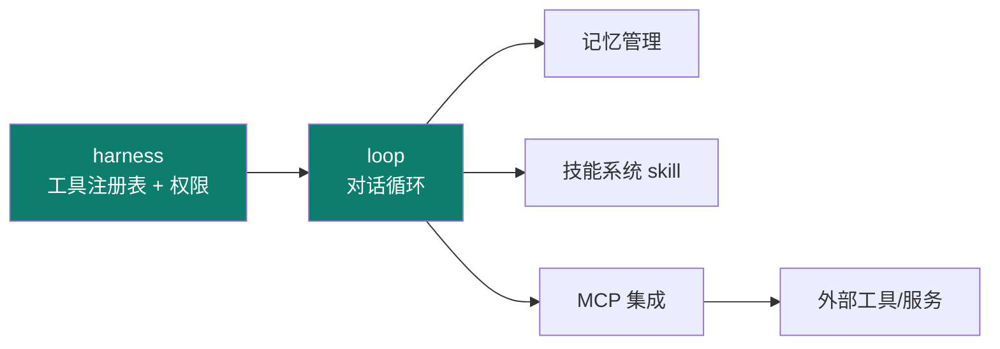
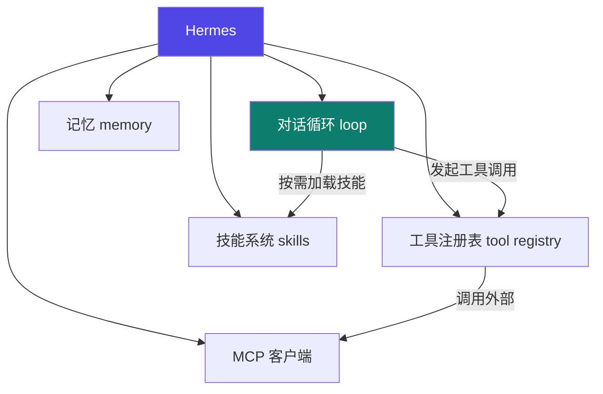

# Hermes

Track B 第一个实例：**NousResearch 开源 Python agent 框架**（注意：是框架，不是模型）。用它把前面主轴讲过的 harness / loop 落到真实代码。

::: tip 一句话
Hermes 是一个**可运行的 Python agent 框架**，把"对话循环、工具注册表、技能系统、记忆、MCP"这些零件都实现了——你改的不是模型，而是**承载它的 harness 与 loop**。
:::

## 精确映射：本实例 × 主轴机制

Hermes 最凸显的工程层是 **harness + loop**：



| 本实例的具体件 | 对应主轴机制 | 章节 |
|---|---|---|
| `@tool_registry.register(..., permission=...)` | 权限矩阵（登记 → 参数校验 → 权限拦截） | [3-1](/concepts/harness/mechanism) |
| 对话循环（`llm.chat` → `registry.invoke` → 回填） | loop 五零件（Prompter/Agent/工具/Verifier） | [4-1](/concepts/loop/mechanism) |
| System Prompt 工程模块 | prompt 分层拼装（人设/工具/纪律分段） | [1-2](/concepts/prompt/basics) |
| 上下文管理与记忆读写 | 记忆分层（工作记忆 / 长期） | [2-1](/concepts/context/mechanism) |
| 技能系统 / MCP / Gateway | 能力扩展（横切） | [06](/concepts/skill) |

## 组成框图：Hermes 的核心模块



## 源码导读：最值得看的两处

### ① 工具注册表（tool registry）—— harness 的权限落点

工具在 Hermes 里以**声明式 schema 注册**，由注册表统一登记、校验参数、并在 harness 授权后才执行。典型形态（依据 NousResearch/hermes-agent 的工具注册机制，【事实】；具体装饰器/类名以你拉取的源码版本为准）：

```python
# 示意：把一个函数登记为 agent 可调用的工具
@tool_registry.register(
    name="read_file",
    description="读取指定路径的文件内容（只读，不改文件）",
    params={"path": "str"},
    permission="read",          # 权限标签：由 harness 的 allow/deny 判定
)
def read_file(path: str) -> str:
    with open(path, encoding="utf-8") as f:
        return f.read()
```

注册后发生三件事（这正是 [03 harness](/concepts/harness) 的机制落点）：
1. **登记入表**：agent 在 system prompt 里看到该工具的 schema（名称 + 描述 + 参数）；
2. **参数校验**：调用前由注册表按 `params` 校验，非法参数直接拒绝，不进模型；
3. **权限拦截**：`permission="read"` 与 harness 的 allow/deny 矩阵比对，越权调用被**确定性拒绝**（呼应 [3-1 权限矩阵](/concepts/harness/mechanism)）。

> 要点：**工具不是"模型想调就能调"**——注册表 + 权限是 harness 的硬边界。

### ② 对话循环（loop）—— 五零件的真实串联

每一轮"思考 → 工具调用 → 结果回填 → 验证"的骨架：

```python
def run_turn(user_input, tools, max_iter=10):
    messages = [{"role": "user", "content": user_input}]
    for i in range(max_iter):                       # 刹车1：迭代上限
        resp = llm.chat(messages, tools=tools)      # Agent 推理
        if not resp.tool_calls:                     # 无工具调用 → 直接作答
            return resp.content
        for call in resp.tool_calls:
            result = registry.invoke(call)          # 经注册表（含权限校验）
            messages.append(tool_result_msg(call, result))
        # 结果回填 messages，进入下一轮 → 直到模型不再要工具或触顶
    return "达到迭代上限，已停止"                      # 刹车2：兜底
```
> 对应 [04 loop 五零件](/concepts/loop)：`messages` 是 **Prompter 组装的产物**，`llm.chat` 是 **Agent 执行**，`registry.invoke` 受 **harness 权限**约束，`max_iter` 是**三刹车之一**。这段把 03 与 04 串在了一起。

## 跑起来 + 扩展一个工具/技能

1. 克隆仓库，按其 README 装依赖、配模型（按【建议】官方步骤执行）。
2. 先跑通默认对话循环，观察 loop 与工具往返日志。
3. 扩展：新增一个自定义工具注册进注册表，或写一个新技能让其被按需加载。

::: info 【事实】
来源：github.com/luyao618/Hermes-Source-Code-Study（指向 NousResearch/hermes-agent）。具体接口以官方 README / 源码为准；"凸显 harness+loop"是本体系的结构化定位（【推断】）。
:::

## 小测验

::: details 点击展开题目与答案
**Q1（判断）**：Hermes 是一个开源的 LLM 模型。  
❌ 错。它是 **agent 框架**，承载 LLM 运行，不是模型本身。

**Q2（选择）**：Hermes 最凸显的工程层是？  
A. prompt　B. harness + loop　C. 仅 graph  
✅ B。

**Q3（选择）**：要了解"工具如何在受限环境被授权执行"，应重点读哪部分？  
A. 工具注册表　B. 记忆模块　C. 技能加载  
✅ A。
:::

## 三档自检

| 档位 | 你能做到 |
|---|---|
| 了解 | 说出 Hermes 是框架而非模型，列出其核心模块（循环/工具/技能/记忆/MCP） |
| 熟悉 | 能指出工具注册表与对话循环各对应主轴的哪个工程层 |
| 精通 | 能给 Hermes 新增一个工具并跑通，或扩展一个技能被按需加载 |

> 相关概念：[03 harness](/concepts/harness) · [04 loop](/concepts/loop) ｜ 下一实例：[DeepAgent](./deepagent)
