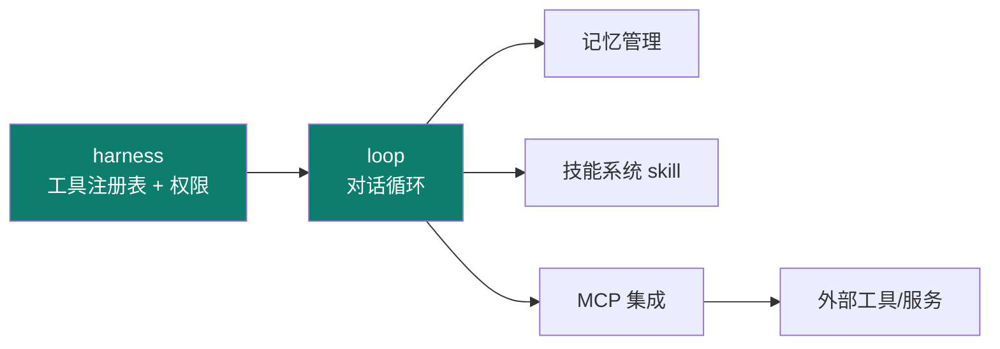
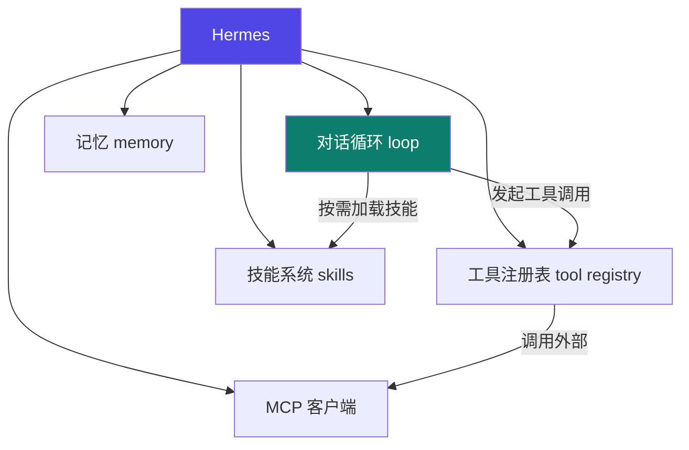

# Hermes

Track B 第一个实例：**NousResearch 开源 Python agent 框架**（注意：是框架，不是模型）。用它把前面主轴讲过的 harness / loop 落到真实代码。

::: tip 一句话
Hermes 是一个**可运行的 Python agent 框架**，把"对话循环、工具注册表、技能系统、记忆、MCP"这些零件都实现了——你改的不是模型，而是**承载它的 harness 与 loop**。
:::

## 精确映射：本实例 × 主轴机制

Hermes 最凸显的工程层是 **harness + loop**：



| 本实例的具体件 | 对应主轴机制 | 章节 |
|---|---|---|
| `@tool_registry.register(..., permission=...)` | 权限矩阵（登记 → 参数校验 → 权限拦截） | [3-1](/concepts/harness/mechanism) |
| 对话循环（`llm.chat` → `registry.invoke` → 回填） | loop 五零件（Prompter/Agent/工具/Verifier） | [4-1](/concepts/loop/mechanism) |
| System Prompt 工程模块 | prompt 分层拼装（人设/工具/纪律分段） | [1-2](/concepts/prompt/basics) |
| 上下文管理与记忆读写 | 记忆分层（工作记忆 / 长期） | [2-1](/concepts/context/mechanism) |
| 技能系统 / MCP / Gateway | 能力扩展（横切） | [06](/concepts/skill) |

## 组成框图：Hermes 的核心模块



## 源码导读：最值得看的两处

> **怎么定位（搜索锚点，【导航】非事实断言）**：本文不臆造文件路径。请在你 clone 的 [Hermes-Source-Code-Study](https://github.com/luyao618/Hermes-Source-Code-Study) 里用下列关键词检索，命中处即对应本实例讲的两处：
>
> | 要看的机制 | 搜索锚点 | 对应主轴 |
> |---|---|---|
> | 工具注册与权限 | `tool_registry`、`register(`、`permission` | [03 harness](/concepts/harness) |
> | 对话循环 | `chat(`、`tool_calls`、`while` / `for` 循环体 | [04 loop](/concepts/loop) |
> | System Prompt 工程 | `system_prompt`、`PromptSection` 类名 | [01 prompt](/concepts/prompt) |
> | 记忆读写 | `memory`、`add_context` | [02 context](/concepts/context) |
>
> 检索命中后再对照本页的代码示意——**先定位，再理解**，避免对着 README 空想。

### ① 工具注册表（tool registry）—— harness 的权限落点

工具在 Hermes 里以**声明式 schema 注册**，由注册表统一登记、校验参数、并在 harness 授权后才执行。典型形态（依据 NousResearch/hermes-agent 的工具注册机制，【事实】；具体装饰器/类名以你拉取的源码版本为准）：

```python
# 示意：把一个函数登记为 agent 可调用的工具
@tool_registry.register(
    name="read_file",
    description="读取指定路径的文件内容（只读，不改文件）",
    params={"path": "str"},
    permission="read",          # 权限标签：由 harness 的 allow/deny 判定
)
def read_file(path: str) -> str:
    with open(path, encoding="utf-8") as f:
        return f.read()
```

注册后发生三件事（这正是 [03 harness](/concepts/harness) 的机制落点）：
1. **登记入表**：agent 在 system prompt 里看到该工具的 schema（名称 + 描述 + 参数）；
2. **参数校验**：调用前由注册表按 `params` 校验，非法参数直接拒绝，不进模型；
3. **权限拦截**：`permission="read"` 与 harness 的 allow/deny 矩阵比对，越权调用被**确定性拒绝**（呼应 [3-1 权限矩阵](/concepts/harness/mechanism)）。

> 要点：**工具不是"模型想调就能调"**——注册表 + 权限是 harness 的硬边界。

**权限判定（harness 的 allow/deny 矩阵落点）**：

```python
# 【示意实现】调用前的机械权限判定：fail-closed
ALLOW = {"read", "write_src", "run_tests"}
DENY  = {"http_request", "git_push", "shell_rm"}

def authorize(permission: str) -> bool:
    """deny 优先；未声明的一律拒绝（fail-closed，而不是默认放行）。"""
    if permission in DENY:
        return False
    if permission not in ALLOW:
        return False        # 未登记 = 拒绝（关键：不是默认允许）
    return True

# 注册表在 invoke 前调用它
def registry_invoke(call):
    perm = TOOL_PERMISSIONS.get(call.name)
    if not authorize(perm):
        raise PermissionError(f"denied: {call.name} (perm={perm})")
    return TOOLS[call.name](**call.args)
```
> 注意 `else` 分支：**未登记的权限一律拒绝**——这就是 [3-1 fail-closed](/concepts/harness/mechanism) 的代码形态。若反过来写（默认放行），新增工具忘了配权限就会裸奔。

### ② 对话循环（loop）—— 五零件的真实串联

每一轮"思考 → 工具调用 → 结果回填 → 验证"的骨架：

```python
def run_turn(user_input, tools, max_iter=10):
    messages = [{"role": "user", "content": user_input}]
    for i in range(max_iter):                       # 刹车1：迭代上限
        resp = llm.chat(messages, tools=tools)      # Agent 推理
        if not resp.tool_calls:                     # 无工具调用 → 直接作答
            return resp.content
        for call in resp.tool_calls:
            result = registry.invoke(call)          # 经注册表（含权限校验）
            messages.append(tool_result_msg(call, result))
        # 结果回填 messages，进入下一轮 → 直到模型不再要工具或触顶
    return "达到迭代上限，已停止"                      # 刹车2：兜底
```
> 对应 [04 loop 五零件](/concepts/loop)：`messages` 是 **Prompter 组装的产物**，`llm.chat` 是 **Agent 执行**，`registry.invoke` 受 **harness 权限**约束，`max_iter` 是**三刹车之一**。这段把 03 与 04 串在了一起。

## 跑起来 + 扩展一个工具/技能

1. 克隆仓库，按其 README 装依赖、配模型（按【建议】官方步骤执行）。
2. 先跑通默认对话循环，观察 loop 与工具往返日志。
3. 扩展：新增一个自定义工具注册进注册表，或写一个新技能让其被按需加载。

::: info 【事实】
> 来源：[luyao618/Hermes-Source-Code-Study](https://github.com/luyao618/Hermes-Source-Code-Study)（[S3](/practice/sources)，指向 NousResearch/hermes-agent）（覆盖：Hermes 实例）。上述代码为**依据来源归纳的示意实现（【示意实现】）**，具体接口以官方 README / 源码为准；"凸显 harness+loop"是本体系的结构化定位（【推断】）。
:::

## 局限与不适用场景

| 局限 | 说明 | 何时别用 |
|---|---|---|
| 生态较窄 | 社区与第三方集成远少于 Claude Code / Codex（[对比矩阵](/practice/compare) 给"生态较窄"） | 需要大量现成插件/IDE 集成时 |
| 偏研究/教学定位 | 目标是"可读的 agent 框架范例"，不是生产级工程产品 | 需要企业级权限治理、审计合规时 |
| 上下文压缩不突出 | 源码里记忆/压缩机制的工程化程度弱于 DeepSeek Harness、Claude Code | 长任务、超长上下文场景 |

**替代方案**：追求成熟工程与权限治理 → [Claude Code](/instances/claude-code) / [Codex](/instances/codex)；追求插件化扩展 → [DeepSeek Harness](/instances/deepseek-harness)。

## 常见坑与反模式

- **坑① 把工具注册表当纯装饰器**：`@tool_registry.register` 只做"登记"，**不等于授权**。反模式是登记完直接执行；正解是在 `invoke` 前过一遍权限判定（见上文 `registry_invoke`）。
- **坑② 权限默认放行**：`authorize()` 若把 else 写成 `return True`，**新增工具忘了配权限就会裸奔**。必须 fail-closed（未登记即拒绝）。
- **坑③ 盲抄接口签名**：`@tool_registry.register(...)` 是**示意**写法，装饰器名与参数随版本变化；照抄前核对你拉取的源码版本。

## 架构决策与取舍

| 决策 | 做法 | 放弃了什么 |
|---|---|---|
| 工具用**声明式 schema 注册** | 注册表统一登记 → 参数校验 → 权限比对 | 灵活性：新增工具要写完整注册元数据 |
| **System prompt 独立成工程模块** | 可随模型/场景切换拼装 | 简单性：多一层抽象与配置 |
| 记忆读写与上下文**显式分离** | 由使用方决定何时读写 | 自动化：压缩策略需自己设计 |

> 对比 [03 harness 决策表](/concepts/harness/design)：Hermes 选"显式 > 隐式"，把控制权交回使用方——**可读性换便利性**。

## 性能、成本与横向对比

| 维度 | Hermes | 参照对象 |
|---|---|---|
| token 开销 | 中：system prompt 模块化，可裁剪 | 低于 Claude Code 的完整工具说明 |
| 延迟 | 低-中：单循环无图编排开销 | 快于 [DeepAgent](/instances/deepagent) 的多中间件链 |
| 扩展成本 | 中：需写注册元数据 | 高于 [OpenClaw](/instances/openclaw) 的插件外挂 |
| 定位 | 通用研究 / 教学 | 与 [OpenClaw](/instances/openclaw)（多通道）、[DeepSeek Harness](/instances/deepseek-harness)（插件化）互补 |

## 小测验

::: details 点击展开题目与答案
**Q1（判断）**：Hermes 是一个开源的 LLM 模型。  
❌ 错。它是 **agent 框架**，承载 LLM 运行，不是模型本身。

**Q2（选择）**：Hermes 最凸显的工程层是？  
A. prompt　B. harness + loop　C. 仅 graph  
✅ B。

**Q3（选择）**：要了解"工具如何在受限环境被授权执行"，应重点读哪部分？  
A. 工具注册表　B. 记忆模块　C. 技能加载  
✅ A。
:::

## 三档自检

| 档位 | 你能做到 | 判据（怎么算达标） |
|---|---|---|
| 了解 | 说出 Hermes 是框架而非模型，列出核心模块（循环/工具/技能/记忆/MCP） | 一口气说出 ≥4 个核心模块且不混淆归属 |
| 熟悉 | 指出工具注册表与对话循环各对应主轴的哪个工程层 | 能指着代码说出"这行是 03 的权限判定 / 这行是 04 的循环" |
| 精通 | 给 Hermes 新增一个工具并跑通，或扩展一个技能被按需加载 | 新增工具在**未配权限时被拒**（fail-closed），配好后可正常调用 |

> 相关概念：[03 harness](/concepts/harness) · [04 loop](/concepts/loop) ｜ 下一实例：[DeepAgent](./deepagent)
