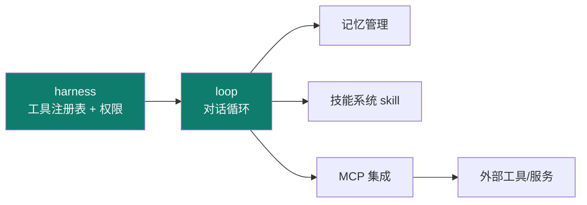
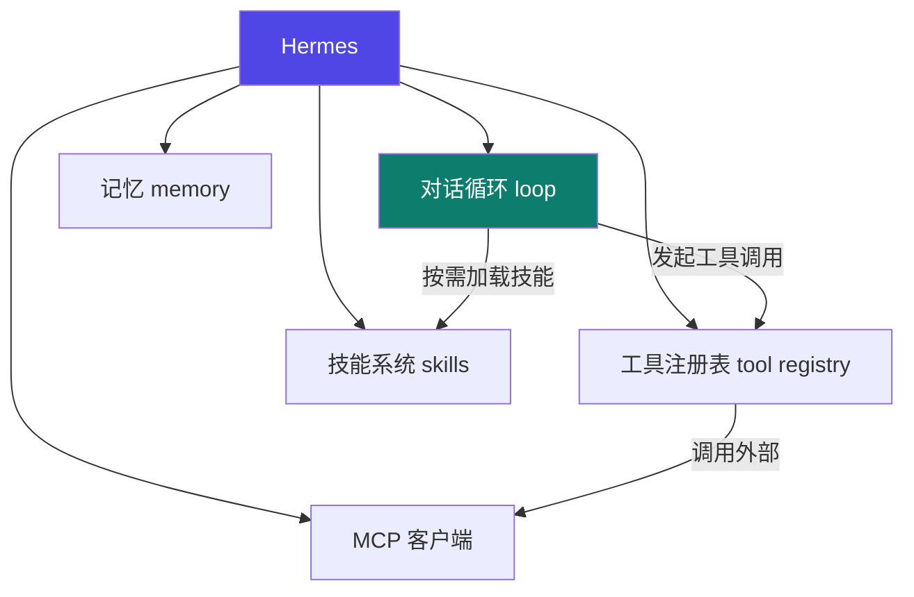

# Hermes

Track B 第一个实例：**NousResearch 开源 Python agent 框架**（注意：是框架，不是模型）。用它把前面主轴讲过的 harness / loop 落到真实代码。

::: tip 一句话
Hermes 是一个**可运行的 Python agent 框架**，把"对话循环、工具注册表、技能系统、记忆、MCP"这些零件都实现了——你改的不是模型，而是**承载它的 harness 与 loop**。
:::

## 实例 × 工程层映射

Hermes 最凸显的工程层是 **harness + loop**：

| 主轴层 | Hermes 里的落地 |
|---|---|
| context | 上下文管理、记忆读写 |
| harness | 工具注册表、执行环境 |
| loop | 对话循环（思考→工具→结果） |
| skill | 技能系统 |
| （跨层） | MCP、Gateway 集成 |

## 组成框图：Hermes 的核心模块

## 源码导读：最值得看的两处

- **工具注册表**：工具如何登记、校验参数、在 harness 里被授权执行——呼应 03 harness 的"权限系统"。
- **对话循环**：每一轮"思考 → 工具调用 → 结果回填 → 验证"怎么串起来——呼应 04 loop 的五零件。

## 跑起来 + 扩展一个工具/技能

1. 克隆仓库，按其 README 装依赖、配模型（按【建议】官方步骤执行）。
2. 先跑通默认对话循环，观察 loop 与工具往返日志。
3. 扩展：新增一个自定义工具注册进注册表，或写一个新技能让其被按需加载。

::: info 【事实】
来源：github.com/luyao618/Hermes-Source-Code-Study（指向 NousResearch/hermes-agent）。具体接口以官方 README / 源码为准；"凸显 harness+loop"是本体系的结构化定位（【推断】）。
:::

## 小测验

::: details 点击展开题目与答案
**Q1（判断）**：Hermes 是一个开源的 LLM 模型。  
❌ 错。它是 **agent 框架**，承载 LLM 运行，不是模型本身。

**Q2（选择）**：Hermes 最凸显的工程层是？  
A. prompt　B. harness + loop　C. 仅 graph  
✅ B。

**Q3（选择）**：要了解"工具如何在受限环境被授权执行"，应重点读哪部分？  
A. 工具注册表　B. 记忆模块　C. 技能加载  
✅ A。
:::

## 三档自检

| 档位 | 你能做到 |
|---|---|
| 了解 | 说出 Hermes 是框架而非模型，列出其核心模块（循环/工具/技能/记忆/MCP） |
| 熟悉 | 能指出工具注册表与对话循环各对应主轴的哪个工程层 |
| 精通 | 能给 Hermes 新增一个工具并跑通，或扩展一个技能被按需加载 |

> 相关概念：[03 harness](/concepts/harness) · [04 loop](/concepts/loop) ｜ 下一实例：[DeepAgent](./deepagent)
