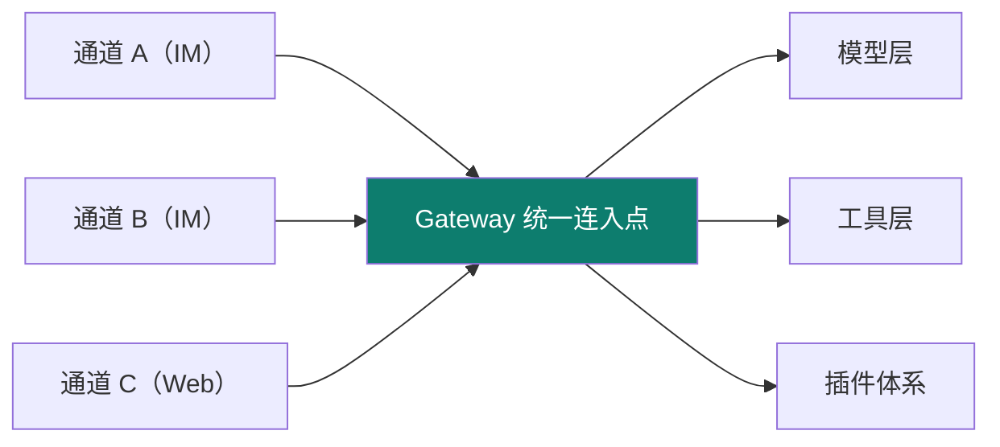
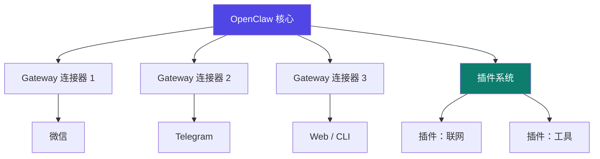

# OpenClaw

Track B 第三个实例：**自托管多通道 AI 助手平台**（前身 ClawdBot）。它最凸显的工程层是 **harness（外壳 / Gateway）**——把"一个核心接N个通道"这件事做到极致。

::: tip 一句话
OpenClaw 是 harness 的极致示范：模型不是被写死在某一个聊天框里，而是通过 **Gateway 这座"中央车站"**，同时服务微信、Telegram…… 多个通道，共享同一套工具与插件。
:::

## 精确映射：本实例 × 主轴机制

OpenClaw 最凸显的工程层是 **harness**：



| 本实例的具体件 | 对应主轴机制 | 章节 |
|---|---|---|
| Gateway 多通道连接器 | harness 外壳（核心与通道解耦） | [3-1](/concepts/harness/mechanism) |
| `sessionKey`（如 `my-channel:{chatId}`） | 多通道会话隔离（会话存储与恢复） | [2-2](/concepts/context/design) |
| `ChannelConnector` 统一接口 | 能力外挂（新增通道不改核心） | [06](/concepts/skill) |
| 插件 `setup` / `teardown` | 注册即副作用、卸载即撤销 | [06](/concepts/skill) |
| 工具集成（`registerTool`） | 工具调用（tool use） | [1-5](/concepts/prompt/think-tools-test) |

## Gateway 架构：一个核心，多通道



## 源码级：配置 + 连接器 + 插件骨架

以下三份是 OpenClaw harness 的核心资产（格式依据 openclaw-docs，【事实】；具体字段以官方文档为准）。

### ① Gateway 配置（一个核心，多通道）

```yaml
# openclaw.config.yaml
gateway:
  host: 127.0.0.1
  port: 8787
  channels:
    - type: cli        # 先接 CLI 验证会话统一
      enabled: true
    - type: telegram
      enabled: true
      token: ${TELEGRAM_TOKEN}   # 凭据走环境变量引用，不写死
    - type: web
      enabled: true
model:
  provider: deepseek
  name: deepseek-chat
plugins:
  - network          # 插件：联网
  - tools            # 插件：工具
```

### ② 通道连接器骨架（核心不动、通道外挂）

```typescript
// connectors/my-channel.ts —— 新通道只需实现统一接口，核心不改
import type { ChannelConnector, IncomingMessage } from "openclaw/connector";

export const myChannel: ChannelConnector = {
  id: "my-channel",

  // 出站：把 agent 的回复推送到该通道
  async send(to: string, text: string) {
    await mySdk.pushMessage(to, text);
  },

  // 入站：把通道消息转成统一消息，交给 Gateway
  onMessage(handler: (msg: IncomingMessage) => void) {
    mySdk.on("message", (raw) =>
      handler({
        channelId: "my-channel",
        userId: raw.from,
        text: raw.text,
        sessionKey: `my-channel:${raw.chatId}`,   // 会话键 → 多通道会话隔离
      }),
    );
  },
};
```
> 要点：**核心只认 `ChannelConnector` 接口**，新增通道 = 加一个实现文件 + 在配置里 enable——这就是"harness 核心与通道解耦"。`sessionKey` 决定 02 context 里的多通道会话如何隔离。

### ③ 插件骨架（能力外挂）

```typescript
// plugins/network.ts —— 插件向 agent 贡献能力，用完可卸载
import type { Plugin } from "openclaw/plugin";

export const networkPlugin: Plugin = {
  name: "network",
  setup(app) {
    app.registerTool({
      name: "http_get",
      description: "发起 HTTP GET 请求（受 harness 权限约束）",
      run: async ({ url }) => (await fetch(url)).text(),
    });
  },
  teardown() { /* 卸载时撤销注册（注册即副作用、卸载即撤销） */ },
};
```

## 上手顺序
① 按文档部署核心 → ② 先接 CLI 通道，确认 Gateway 统一会话 → ③ 加一个连接器或插件，体会"核心不动、能力外挂"。

::: info 【事实】
> 来源：[openclaw-docs](https://openclaw-docs.dx3n.cn/)（[S1](/practice/sources)，本站对标对象）（覆盖：OpenClaw 实例 · 06）。上述配置/接口为**依据官方文档的示意实现（【示意实现】）**；"凸显 harness/Gateway"是本体系的结构化定位（【推断】）。
:::

## 小测验

::: details 点击展开题目与答案
**Q1（选择）**：OpenClaw 的 Gateway 主要作用是什么？  
A. 训练模型　B. 统一连接多通道并共享工具/插件　C. 只服务单一聊天框  
✅ B。它是"中央车站"式的统一连入点。

**Q2（判断）**：OpenClaw 最凸显的工程层是 loop（单次循环）。  
❌ 错。它最凸显的是 harness（Gateway 外壳与插件体系）。

**Q3（选择）**：要让 OpenClaw 支持一种新的 IM，主要做什么？  
A. 重训模型　B. 新增一个 Gateway 连接器　C. 重写核心  
✅ B。
:::

## 三档自检

| 档位 | 你能做到 |
|---|---|
| 了解 | 说出 OpenClaw 是自托管多通道平台，凸显 harness/Gateway |
| 熟悉 | 画得出"一个核心 + 多通道 + 插件"的 Gateway 架构 |
| 精通 | 能新增一个通道连接器或插件，理解核心-外挂的 harness 解耦 |

> 上一实例：[DeepAgent](./deepagent) ｜ 相关概念：[02 context](/concepts/context) · [03 harness](/concepts/harness) ｜ 下一实例：[Claude Code](./claude-code)