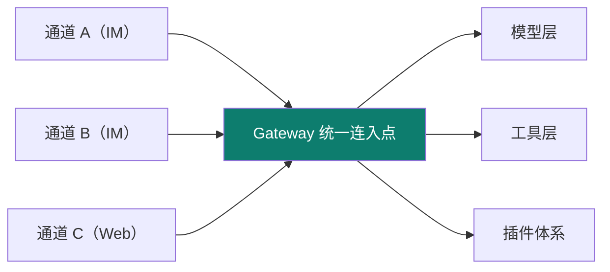
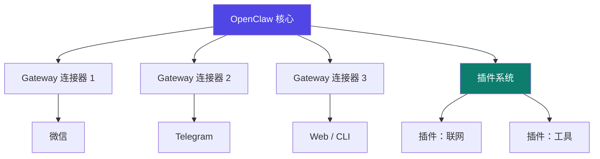
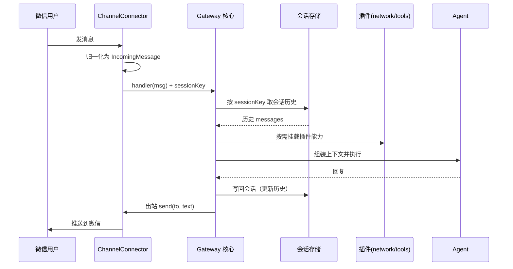

# OpenClaw

Track B 第三个实例：**自托管多通道 AI 助手平台**（前身 ClawdBot）。它最凸显的工程层是 **harness（外壳 / Gateway）**——把"一个核心接N个通道"这件事做到极致。

::: tip 一句话
OpenClaw 是 harness 的极致示范：模型不是被写死在某一个聊天框里，而是通过 **Gateway 这座"中央车站"**，同时服务微信、Telegram…… 多个通道，共享同一套工具与插件。
:::

## 精确映射：本实例 × 主轴机制

OpenClaw 最凸显的工程层是 **harness**：



| 本实例的具体件 | 对应主轴机制 | 章节 |
|---|---|---|
| Gateway 多通道连接器 | harness 外壳（核心与通道解耦） | [3-1](/concepts/harness/mechanism) |
| `sessionKey`（如 `my-channel:{chatId}`） | 多通道会话隔离（会话存储与恢复） | [2-2](/concepts/context/design) |
| `ChannelConnector` 统一接口 | 能力外挂（新增通道不改核心） | [06](/concepts/skill) |
| 插件 `setup` / `teardown` | 注册即副作用、卸载即撤销 | [06](/concepts/skill) |
| 工具集成（`registerTool`） | 工具调用（tool use） | [1-5](/concepts/prompt/think-tools-test) |

## Gateway 架构：一个核心，多通道



## 配置 + 连接器 + 插件骨架

以下三份是 OpenClaw harness 的核心资产（格式依据 openclaw-docs，【事实】；具体字段以官方文档为准）。

### ① Gateway 配置（一个核心，多通道）

```yaml
# openclaw.config.yaml
gateway:
  host: 127.0.0.1
  port: 8787
  channels:
    - type: cli        # 先接 CLI 验证会话统一
      enabled: true
    - type: telegram
      enabled: true
      token: ${TELEGRAM_TOKEN}   # 凭据走环境变量引用，不写死
    - type: web
      enabled: true
model:
  provider: deepseek
  name: deepseek-chat
plugins:
  - network          # 插件：联网
  - tools            # 插件：工具
```

### ② 通道连接器骨架（核心不动、通道外挂）

```typescript
// connectors/my-channel.ts —— 新通道只需实现统一接口，核心不改
import type { ChannelConnector, IncomingMessage } from "openclaw/connector";

export const myChannel: ChannelConnector = {
  id: "my-channel",

  // 出站：把 agent 的回复推送到该通道
  async send(to: string, text: string) {
    await mySdk.pushMessage(to, text);
  },

  // 入站：把通道消息转成统一消息，交给 Gateway
  onMessage(handler: (msg: IncomingMessage) => void) {
    mySdk.on("message", (raw) =>
      handler({
        channelId: "my-channel",
        userId: raw.from,
        text: raw.text,
        sessionKey: `my-channel:${raw.chatId}`,   // 会话键 → 多通道会话隔离
      }),
    );
  },
};
```
> 要点：**核心只认 `ChannelConnector` 接口**，新增通道 = 加一个实现文件 + 在配置里 enable——这就是"harness 核心与通道解耦"。`sessionKey` 决定 02 context 里的多通道会话如何隔离。

### ③ 插件骨架（能力外挂）

```typescript
// plugins/network.ts —— 插件向 agent 贡献能力，用完可卸载
import type { Plugin } from "openclaw/plugin";

export const networkPlugin: Plugin = {
  name: "network",
  setup(app) {
    app.registerTool({
      name: "http_get",
      description: "发起 HTTP GET 请求（受 harness 权限约束）",
      run: async ({ url }) => (await fetch(url)).text(),
    });
  },
  teardown() { /* 卸载时撤销注册（注册即副作用、卸载即撤销） */ },
};
```

## 上手顺序
① 按文档部署核心 → ② 先接 CLI 通道，确认 Gateway 统一会话 → ③ 加一个连接器或插件，体会"核心不动、能力外挂"。

::: info 【事实】
> 来源：[openclaw-docs](https://openclaw-docs.dx3n.cn/)（[S1](/practice/sources)，本站对标对象）（覆盖：OpenClaw 实例 · 06）。上述配置/接口为**依据官方文档的示意实现（【示意实现】）**；"凸显 harness/Gateway"是本体系的结构化定位（【推断】）。
:::

## 端到端 trace：一条跨通道消息的生命周期



**三个可观察点**：① **通道只做翻译**（归一化进、推送出），不含业务；② **`sessionKey` 决定会话归属**（隔离的唯一开关）；③ **核心不感知通道类型**（新增通道不改核心）。

## 源码级深挖：三处关键实现

### ① 会话键设计：隔离的唯一开关

`sessionKey` 的构成直接决定"会不会串会话"。四种设计及其后果：

| sessionKey 设计 | 隔离粒度 | 后果 |
|---|---|---|
| `userId` | 用户级 | ⚠️ **私聊与群聊共用会话**，上下文互相污染 |
| `channel:chatId` | 会话级 | ✅ 正确：群聊/私聊各自独立 |
| `channel:chatId:userId` | 会话×用户级 | 群聊中每人独立（适合"私人助理"） |
| `channel:chatId:threadId` | 话题级 | 群聊中每个话题独立（适合"话题助手"） |

```typescript
// 【示意实现】sessionKey 构造：按产品语义选择隔离粒度
export function buildSessionKey(msg: IncomingMessage, scope: "chat" | "user" | "thread") {
  const base = `${msg.channelId}:${msg.chatId}`;
  switch (scope) {
    case "chat":   return base;                              // 整个会话共享
    case "user":   return `${base}:${msg.userId}`;           // 每人独立
    case "thread": return `${base}:${msg.threadId ?? "main"}`; // 每话题独立
  }
}
```
> **反模式**：`sessionKey` 只用 `userId`——群里所有人共享一个上下文，A 的私事会漏给 B（见本页"常见坑 ①"）。

### ② Gateway 启动：插件的装配顺序

插件之间可能有依赖，**装配顺序错会导致运行期报错**：

```typescript
// 【示意实现】Gateway 启动：按依赖拓扑序装配，失败即中止（fail-closed）
async function boot(config: GatewayConfig) {
  const core = new GatewayCore(config.gateway);
  const plugins: Plugin[] = [];

  // ① 先装配能力型插件（被其他插件依赖）
  for (const name of ["network", "tools"]) {
    const p = await loadPlugin(name);
    if (!p) throw new Error(`PLUGIN_LOAD_FAILED: ${name}`);   // 缺插件即失败，不静默跳过
    await p.setup(core);
    plugins.push(p);
  }
  // ② 再挂载通道（依赖 core + 能力插件就绪）
  for (const ch of config.gateway.channels.filter(c => c.enabled)) {
    core.registerConnector(await loadConnector(ch.type));
  }
  // ③ 注册优雅关闭：与 setup 严格对称
  process.on("SIGTERM", async () => {
    for (const p of plugins.reverse()) await p.teardown();    // 逆序撤销
  });
  await core.listen(config.gateway.port);
}
```
> **对称性是硬要求**：`setup` 顺序与 `teardown` 顺序相反，漏掉 `teardown` 会导致热重载后**工具重复注册**。

### ③ 会话存储与恢复：多通道的连续性

```typescript
// 【示意实现】会话存储：按 sessionKey 存取，支持恢复
interface SessionStore {
  load(key: string): Promise<Message[]>;
  append(key: string, msg: Message): Promise<void>;
  compact(key: string, keep: number): Promise<void>;   // 保留最近 N 轮
}

export async function handle(gateway: GatewayCore, msg: IncomingMessage) {
  const key = buildSessionKey(msg, "chat");
  const history = await gateway.store.load(key);        // ① 恢复历史
  const limited = trimToBudget(history, gateway.budget); // ② 按预算裁剪（有界上下文）
  const reply = await gateway.agent.run([...limited, toUser(msg)]);  // ③ 执行
  await gateway.store.append(key, toUser(msg));          // ④ 落库（先记后回）
  await gateway.store.append(key, toAssistant(reply));
  return reply;
}
```
> 注意 ③ 之前先做了 **预算裁剪**——多通道下会话可能无限增长，**每条通道都必须有界**（见 [02 context 预算控制](/concepts/context/mechanism)）。

## 深入问答：为什么这样设计

**Q1：连接器为什么不能写业务逻辑？**
连接器的职责只有一个：**消息格式翻译**（通道格式 ↔ 统一格式）。把业务塞进去会让核心与具体通道重新耦合——那就退回了"每加一个通道就改一遍核心"的老路，Gateway 失去了存在意义。

**Q2：`sessionKey` 为什么必须包含 `chatId`？**
只用 `userId` 会让**私聊与群聊共用同一会话**：你在群里聊的内容会出现在私聊回复里。`chatId` 是区分"会话容器"的最小单位，缺它就没有隔离。

**Q3：插件为什么必须实现 `teardown`？**
插件是**热插拔**的。若卸载时不撤销注册，重新加载就会**重复注册**（模型看到两份工具、可能执行两次）。`setup`/`teardown` 严格对称是插件系统的基本契约。

**Q4：为什么在交给 Agent 之前先裁剪会话？**
多通道场景下会话会**无限增长**（每个群、每个用户都在积累）。必须在进 Agent 前按预算裁剪，否则某条通道迟早撑爆上下文——**每条通道都要有界**（见 [02 预算控制](/concepts/context/mechanism)）。

## 局限与不适用场景

| 局限 | 说明 | 何时别用 |
|---|---|---|
| 自托管较重 | 需自行部署核心 + 各通道（含微信/Telegram 等凭据与网络） | 只想跑一个本地 CLI 助手时 |
| 多通道会话需自设 | `sessionKey` 的隔离策略要自己设计，**配错会串会话** | 缺少会话隔离设计经验时 |
| 通道/插件生态依赖社区 | 覆盖范围与维护活跃度不稳定 | 需要官方长期支持的通道 |

**替代方案**：单通道 / 轻量 → [Hermes](/instances/hermes) 或 [Claude Code](/instances/claude-code)；需要图编排的复杂流程 → [DeepAgent](/instances/deepagent)。

## 常见坑与反模式

- **坑① `sessionKey` 只用 `userId`**：私聊与群聊会**共用同一会话**，上下文互相污染。应带上 `chatId` / 房间号（本文示例为 `my-channel:${chatId}`）。
- **坑② 插件 `teardown` 不撤销注册**：热重载后**工具被重复注册**，模型看到重复 schema。注册即副作用，卸载必须撤销。
- **坑③ 凭据写进配置文件**：应走环境变量引用（示例中的 `${TELEGRAM_TOKEN}`），**配置文件可能进版本库**。
- **坑④ 通道连接器里写业务逻辑**：连接器只该做"消息 ↔ 统一格式"的翻译；把业务塞进连接器会**让核心与通道重新耦合**，失去 Gateway 的意义。

## 架构决策与取舍

| 决策 | 做法 | 放弃了什么 |
|---|---|---|
| **核心与通道解耦** | 核心只认 `ChannelConnector` 接口 | 抽象层数：多一层接口心智 |
| **插件 setup/teardown 对称** | 注册即副作用、卸载即撤销 | 使用纪律：不对称会导致重复注册 |
| **会话隔离交给 `sessionKey`** | 由使用方设计键规则 | 安全责任外移：配错会串会话 |
| **配置引用环境变量** | 凭据走 `${VAR}` 引用 | 便利性：部署多一步环境准备 |

> 与 [DeepSeek Harness](/instances/deepseek-harness) 的差异：两者都是"插件化"，但 OpenClaw 的插件边界是**通道/工具**，DSH 的插件边界是**框架级单元（Context/Service/Event/Effect）**。

## 性能、成本与横向对比

| 维度 | OpenClaw | 参照对象 |
|---|---|---|
| token 开销 | 低-中：按通道独立会话，不共享无关历史 | 低于 [Claude Code](/instances/claude-code) |
| 延迟 | 低：无 hook 检查开销，Gateway 只做转发与统一 | 快于 [Claude Code](/instances/claude-code) 的编辑即检查 |
| 成本模型 | 与通道数、并发会话数正相关 | 需按通道配额规划 |
| 定位 | 多通道助手平台（自托管） | vs [Hermes](/instances/hermes)：OpenClaw 强"多入口部署"，Hermes 强"框架可读性" |

## 小测验

::: details 点击展开题目与答案
**Q1（选择）**：OpenClaw 的 Gateway 主要作用是什么？  
A. 训练模型　B. 统一连接多通道并共享工具/插件　C. 只服务单一聊天框  
✅ B。它是"中央车站"式的统一连入点。

**Q2（判断）**：OpenClaw 最凸显的工程层是 loop（单次循环）。  
❌ 错。它最凸显的是 harness（Gateway 外壳与插件体系）。

**Q3（选择）**：要让 OpenClaw 支持一种新的 IM，主要做什么？  
A. 重训模型　B. 新增一个 Gateway 连接器　C. 重写核心  
✅ B。
:::

## 三档自检

| 档位 | 你能做到 | 判据（怎么算达标） |
|---|---|---|
| 了解 | 说出 OpenClaw 是自托管多通道平台，凸显 harness/Gateway | 说得出"核心不动、通道外挂"的解耦点在哪 |
| 熟悉 | 画得出"一个核心 + 多通道 + 插件"的 Gateway 架构 | 能指出 `sessionKey` 决定会话隔离，`sessionKey` 只带 userId 会**串会话** |
| 精通 | 新增一个通道连接器或插件，理解核心-外挂的 harness 解耦 | 插件 `teardown` 不撤销注册时你能识别**重复注册**问题；凭据全部走 `${VAR}` 引用 |

> 上一实例：[DeepAgent](./deepagent) ｜ 相关概念：[02 context](/concepts/context) · [03 harness](/concepts/harness) ｜ 下一实例：[Claude Code](./claude-code)