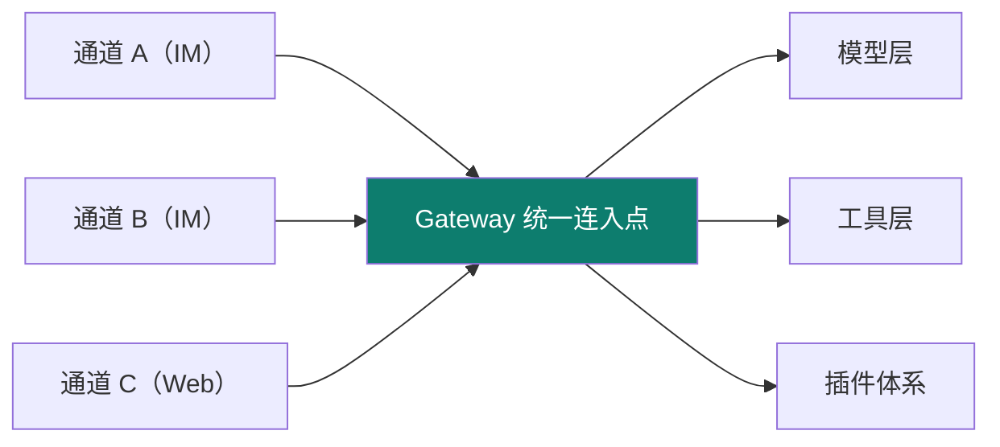
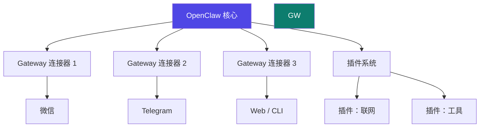

# OpenClaw

Track B 第三个实例：**自托管多通道 AI 助手平台**（前身 ClawdBot）。它最凸显的工程层是 **harness（外壳 / Gateway）**——把"一个核心接N个通道"这件事做到极致。

::: tip 一句话
OpenClaw 是 harness 的极致示范：模型不是被写死在某一个聊天框里，而是通过 **Gateway 这座"中央车站"**，同时服务微信、Telegram…… 多个通道，共享同一套工具与插件。
:::

## 实例 × 工程层映射

OpenClaw 最凸显的工程层是 **harness**：

| 主轴层 | OpenClaw 里的落地 |
|---|---|
| harness | Gateway 外壳、多通道会话 |
| context | 多通道会话存储与恢复 |
| skill/插件 | 插件体系（能力扩展） |
| tool | 工具集成 |

## Gateway 架构：一个核心，多通道

## 部署并扩展

1. 按 openclaw-docs 的部署步骤跑起核心。
2. 先接一个通道（如 CLI / Web），确认 Gateway 统一会话。
3. 扩展：新增一个通道连接器，或写一个插件挂进插件体系——体会"核心不动、能力外挂"的 harness 设计。

::: info 【事实】
来源：openclaw-docs.dx3n.cn（本站对标对象）。具体部署步骤、连接器/插件接口以官方文档为准；"凸显 harness/Gateway"是本体系的结构化定位（【推断】）。
:::

## 小测验

::: details 点击展开题目与答案
**Q1（选择）**：OpenClaw 的 Gateway 主要作用是什么？  
A. 训练模型　B. 统一连接多通道并共享工具/插件　C. 只服务单一聊天框  
✅ B。它是"中央车站"式的统一连入点。

**Q2（判断）**：OpenClaw 最凸显的工程层是 loop（单次循环）。  
❌ 错。它最凸显的是 harness（Gateway 外壳与插件体系）。

**Q3（选择）**：要让 OpenClaw 支持一种新的 IM，主要做什么？  
A. 重训模型　B. 新增一个 Gateway 连接器　C. 重写核心  
✅ B。
:::

## 三档自检

| 档位 | 你能做到 |
|---|---|
| 了解 | 说出 OpenClaw 是自托管多通道平台，凸显 harness/Gateway |
| 熟悉 | 画得出"一个核心 + 多通道 + 插件"的 Gateway 架构 |
| 精通 | 能新增一个通道连接器或插件，理解核心-外挂的 harness 解耦 |

> 上一实例：[DeepAgent](./deepagent) ｜ 相关概念：[02 context](/concepts/context) · [03 harness](/concepts/harness) ｜ 下一实例：[Claude Code](./claude-code)