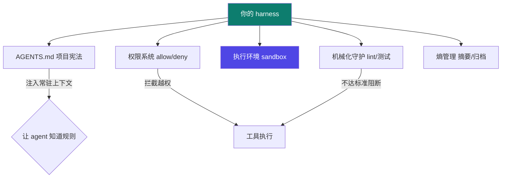
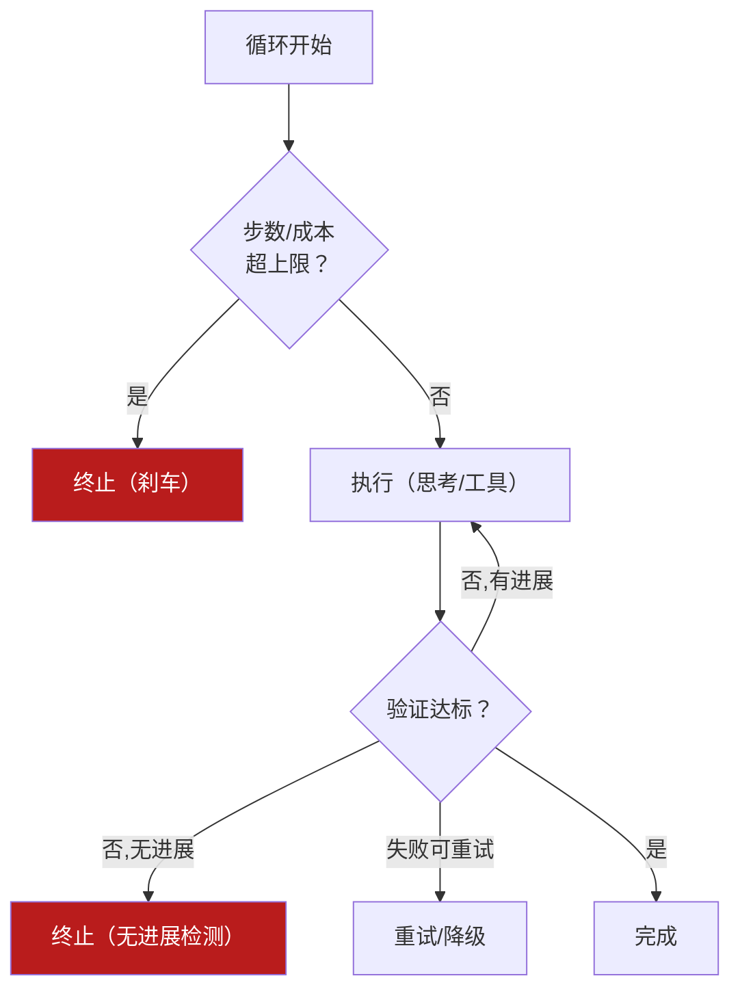
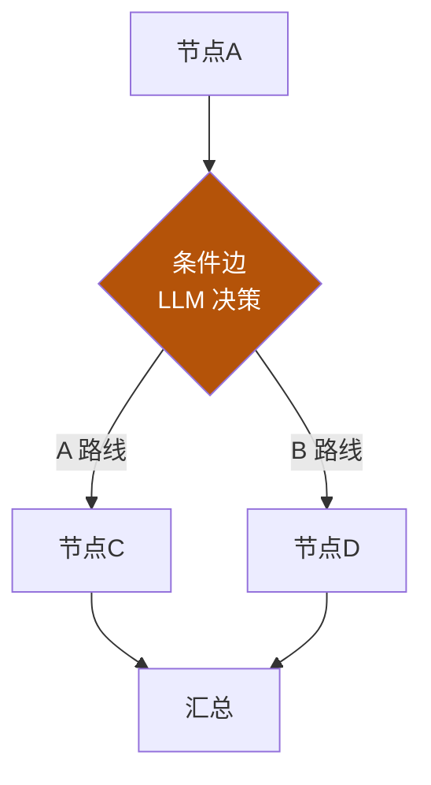
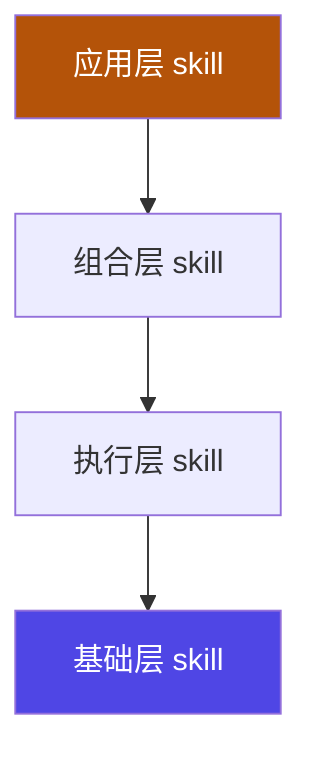
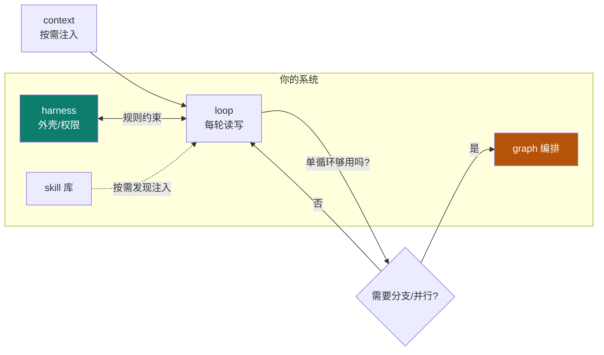

# 自研 harness

Track C 终点、也是阶段 B 的收口：把前面所有复盘，沉淀成**你自己的 harness 架构**。这不是"看懂别人的框架"，而是"画得出自己的体系，并且能跑起来"。

::: tip 一句话
自研 harness = 画四张图（harness / loop / graph / skill）+ 合成一张整体图 + 做一个最小可跑原型。四张图是设计，原型是"真的能跑"的证明。
:::

## 四步骤产出

### ① harness 架构图
外壳 / 权限 / 执行环境 / 机械化守护 / 熵管理，五件套缺一不可：

### ② loop 流程图 + 终止/韧性决策表

| 情形 | 决策 |
|---|---|
| 步数/成本超上限 | 立即终止，报错 |
| 连续多轮无进展 | 终止（无进展检测） |
| 单步工具失败 | 重试或降级，不整轮崩溃 |
| 验证不达标但有进展 | 继续下一轮 |

### ③ graph 状态图
多步骤 / 多 agent 时，用节点+边+状态+reducer 显式编排：

### ④ skill 体系架构图

## 合成整体架构

**设计说明**：合成图回答三个问题——谁承载（harness）、谁反复干活（loop）、谁编排复杂流程（graph），以及 skill 如何横切注入。三个问题自洽，架构就成立。

## 最小可跑原型

按最简闭环落地：**一个 harness（含 AGENTS.md + 简单权限）+ 一个 loop（含成本/进展刹车）+ 至少 2 个工具 + 1 个 skill + 一个任务**。能跑通"输入任务→受控执行→验证→输出"，就算达标。

## 小测验

::: details 点击展开题目与答案
**Q1（选择）**：自研 harness 的四张图是？  
A. harness/loop/graph/skill　B. 需求/测试/部署/运维　C. prompt/模型/数据/界面  
✅ A。

**Q2（判断）**：只要画出四张图就算完成自研。  
❌ 错。还要**合成整体图 + 做最小可跑原型**，设计要落到"能跑"。

**Q3（选择）**：loop 中"连续多轮无进展"应如何处理？  
A. 继续无限重试　B. 无进展检测→终止　C. 悄悄跳过  
✅ B，这是防止 runaway 的安全刹车。
:::

## 完成即毕业

> 到此，你走完了 **Track 0（打底）→ Track A（概念）→ Track B（实例）→ Track C（评用→自研）** 的全程。你不仅"会用"，还能"自己造"——这正是这门体系的目标。

> 上一页：[掌握自检](./selfcheck) ｜ 回到：[统一对比矩阵](./compare)