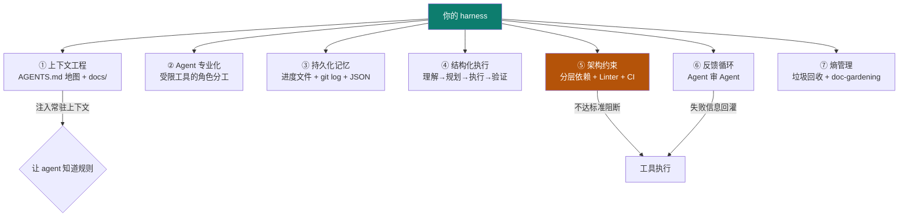
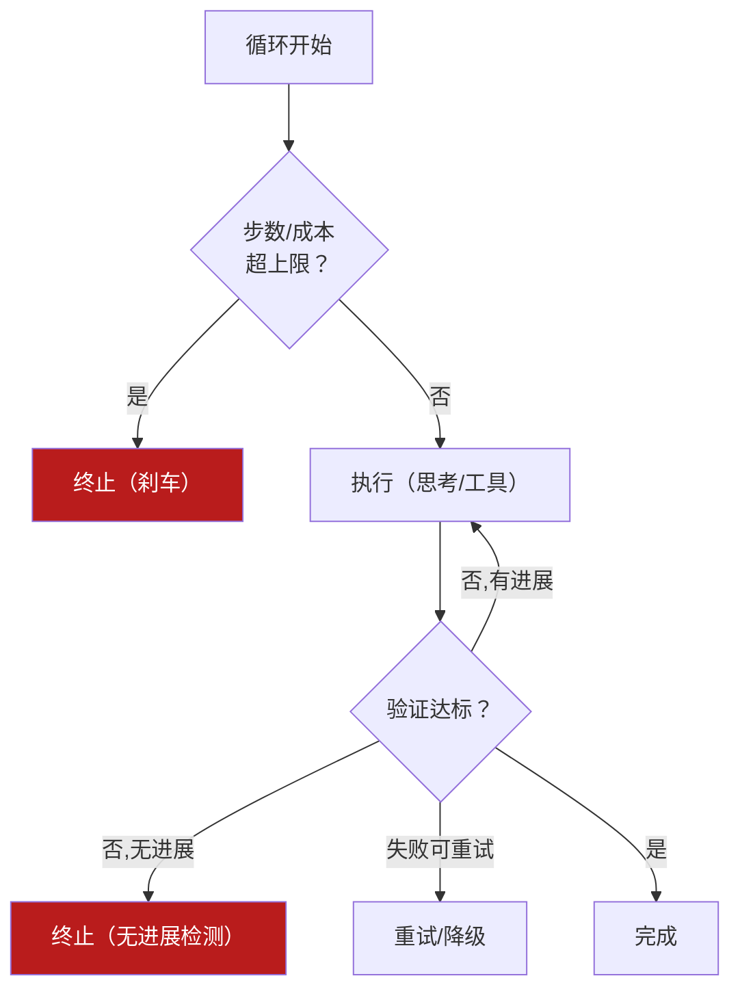
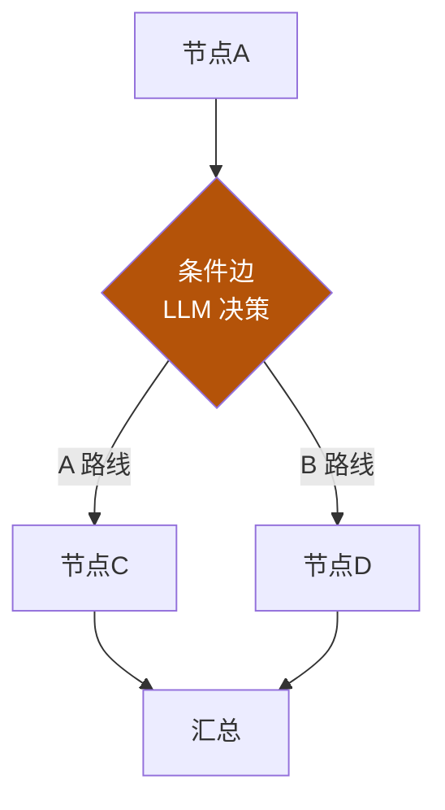
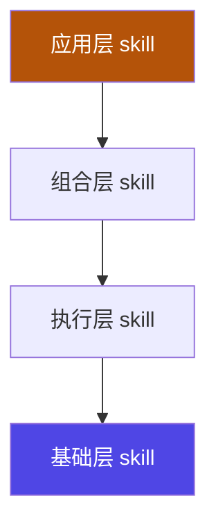
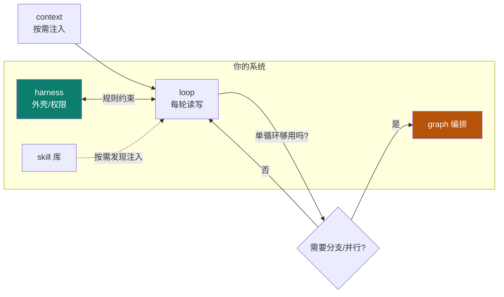

# 自研 harness

Track C 终点、也是阶段 B 的收口：把前面所有复盘，沉淀成**你自己的 harness 架构**。这不是"看懂别人的框架"，而是"画得出自己的体系，并且能跑起来"。

::: tip 一句话
自研 harness = 画四张图（harness / loop / graph / skill）+ 合成一张整体图 + 做一个最小可跑原型。四张图是设计，原型是"真的能跑"的证明。
:::

## 四步骤产出

### ① harness 架构图
对齐 [03 harness 的七大核心组件](/concepts/harness)：上下文工程 / Agent 专业化 / 持久化记忆 / 结构化执行 / 架构约束 / 反馈循环 / 熵管理，缺一不可：



### ② loop 流程图 + 终止/韧性决策表



| 情形 | 决策 |
|---|---|
| 步数/成本超上限 | 立即终止，报错 |
| 连续多轮无进展 | 终止（无进展检测） |
| 单步工具失败 | 重试或降级，不整轮崩溃 |
| 验证不达标但有进展 | 继续下一轮 |

### ③ graph 状态图
多步骤 / 多 agent 时，用节点+边+状态+reducer 显式编排：



### ④ skill 体系架构图



## 合成整体架构



**设计说明**：合成图回答三个问题——谁承载（harness）、谁反复干活（loop）、谁编排复杂流程（graph），以及 skill 如何横切注入。三个问题自洽，架构就成立。

## 最小可跑原型

按最简闭环落地：**一个 harness（含 AGENTS.md + 简单权限）+ 一个 loop（含成本/进展刹车）+ 至少 2 个工具 + 1 个 skill + 一个任务**。能跑通"输入任务→受控执行→验证→输出"，就算达标。

### 完整可运行代码（无外部依赖）

下面这份原型把前四张图落成**真代码**：权限矩阵、三刹车、工具注册、skill 注入、机械化验证一应俱全。复制即可运行。

```python
"""minimal_harness.py — 最小可跑自研 harness（无第三方依赖）
运行：python minimal_harness.py
覆盖：harness 权限/门禁 + loop 三刹车 + 工具 + skill 注入 + 验证闭环
"""
import re

# ========== ① HARNESS：权限矩阵 + 机械化门禁（fail-closed）==========
class Harness:
    def __init__(self, agents_md_path="AGENTS.md"):
        # 权限矩阵：allow / deny（越权动作在此被拦）
        self.allow = {"read_file", "list_files", "run_tests"}
        self.deny = {"http_request", "git_push", "rm_rf"}
        self.agents_md = self._load_rules(agents_md_path)
        self.log = []

    def _load_rules(self, path):
        """规则缺失即 fail-closed：拿不到项目宪法就不允许执行。"""
        try:
            with open(path, encoding="utf-8") as f:
                return f.read()
        except FileNotFoundError:
            raise RuntimeError("HARNESS_FAIL_CLOSED: 缺少 AGENTS.md，拒绝在无规则环境执行")

    def call_tool(self, name, **kw):
        """所有工具调用统一过权限门禁（模型不能绕过）。"""
        if name in self.deny:
            self.log.append(f"DENY {name}")
            return {"ok": False, "error": f"permission denied: {name}"}
        if name not in self.allow:
            self.log.append(f"UNKNOWN {name}")
            return {"ok": False, "error": f"tool not registered: {name}"}
        self.log.append(f"ALLOW {name}")
        return TOOLS[name](**kw)

    def gate(self, workdir="."):
        """机械化门禁：不达标即失败（声明 ≠ 执行）。"""
        r = self.call_tool("run_tests", workdir=workdir)
        return r["ok"] and r.get("exit_code") == 0


# ========== ② 工具注册表（真实函数）==========
import os, subprocess

def _read_file(path):
    if not path or not os.path.isfile(path):
        return {"ok": False, "error": f"not found: {path}"}
    with open(path, encoding="utf-8") as f:
        return {"ok": True, "content": f.read()}

def _list_files(workdir="."):
    try:
        return {"ok": True, "files": sorted(os.listdir(workdir))}
    except OSError as e:
        return {"ok": False, "error": str(e)}

def _run_tests(workdir="."):
    """真实执行 pytest 或 python -m unittest；无测试则视为通过（示例）。"""
    if os.path.exists(os.path.join(workdir, "tests")):
        p = subprocess.run(["python", "-m", "unittest", "discover", "-s", "tests"],
                           cwd=workdir, capture_output=True, text=True)
        return {"ok": p.returncode == 0, "exit_code": p.returncode,
                "out": p.stdout[-400:] + p.stderr[-400:]}
    return {"ok": True, "exit_code": 0, "out": "(no tests dir)"}

TOOLS = {"read_file": _read_file, "list_files": _list_files, "run_tests": _run_tests}


# ========== ③ SKILL：按需注入的能力说明（不是工具）==========
SKILLS = {
    "code-review": {
        "description": "审查代码 diff，按 P0/P1/P2 分级输出问题清单",
        "body": "步骤：1) 读 diff 2) 分级 3) 输出 JSON {issues,verdict}；边界：只读不改。",
    },
}

def discovery(intent, harness):
    """skill discovery：按意图命中才注入正文（不常驻，防预算膨胀）。"""
    for name, sk in SKILLS.items():
        if name.split("-")[0] in intent or any(k in intent for k in sk["description"]):
            harness.log.append(f"INJECT_SKILL {name}")
            return f"[skill:{name}]\n{sk['body']}"
    return ""


# ========== ④ LOOP：三刹车 + Goal 短路 ==========
def run_loop(harness, task, step_fn, goal_fn, max_iter=8, max_cost=3.0, no_progress=2):
    cost = 0.0; last = None; stalled = 0; history = []
    skill_ctx = discovery(task, harness)          # 按需注入 skill
    for i in range(max_iter):
        if cost >= max_cost:                       # 刹车① 成本
            history.append(f"[BRAKE cost] cost={cost}")
            break
        result = step_fn(i, task, skill_ctx)
        cost += result["cost"]; history.append(result["output"])
        if goal_fn(result):                        # Goal 短路
            return {"met": True, "output": result["output"], "cost": cost,
                    "iterations": i + 1, "history": history}
        if result["output"] == last:               # 刹车② 无进展
            stalled += 1
            if stalled >= no_progress:
                history.append(f"[BRAKE no-progress] stalled={stalled}")
                break
        else:
            stalled = 0
        last = result["output"]
    else:                                          # 刹车③ 迭代上限（for 正常耗尽）
        history.append(f"[BRAKE max_iter] iterations={max_iter}")
    return {"met": False, "output": None, "cost": cost, "iterations": len(history),
            "history": history}


# ========== ⑤ 演示：真实执行一个"受控任务" ==========
def demo_step(i, task, skill_ctx):
    """真实动作：列目录 → 读 AGENTS.md → 跑门禁。返回 (output, cost)。"""
    h = HARNESS
    if i == 0:
        r = h.call_tool("list_files", workdir=".")
        return {"output": f"listed {len(r.get('files', []))} files", "cost": 0.2}
    if i == 1:
        r = h.call_tool("read_file", path="AGENTS.md")
        return {"output": f"rules {len(r.get('content',''))} chars", "cost": 0.3}
    r = h.call_tool("run_tests", workdir=".")
    return {"output": f"gate={'pass' if r.get('ok') else 'fail'}", "cost": 0.4}


def demo_goal(result):
    return result["output"].startswith("gate=pass")


if __name__ == "__main__":
    # 写一份 AGENTS.md 作为项目宪法（若不存在）
    if not os.path.exists("AGENTS.md"):
        with open("AGENTS.md", "w", encoding="utf-8") as f:
            f.write("# AGENTS.md\n## 硬性纪律\n- 改动必须通过测试\n## 目录指针\n- docs/arch.md\n- docs/rules.md\n")

    HARNESS = Harness("AGENTS.md")
    out = run_loop(HARNESS, "检查仓库并跑门禁", demo_step, demo_goal)
    print("met =", out["met"], "| iterations =", out["iterations"], "| cost =", out["cost"])
    for line in out["history"]:
        print("  -", line)
    print("harness log:", HARNESS.log)
    # 越权演示：模型试图 git_push → 被门禁拦截
    print("try git_push ->", HARNESS.call_tool("git_push"))
```

**跑起来后应当看到**：`met=True`、`gate=pass`、日志里全是 `ALLOW`，最后一行 `git_push` 被 `DENY`——这就同时验证了 **loop 的 Goal 短路**与 **harness 的越权拦截**。

## 自检：用 5 个 gate 的判据审你的原型

把 [各章 gate](/concepts/context/gate/context_gate) 的判据拿来当"毕业标准"：

| 维度 | 你的原型应满足 | 出处 |
|---|---|---|
| context | 有预算控制；超限降配不崩 | [2 gate](/concepts/context/gate/context_gate) |
| harness | 规则缺失时 **fail-closed**；越权动作被拦 | [3 gate](/concepts/harness/gate/harness_gate) |
| loop | 三刹车齐备；Goal 满足即退出 | [4 gate](/concepts/loop/gate/loop_gate) |
| graph | 有分支/并行时用显式图编排（而非硬编码 if） | [5 gate](/concepts/graph/gate/graph_gate) |
| skill | 有统一字段 + 版本号 + 失败处理段 | [6 gate](/concepts/skill/gate/skill_gate) |

> 判据口径统一在 [事实源清单](/practice/sources) 与 [掌握自检](/practice/selfcheck)；来源覆盖可机器校验。

## 小测验

::: details 点击展开题目与答案
**Q1（选择）**：自研 harness 的四张图是？  
A. harness/loop/graph/skill　B. 需求/测试/部署/运维　C. prompt/模型/数据/界面  
✅ A。

**Q2（判断）**：只要画出四张图就算完成自研。  
❌ 错。还要**合成整体图 + 做最小可跑原型**，设计要落到"能跑"。

**Q3（选择）**：loop 中"连续多轮无进展"应如何处理？  
A. 继续无限重试　B. 无进展检测→终止　C. 悄悄跳过  
✅ B，这是防止 runaway 的安全刹车。
:::

## 完成即毕业

> 到此，你走完了 **Track 0（打底）→ Track A（概念）→ Track B（实例）→ Track C（评用→自研）** 的全程。你不仅"会用"，还能"自己造"——这正是这门体系的目标。

::: tip 下一步 → Track D
到这里你完成了"**能跑起来**"。但要把它变成**可交付、可审计**的生产级成果，还需要一套受控流程——
进入 [**Track D · 生产级流程**](/process/)：风险分级、双轴判定、三级结论、证据包、受控突变。
:::

> 上一页：[掌握自检](./selfcheck) ｜ 回到：[统一对比矩阵](./compare)