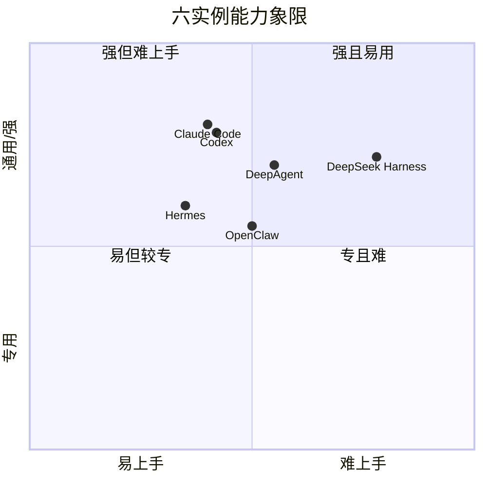

# 统一对比矩阵

Track C 第一页：把六个实例放到**同一个 7 维口径**下对比，而不是各说各话。评分语义以 [掌握自检/口径页](/practice/selfcheck) 的常量表为准（0–5，5 最强）。

::: tip 一句话
同样的问题，六个框架的答案不同。本页用 7 个固定维度给它们"同框打分"，帮你**选型**，也帮你看清每家的强项/短板。
:::

## 7 维口径（来自你的需求原文，未增删）

1. 整体架构
2. 上下文与记忆
3. 工具调用与执行循环
4. skill 与能力扩展
5. 适用场景
6. 上手曲线
7. 主要局限

## 7 维 × 6 实例 对比矩阵

> 评分 0–5（5 最强），"上手曲线"按**越低越易上手**给分（5=极易，1=很陡）。完整语义见 [口径常量表](/practice/selfcheck)。

| 维度 | Hermes | DeepAgent | OpenClaw | Claude Code | Codex | DeepSeek Harness |
|---|---|---|---|---|---|---|
| 整体架构 | 4 | 4 | 5 | 5 | 5 | 4 |
| 上下文与记忆 | 3 | 4 | 4 | 4 | 4 | 3 |
| 工具调用与执行循环 | 4 | 4 | 4 | 5 | 5 | 4 |
| skill 与能力扩展 | 4 | 3 | 4 | 5 | 4 | 5 |
| 适用场景 | 通用研究 | 复杂编排 | 多通道助手 | 软件工程 | 软件工程 | 插件化自研 |
| 上手曲线（越高越易） | 4 | 3 | 3 | 4 | 4 | 2 |
| 主要局限 | 生态较窄 | 依赖 LangChain | 自托管较重 | 商用闭源 | 偏代码域 | 仍在 preview |

::: warning 评分口径
以上数字是**本页的结构化初判（【推断】）**，用于帮助相对排序，不是官方基准。正式定稿前应在事实源页逐格复核，防止"各说各话"（这也是 7 维口径存在的意义）。
:::

## 能力象限图

横轴 = 上手难度（右=越难），纵轴 = 能力/场景定位（上=越强越通用）：

## 怎么用这张矩阵

- **选型**：先看"适用场景"命中你的目标，再看"上手曲线"与"主要局限"取舍。
- **学习**：想学 harness/权限 → Claude Code、Codex；想学 graph 编排 → DeepAgent；想学插件化 → DeepSeek Harness、OpenClaw。

## 小测验

::: details 点击展开题目与答案
**Q1（选择）**：本矩阵用几个固定维度对比六实例？  
A. 3　B. 7　C. 12  
✅ B（7 维口径）。

**Q2（判断）**：评分数字是官方权威基准。  
❌ 错。这是结构化初判（【推断】），定稿前需在事实源页复核。

**Q3（选择）**：想学"图编排（graph）"，最该看哪个实例？  
A. DeepAgent　B. OpenClaw　C. Hermes  
✅ A。DeepAgent 基于 LangGraph，凸显 graph+loop。
:::

> 上一实例：[DeepSeek Harness](/instances/deepseek-harness) ｜ 下一页：[学习路径](./path)
