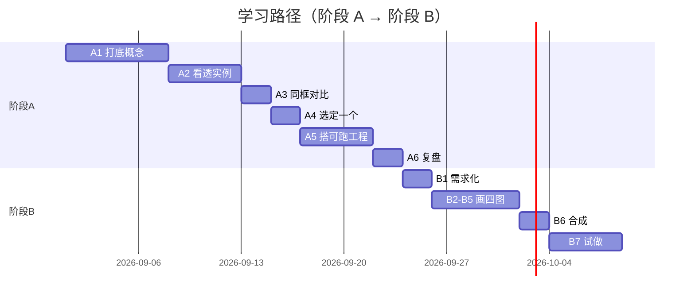

# 学习路径

Track C 第二页：把前面所有内容串成一条可执行的路。两段式——**阶段 A 评用**（会选型、能搭可跑工程）→ **阶段 B 自研**（能设计 harness + loop + graph + skill 体系）。

::: tip 一句话
先学会"用对、搭对"（A），再学会"自己造"（B）。A 的对比矩阵，正是 B 的"基准集"——你知道各家好在哪，才知道自己要造出什么。
:::

## 两段式总览

## 阶段 A · 评用（六步 A1→A6）

| 步骤 | 内容 | 产出物 |
|---|---|---|
| A1 打底概念 | 过完 Track 0 + Track A 五章 | 概念笔记 |
| A2 看透六个实例 | 读完 Track B 六页 | 六实例速记卡 |
| A3 同框对比 | 用 7 维矩阵给六实例打分 | 一张对比表 |
| A4 选定一个 | 按场景锁定 1–2 个实例深挖 | 选型理由 |
| A5 搭可跑工程 | 把选定实例跑起来 + 扩展一个能力 | 可跑 demo |
| A6 复盘 | 反推它各层的设计取舍 | 复盘文档 |

## 阶段 B · 自研（七步 B1→B7）

| 步骤 | 内容 | 产出物 |
|---|---|---|
| B1 需求化 | 把"我要造的 agent"写成需求 | 需求说明 |
| B2 画 harness | 设计外壳/权限/约束 | harness 架构图 |
| B3 画 loop | 设计循环 + 终止/韧性决策 | loop 流程图 |
| B4 画 graph | 设计多步编排与状态 | graph 状态图 |
| B5 画 skill | 设计能力扩展分层 | skill 架构图 |
| B6 合成 | 四图合成整体架构 | 整体架构图 + 设计说明 |
| B7 试做 | 实现最小可跑原型 | 最小原型 |

## 时间线示意

> 时间按个人节奏缩放。**不追求快，追求每一步有产出物**。

## 每步的达标判据（可勾选）

"完成"不靠感觉，每步都有可勾选判据。**勾不满就不进入下一步**。

### 阶段 A · 评用

- [ ] **A1 打底**：能用自己的话解释"Agent = LLM + 工具 + 循环"，并说出 prompt/context/harness 的区别。
- [ ] **A2 看透实例**：能对任一实例说出"它的 harness 是什么、loop 怎么转、skill 怎么扩展"。
- [ ] **A3 同框对比**：产出 7 维表格，且每个分数能给出理由（对应 [评分依据](./compare)）。
- [ ] **A4 选定**：写出 ≥3 句选型理由，明确"排除其它实例的原因"。
- [ ] **A5 搭可跑工程**：本地能跑起选定实例，并**新增一个能力**（工具/技能/配置）后复现成功。
- [ ] **A6 复盘**：反推该实例"为什么这样设计"，列出 ≥3 条取舍取舍（做了什么、放弃了什么）。

### 阶段 B · 自研

- [ ] **B1 需求化**：需求里写明**成功标准可程序检验**（如"测试全绿"），而非"做得好"。
- [ ] **B2 harness 图**：含**权限矩阵**与**fail-closed** 策略（对应 [3 gate](/concepts/harness/gate/harness_gate)）。
- [ ] **B3 loop 图**：含**三刹车**（迭代/成本/无进展）与 Goal 短路（对应 [4 gate](/concepts/loop/gate/loop_gate)）。
- [ ] **B4 graph 图**：只在**确有分支/并行**时使用；否则注明"降级为单 loop"。
- [ ] **B5 skill 图**：分层清晰，且注明**按需注入**（不常驻）。
- [ ] **B6 合成**：整体图能回答"谁承载 / 谁反复干 / 谁编排 / 能力从哪来"四问。
- [ ] **B7 试做**：跑通 [最小可跑原型](./build)，且**故意越权时被拦、故意不达标时被刹车拦下**。

> **红线自检**：B7 若做不到"故意违规被拦"，说明 harness 只是声明、没有执行——回去补机械化门禁。

## 常见卡点与解法

| 卡点 | 现象 | 解法 |
|---|---|---|
| A3 打分心虚 | 每格都给 3 分 | 回到 [评分依据](./compare)，凡给不出理由的格标【推断】或降级为"未评" |
| A5 跑不起来 | 环境/依赖卡住 | 先跑官方最小示例，再逐步加能力；不要一上来就改架构 |
| B4 过度设计 | 单线性任务也画图 | 先问"真的需要分支/并行吗"，不需要就退回单 loop |
| B7 停不下来 | 循环跑飞/烧钱 | 检查三刹车是否真的接进了循环（对照 [4 gate](/concepts/loop/gate/loop_gate)） |
| B6 四图不自洽 | 图能画但串不起来 | 用"谁承载/谁反复干/谁编排/能力从哪来"四问逐条核对 |

## 小测验

::: details 点击展开题目与答案
**Q1（选择）**：阶段 A 的"对比矩阵"在阶段 B 中起什么作用？  
A. 无关　B. 作为自研的"基准集"　C. 只是装饰  
✅ B。你知道各家好在哪，才知道自己要造出什么。

**Q2（判断）**：学习路径只要求"看懂"，不要求跑起来。  
❌ 错。A5 要求"搭可跑工程"，B7 要求"最小可跑原型"，强调动手。

**Q3（选择）**：阶段 B 的正确顺序是？  
A. 直接写代码　B. 需求化 → 画 harness/loop/graph/skill → 合成 → 试做　C. 先买框架  
✅ B。
:::

> 上一页：[统一对比矩阵](./compare) ｜ 下一页：[掌握自检](./selfcheck)
