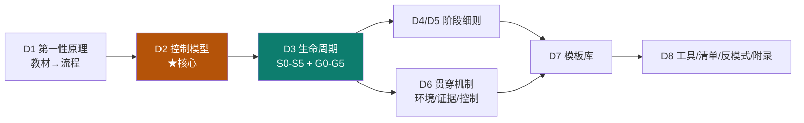

# D0 · 生产级流程：这套流程是什么

> **本章依据**：一份项目内部整理的《Harness Engineering 生产级项目标准流程》（v2.2.1，2266 行）。其 `authority` 字段指向的正是 [03 harness 章的权威教材 S11](/practice/sources)——**Track D 是同一理论的生产级落地版**。

::: warning 本 Track 的诚实声明（请先读）
本章内容来自一份**项目内部规范**，它有下面三个必须知情的状态，**原文如实保留**：

| 事项 | 状态 |
|---|---|
| **主体机制是否已生效** | ⚠️ **部分未生效**。该规范自述：唯一被工具绑定的是活契约（Tier 1），而**活契约当前仍是带占位符的模板**，未被任何脚本或 CI 检查——属"**已声明未生效**" |
| **规则是否都被验证过** | ⚠️ **不是**。该规范自带验证台账：15 条关键规则中 **7 条已验证 / 3 条部分验证 / 1 条被证伪 / 4 条未验证**（见 [D8 附录](/process/tooling)） |
| **维护结构风险** | ⚠️ 当前为**单一维护者**，无第二人复核——规范自己把这条列为"最大的结构性风险" |

**所以请把本章读作「一套经过实战检验、但尚未完全接线的方法论」，而不是「某组织的既定标准」。**
:::

## 一句话定位

> **Track C 让你"能跑起来"，Track D 让你"敢交付"。**

| Track | 关键词 | 你获得什么 |
|---|---|---|
| 0 新手前置 | 打底 | 概念地基 |
| A 概念主轴 | **懂** | prompt → context → harness → loop → graph + skill |
| B 框架实例 | **看** | 六个真实框架怎么落地 |
| C 复刻实战 | **造** | 自研一个最小 harness |
| **D 生产级流程** | **交付** | **把造出来的东西，按受控流程跑成生产级** |

## 它解决的不是"怎么写代码"，而是"怎么不放过错误"

这套流程的根因判断只有一句：

> **当 AI 同时扮演执行者、验收者和放行者时，必然产生过度乐观判断。**
> 把提示词写得更严格不够——**必须改流程、证据、交互规则三层**。

由此推出的**唯一硬底线**：

> **AI 没有证明「可以放行」，就只能判定为「不能放行」。**

## 七个"独有增量"（Track A 里没有的）

| # | 增量 | 解决什么 |
|---|---|---|
| 1 | **风险分级 L0–L3** + 升级触发条件 | 让流程可裁剪，而不是所有项目套一套 |
| 2 | **双轴判定**（技术完成度 / 阶段可放行性） | 拆开被混为一谈的两个结论 |
| 3 | **三级结论 A/B/C**（含 B 的防滥用三件套） | 门禁不再是二元通过/不通过 |
| 4 | **证据充分性阈值与停止规则** | 修掉"未证明即未完成"的字面死锁 |
| 5 | **控制权分离**（执行 / 校验 / 放行）+ 独立校验上下文 | 直击"自检自判自放行" |
| 6 | **受控突变**（证明测试有观察力） | 区分"测试通过"与"测试能失败" |
| 7 | **机制成本账与移除条件** | 给每个机制接上"何时删掉它" |

> **注意**：这七条**不是教材的复述**——教材讲"机制是什么"，这里讲"机制在真实交付里怎么被约束、举证、放行"。这是 D 的真正价值。

## 阅读路径

**按你的情况选入口：**

| 你是 | 建议路径 |
|---|---|
| 第一次接触 | D1 → D2 → D3（先建立"门禁"概念） |
| 已经在用 Agent 写代码但常翻车 | **直接从 D2 控制模型开始**——它是根因修复 |
| 要落地到真实项目 | D3 → D4/D5 → D7 模板库 → D8 落地清单 |
| 只想抄配置 | [D7 模板库](/process/templates) + [D8 工具映射](/process/tooling) |

## 理论锚点：D 的规则 ←→ A 的章节

| D 的规则 | Track A 对应 |
|---|---|
| §10.1 AGENTS.md 写地图不写百科全书 | [3-1 机制](/concepts/harness/mechanism) · [3-2 设计](/concepts/harness/design) |
| §10.2 错误信息即 Prompt（三要素） | [3-2 设计决策](/concepts/harness/design) |
| §10.3 反压模型（上游/下游） | [4-2 loop 设计](/concepts/loop/design) |
| §10.4 熵管理：技术债像高息贷款 | [3-1 组件⑦](/concepts/harness/mechanism) |
| §10.5 持久化记忆 / 结构化执行 / 专业化 | [3-1 组件②③④](/concepts/harness/mechanism) |
| §1.4 四类失败模式 → 四道防线 | [3-1 三大失败模式](/concepts/harness/mechanism) |
| §7.4 TDD / §7.6 受控回归 | [4 loop](/concepts/loop) · [1-5 验证](/concepts/prompt/think-tools-test) |
| §6.2 分层依赖 → 断言 | [3-2 ArchUnit](/concepts/harness/design) |
| **§2 控制模型（全部）** | **A 中无对应 —— D 独有** |

> 反向链接已在 Track A 的 harness 各页补齐（"→ 生产落地见 Track D"），形成**理论 ↔ 流程**双向可追溯。

## 标记法映射（重要）

本章**保留原规范的溯源标记**（改动会破坏可追溯性）。两类标记的对应关系：

| 原规范标记 | 含义 | 本站等价标记 |
|---|---|---|
| `[书 pX]` | 教材原文思想，页码可回查 | 【事实·教材】 |
| `[书 pX ✓]` | 教材思想**且已实际验证过** | 【事实·已验证】 |
| `[推]` | 该规范的工程化推演 | 【推断】 |
| `[K]` | 决策控制准则（证据 / 双轴 / 三级结论） | 【决策准则】 |

> **默认规则**：**未标 `✓` 的 `[书 pX]` 一律视为"来源自教材的意见"，不是"已验证事实"。**
> 溯源的作用是**可反驳**（能被追到源头并被推翻），**不是授权**。页码可回查 ≠ 该规则有证据支撑。

## 本章目录

| 页 | 内容 |
|---|---|
| **D1** [第一性原理](/process/principles) | 教材 → 六条流程设计律 → 核心闭环 |
| **D2** [控制模型 ★](/process/control-model) | 风险分级 / 事实五分类 / 双轴判定 / 三级结论 / 证据阈值 / 规模分级 |
| **D3** [生命周期主干](/process/lifecycle) | S0–S5 + G0–G5 + 三方映射 + 每阶段四要素 |
| **D4** [阶段细则（上）](/process/stages-1) | S0 基线 / S1 定义 / S2 设计 |
| **D5** [阶段细则（下）](/process/stages-2) | S3 切片循环 / S4 发布运营 / S5 复盘 |
| **D6** [贯穿机制](/process/mechanisms) | 环境层 / 证据层 / 控制层 + 门禁速查 + 度量 |
| **D7** [模板库](/process/templates) | 10 组可直接抄用的模板 |
| **D8** [工具·清单·反模式·附录](/process/tooling) | 工具映射 / 落地清单与顺序 / 反模式 / 维护节奏 / 验证台账 |

> 上一章：[Track C · 自研 harness](/practice/build) ｜ 下一节：[D1 第一性原理](/process/principles)
