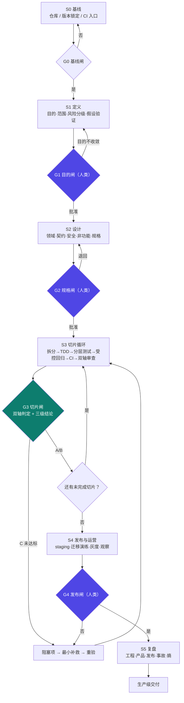

# D3 · 生命周期主干：S0–S5 + G0–G5

> **理论锚点**：本节的"信息层 / 约束层 / 自动化层"直接对应 [03 harness 的落地三步走](/concepts/harness/design)；门禁的"证据"要求对应 [3-1 组件⑥ 反馈循环](/concepts/harness/mechanism)。

## 3.1 三方映射

本流程把 **16 阶段工程流程** 与 **教材三阶段** 合并为 **S0–S5 六阶段 + 六道门**：

| 本版阶段 | 16 阶段流程对应 | 教材三阶段 `[书 p16-17]` | 门禁 |
|---|---|---|---|
| **S0 基线** | 阶段 0 仓库基线与工程约束 | 信息层（前置） | **G0** 基线闸（自动） |
| **S1 定义** | 阶段 1 目的/范围/风险分级；阶段 2 用户与业务假设验证 | **信息层**（AGENTS.md / docs） | **G1** 目的闸（**人类**） |
| **S2 设计** | 阶段 3 领域契约架构；阶段 4 安全/非功能/数据/运营门禁；阶段 5 规格固化 | **约束层**（设计即约束的定义点） | **G2** 规格闸（**人类**） |
| **S3 切片循环** | 阶段 6 拆分；7 原型；8 实现；9 TDD；10 受控回归；11 CI；12 代码审查 | **约束层 + 自动化层** | **G3** 切片闸（自动，每切片） |
| **S4 发布与运营** | 阶段 13 Staging/迁移/发布；14 上线后验证与事故响应 | **自动化层**（可观测） | **G4** 发布闸（**人类**） |
| **S5 复盘** | 阶段 15 复盘 | **熵管理** | **G5** 闭环闸 |

> `[书 p17]` **不要一步到位。** 信息层已能带来显著提升，**约束层是质变点**，自动化层是锦上添花。

## 3.2 流程图



> 紫色 = **人类闸**（只这三处）；绿色 = 自动门禁。

## 3.3 每阶段的四要素 `[K]`

每个阶段**必须**定义四类内容，**缺一不可**：

```
阶段目标
必须交付物
退出证据        ← 没有退出证据，就不能放行
阻塞条件
```

> 这条的价值在于：它把"阶段完成"从**主观判断**变成**判定性检查**——"退出证据"列出来了，就不能用"看起来差不多了"糊过去（对应 [D2 §2.5 未证明即未完成](/process/control-model)）。

## 门禁总览（速查）

| 门 | 位置 | 类型 | 双轴判定要点 | 未通过的处置 |
|---|---|---|---|---|
| **G0** | S0 出口 | 自动 | 基线可回滚 + 版本锁定 + 隔离可用 | 补 S0，不进 S1 |
| **G1** | S1 出口 | **人类** | 目的可一句话 + 判据可观察 + 风险等级已定 | 退回 S1；目的不收敛则暂停 |
| **G2** | S2 出口 | **人类** | 规格已批准 + 门禁按等级执行 + **故意违规能被拦住** | 退回 S2 |
| **G3** | 每切片 | 自动 | 切片验收有证据 + 失败路径已验证 + **受控突变被捕获** + CI 干净通过 | 进入修复循环（受循环预算约束） |
| **G4** | S4 出口 | **人类** | staging 验收 + 迁移回滚演练 + 可观测可查 | 退回；**不得发布** |
| **G5** | S5 出口 | 自动 + 记录 | 假阳性率已统计 + 教训已回写环境 | 补齐记录 |
| **循环预算闸** | 全程 | 自动 | 修复轮次 ≤ max_iterations | **升级人工**，禁止无限重试 |

## 人类闸：只在这三处

| 门 | 位置 | 人类拍板什么 |
|---|---|---|
| **G1 目的闸** | S1 出口 | 目的、范围、非目标、风险等级 |
| **G2 规格闸** | S2 出口 | 规格 17 项、契约、非目标、安全/非功能门禁 |
| **G4 发布闸** | S4 出口 | 是否发布、发布策略、回滚触发条件 |

其余门禁（G0/G3/G5）**自动判定并留痕**。

> **人类闸的职责是授权与问责，不是替 Agent 干活。** 把人的注意力压在三个决策点上，而不是每个 diff 上——这是"人类掌舵"的具体含义。

## 循环预算 `[推]`

任何自动回环（修复循环、重新规划、受控突变重试）设 `max_iterations`：**超限升级为人工**，而不是无限重试烧钱。

```
循环预算：
- 最大修复轮次：N
- 最大重新规划次数：M
- 超限处置：升级人工（输出 C 未达标 + 阻塞项）
```

> 理论锚点：[04 loop 三刹车](/concepts/loop/mechanism)——这里把它从"单个 loop 的刹车"提升为"**流程级的预算闸**"。

## 本节的流程输出

| 问题 | 答案 |
|---|---|
| 一共有几个阶段、几道门？ | S0–S5 六阶段，G0–G5 六道门（+ 循环预算闸） |
| 哪几道门需要人？ | 只有 G1 / G2 / G4 |
| 每阶段必须定义什么？ | 目标 / 必须交付物 / **退出证据** / 阻塞条件 |
| 自动循环停不下来怎么办？ | 循环预算超限 → 升级人工 |

> 上一节：[D2 控制模型](/process/control-model) ｜ 下一节：[D4 阶段细则（上）S0–S2](/process/stages-1)
