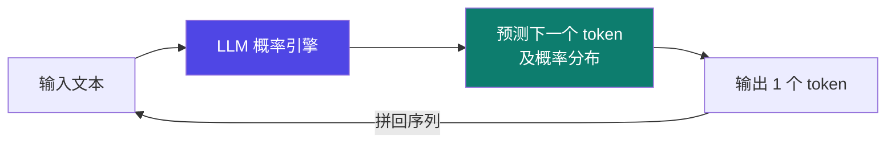

# 0-1 什么是 LLM

大语言模型（Large Language Model）是后面一切的起点。先把"它到底是什么"搞清楚，后面就不会被黑话绕晕。

## 一句话概念

> LLM 是一个**自回归概率模型**：给它一段前文，它算出"下一个最可能出现的 token"；把生成的 token 拼回前文，再算下一个——如此循环，直到说完。

它**不"理解"、也不"知道对错"**，只是在做"接话概率"计算。流畅 ≠ 正确。

::: tip 关键事实
**next-token prediction（下一个 token 预测）** 是 GPT 类语言模型的核心训练目标：【事实】这是公开论文与各家模型文档一致的描述，并非某家独有。
:::

## 类比：接龙高手

想象一个读过全网文本、记忆力惊人的**接龙高手**：

- 你给前半句，他接"最可能的后半句"；
- 他**不查字典、不验证真假**，只凭海量语感；
- 同一句开头，他每次接的下一句可能不同（因为内部有随机采样）。

这就是 LLM 的本质——**概率接话机，不是知识库**。

## 图示：自回归是怎么"吐字"的

过程中每一步，模型都会先给出一个**概率分布**（"下一个字是 A 的概率 40%、B 30%、C 30%…"），再按策略采样出一个字。

## 必须知道的"副作用"

| 现象 | 原因 | 给你的提醒 |
|---|---|---|
| **幻觉**（一本正经地胡说） | 目标是"像"，不是"真" | 关键事实要让它"能查证"，别盲信 |
| **不稳定** | 采样有随机性 | 同一问题换种问法，答案可能变 |
| **知识有截止** | 训练数据停留在某个时点 | 实时/私有信息要靠工具（见 0-4） |

## 小测验

::: details 点击展开题目与答案
**Q1（判断）**：LLM 在生成每个字时，都会先算一个"下一个字的概率分布"。  
✅ 对。这是自回归模型的机制。

**Q2（判断）**：LLM 回答很流畅，说明它"知道"自己说的是真的。  
❌ 错。流畅只代表"像"，不代表"真"——这就是幻觉的来源。

**Q3（选择）**：想让 LLM 获取最新的实时天气，最靠谱的做法是？  
A. 多问它几遍　B. 让它调用天气工具　C. 把模型训练一遍  
✅ B。模型本身知识有截止，实时数据要靠工具调用（见 0-4）。
:::

::: tip 本页要点
LLM = 概率接话机，不是知识库。记住"流畅 ≠ 正确"，后面学 Agent 时才不会被它的自信骗到。
:::

> 下一步：[0-2 token 与上下文窗口](./02-token) —— 搞清楚"一次能看多长的字"与成本。
