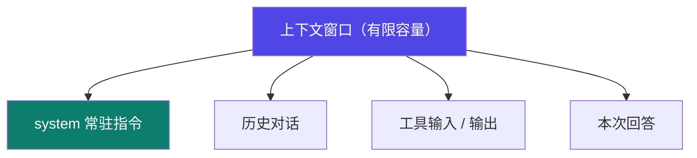

# 0-2 token 与上下文窗口

LLM 不是按"字"或"词"处理的，它有自己的最小单位：**token**。而"一次能看多长"，决定了它会不会忘记开头。

## 一句话概念

> **token** = 模型处理文本的最小单位（不是字符、也不是词）。  
> **上下文窗口（context window）** = 模型**一次能同时看到**的 token 总量上限。

## token 是什么

- 英文约 `1 token ≈ 4 个字符`；中文约 `1 个汉字 ≈ 1–2 token`（不同分词器不同）。
- 你看到的"字数"和模型计费的"token 数"不是一回事。

::: tip 关键事实
各家 API **按 token 计费**、且都有**窗口上限**：【事实】这是 OpenAI / DeepSeek / Claude 等公开 API 文档一致的计费与限制方式（具体数值随模型版本变化，以官方文档为准）。
:::

## 上下文窗口：一块有限的"桌面"

把上下文窗口想成一张**一次只能摊开有限页数的书桌**：

- 桌面上的内容 = `system 指令 + 历史对话 + 工具输入输出 + 本次回答`
- 一旦超出，模型会**截断或遗忘最早的内容**——它不会"记得"被挤出去的部分。

## 图示：上下文窗口的预算分配

## 为什么这事重要

| 你遇到的现象 | 根因 |
|---|---|
| 聊久了它"忘事" | 早期对话被窗口挤出去了 |
| 长文档塞不进去 | 单次上下文装不下，需要分块/检索（这是 02 context engineering 的主题） |
| 用着用着变贵 | 每轮都把历史重新发一遍，token 累计计费 |

::: warning 给新手的提醒
**上下文窗口是预算，不是无限内存。** 后面学 context engineering（02）和 loop（04）时，"怎么在有限窗口里放对东西"是核心命题。
:::

## 小测验

::: details 点击展开题目与答案
**Q1（判断）**：中文里 1 个汉字一定等于 1 个 token。  
❌ 错。约 1–2 个 token，取决于分词器。

**Q2（判断）**：上下文窗口越大，模型就"越聪明"。  
❌ 错。窗口大只是"一次能看更多"，不代表推理更强；超出的内容仍会被遗忘或截断。

**Q3（选择）**：一段长对话突然"失忆"，最可能是？  
A. 模型坏了　B. 超出上下文窗口被截断　C. 网络断了  
✅ B。
:::

::: tip 本页要点
token 是最小单位，上下文窗口是一次能看的上限——它是"预算"，要省着用。
:::

> 上一步：[0-1 什么是 LLM](./01-llm) ｜ 下一步：[0-3 对话角色](./03-roles)
