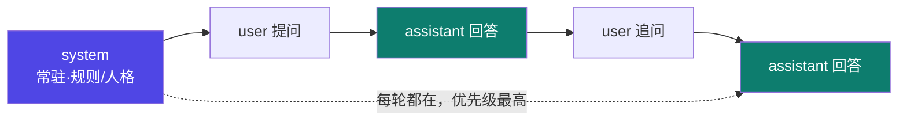

# 0-3 对话角色

和 LLM 对话时，消息是分"角色"的。不同角色分工不同，**谁说了算**也有规矩。

## 一句话概念

> 一次对话由三种角色的消息组成：**system（系统）**、**user（用户）**、**assistant（助手）**。  
> 后面 0-4 还会出现 **tool（工具）** 角色，用来回传工具执行结果。

## 三种基础角色

| 角色 | 谁在说 | 职责 |
|---|---|---|
| `system` | 开发者/平台预设 | **常驻指令 + 人格设定**，优先级最高 |
| `user` | 你 | 本轮的输入、提问、要求 |
| `assistant` | 模型 | 上一轮的回复——它本身也会"看到"自己说过的话 |

::: tip 关键事实
**system 消息优先级最高、且每轮都在**（除非被上下文窗口截断）：【事实】这是 OpenAI / Anthropic 等对话 API 的标准消息结构（role 字段含义一致）。
:::

## 类比：拍电影

- **system = 导演**：开拍前定下"世界观、角色性格、不许越界的规矩"，每场戏都管着。
- **user = 观众/制片**：提需求、喊"卡"、要求改。
- **assistant = 演员**：按导演定的规则演，并记住自己前面演过什么。

## 图示：多轮对话里角色怎么排

注意：**assistant 的历史回复也是上下文的一部分**。模型"看到自己说过的话"，才显得前后连贯。

## 为什么重要

- 想让模型"一直扮演某角色 / 遵守某规则"，要把它写进 **system**，而不是每次 user 都重复。
- 这是后面 **01 prompt engineering** 的基座：system prompt 就是"常驻指令层"。

::: warning 新手提醒
不要把重要规矩只写在 user 里——它可能被后续长对话稀释，或被窗口截断。规矩放 system。
:::

## 小测验

::: details 点击展开题目与答案
**Q1（判断）**：system 消息的优先级比 user 低。  
❌ 错。system 优先级最高，且常驻。

**Q2（选择）**：希望模型"全程用中文、且不开黄腔"，最该把这条写进？  
A. user 每轮提醒　B. system　C. 无所谓  
✅ B。常驻指令放 system 最稳。

**Q3（判断）**：模型能看到自己上一轮的回答。  
✅ 对。assistant 历史是上下文的一部分。
:::

::: tip 本页要点
system（常驻·最高优先级）/ user（你）/ assistant（模型，且记得自己说过的话）—— 三角色是 prompt 的骨架。
:::

> 上一步：[0-2 token 与上下文窗口](./02-token) ｜ 下一步：[0-4 工具调用 Tool Use](./04-tool-use)
