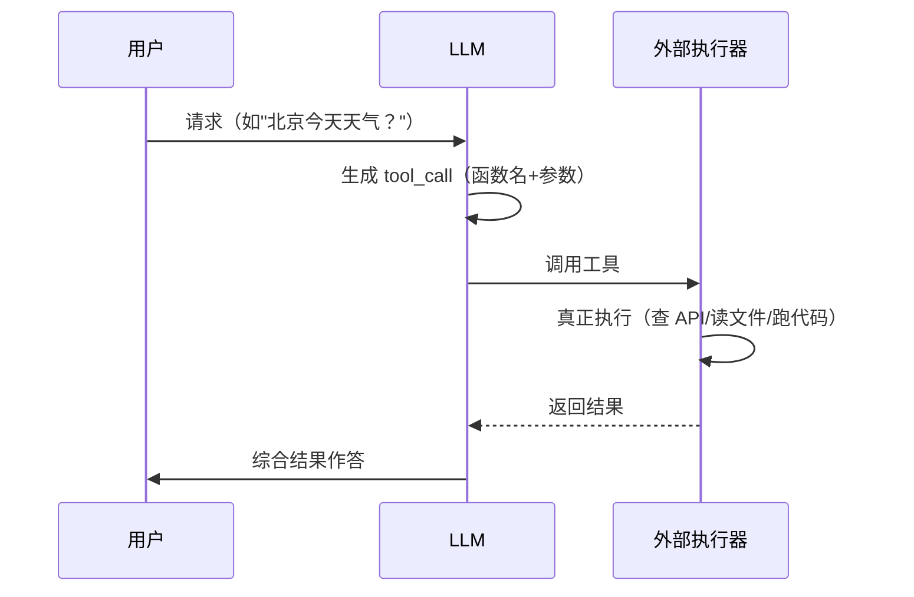

# 0-4 工具调用 Tool Use

纯 LLM 只能"打字"。要让它**查天气、读文件、跑代码**，靠的是工具调用——这是 Agent 能"动手"的关键一步。

## 一句话概念

> **Tool Use / Function Calling**：模型不直接执行代码，而是**输出一个结构化的"调用请求"**（函数名 + 参数）；由**你写的外部程序**真正执行，再把结果喂回给模型。

模型是**"建议者"**，不是"执行者"。

::: tip 关键事实
主流对话 API 都提供 function calling / tool use 机制，模型输出结构化调用、外部执行后回填结果：【事实】OpenAI（function calling）、Anthropic（tool use）等官方文档一致描述此流程。
:::

## 类比：厨师与助理

- **模型 = 厨师**：写下"菜单"（调用请求：做什么、用哪些料）。
- **外部执行器 = 助理**：真去厨房把菜做出来。
- **结果 = 端回来的菜**：助理把成品交回厨师，厨师再决定下一步。

厨师从不下厨——他只"点单"。

## 图示：一次工具调用的完整往返

## 为什么这一步是分水岭

| 没有工具调用 | 有工具调用 |
|---|---|
| 模型只能"凭记忆编" | 模型能取**实时/真实**数据 |
| 算不了、读不了文件 | 能跑代码、读文档、调 API |
| 停留在"聊天" | 跨进"能办事"的 Agent |

::: warning 安全提醒
工具一旦被授予，就可能**真的修改文件、发请求、花钱**。后面 03 harness engineering 的核心就是"给工具加权限与约束"。
:::

## 小测验

::: details 点击展开题目与答案
**Q1（判断）**：LLM 能自己直接运行 Python 代码。  
❌ 错。它只能"建议"调用，真正执行的是外部程序。

**Q2（选择）**：工具调用时，是谁真正去查天气 API 的？  
A. LLM 自己　B. 外部执行器（你写的代码）　C. 用户手动  
✅ B。

**Q3（判断）**：给模型越多的工具，越安全。  
❌ 错。工具越多权限面越大，需要 harness 约束（见 03）。
:::

::: tip 本页要点
模型"点单"、外部"做菜"、结果"回传"——Tool Use 让 LLM 从"打字"变成"能办事"。
:::

> 上一步：[0-3 对话角色](./03-roles) ｜ 下一步：[0-5 什么是 Agent](./05-agent)
