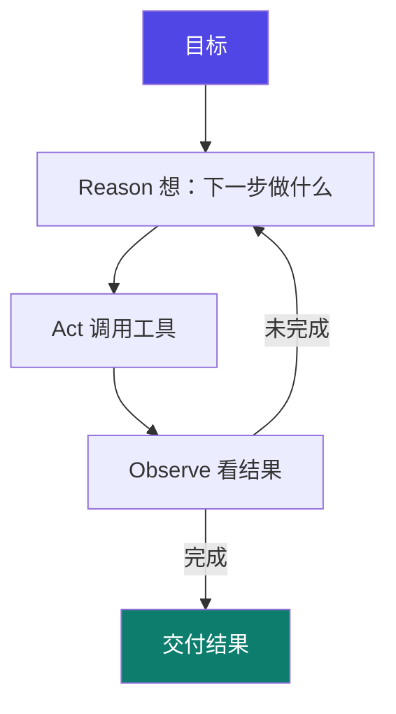

# 0-5 什么是 Agent

把前面几页拼起来，就得到了 Agent：**会自己想办法、动手把事办完**的系统。

## 一句话概念

> **Agent = LLM（大脑/决策） + 工具（手脚/执行） + 循环（反复 思考→行动→观察）**。

它和"单次对话"最大的区别：Agent 能**把大目标拆成多步、调用工具、根据结果调整，直到完成**。

::: tip 关键事实
**"增强的 LLM = 指令 + 额外上下文 + 工具"**：【事实】出自 Anthropic《Building effective agents》官方文章，是业界对"LLM 如何被增强为 Agent"的标准表述。
:::

## 类比：实习生

你给实习生一个目标（"把这份数据整理成周报"）：

- 他**自己拆解步骤**（读文件 → 算指标 → 画图表 → 写总结）；
- 遇错**自己改方案**（数据缺了就去查、格式错了就重排）；
- 过程中**反复调用工具**，而不是等你每一步都下令。

你只给目标，他交付结果——这就是 Agent。

## 图示：Agent 的核心循环（ReAct）

`Reason → Act → Observe → 再 Reason…` 就是经典的 **ReAct** 循环。循环多少次、何时停，由 Agent 自己判断（或你设上限）。

## Agent vs 单次对话

| | 单次对话 | Agent |
|---|---|---|
| 你做的事 | 每步都下令 | 只给目标 |
| 工具 | 一般不调或单次 | 多步反复调用 |
| 试错 | 靠你改问题 | 它自己观察结果、调整 |
| 适合 | 问答、创作 | 多步、需动手的任务 |

::: tip 衔接后面的学习
- "循环"怎么设计、怎么刹车 → **04 loop engineering**
- "工具/权限/约束怎么管" → **03 harness engineering**
- "多个循环怎么编排成复杂流程" → **05 graph engineering**
:::

## 小测验

::: details 点击展开题目与答案
**Q1（判断）**：Agent 和单次对话的区别是——Agent 能自己拆步骤、调工具、按结果调整。  
✅ 对。

**Q2（选择）**：ReAct 循环的"O"代表？  
A. Output　B. Observe（观察结果）　C. Open  
✅ B。

**Q3（判断）**：有了 LLM 就等于有了 Agent。  
❌ 错。还要有工具 + 循环（以及承载它们的 harness），LLM 只是其中"大脑"那一块。
:::

::: tip 本页要点
Agent = LLM + 工具 + 循环（ReAct）。你给目标，它交付结果——这是从"会聊"到"会办事"的跃迁。
:::

> 上一步：[0-4 工具调用 Tool Use](./04-tool-use) ｜ 下一步：[0-6 读懂总览图](./06-overview)
