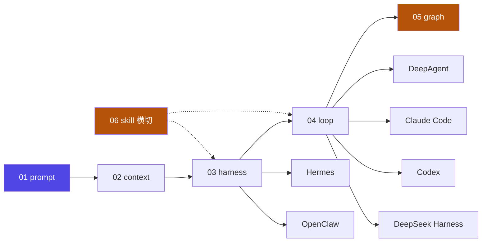

# 0 · 新手前置

零基础术语与原理。**先搞懂 LLM、token、上下文窗口、对话角色、工具调用、什么是 Agent**——后面的知识就再没有黑话。

::: tip 本 Track 怎么用
按 0-1 → 0-6 顺序读。每节都是「概念 + 类比 + 图示 + 小测验」，建议先看懂图、再做题自测。读完这 6 节，即可进入 [Track A 概念主轴](/concepts/prompt)。
:::

## 六节地图

| 子主题 | 讲什么 | 先懂它，才能懂… |
|---|---|---|
| [0-1 什么是 LLM](./01-llm) | 模型如何"接话"：它并不知道对错，只是算"最可能的下一句" | 一切的基础 |
| [0-2 token 与上下文窗口](./02-token) | 字数限制、成本、预算："一次能看多长的字" | context / loop 为什么受窗口约束 |
| [0-3 对话角色](./03-roles) | system / user / assistant 各自分工，谁说了算 | prompt 的骨架 |
| [0-4 工具调用 Tool Use](./04-tool-use) | 模型怎么"点单"、外部程序怎么"做菜" | Agent 能动手的关键 |
| [0-5 什么是 Agent](./05-agent) | LLM + 工具 + 循环：从"会聊"到"会办事" | 后面所有工程层的起点 |
| [0-6 读懂总览图](./06-overview) | 把全站 12 个知识点串成一张图 | 建立全局心智模型 |

## 一句话带走

> LLM 是"只会打字的聪明家伙"；**Agent = LLM + 工具 + 循环**，让它从"只会打字"变成"会动手办事"。

## 全貌速览

> 这张图在 [0-6 读懂总览图](./06-overview) 有逐节点讲解；主轴顺序为本站【推断】，非官方唯一定义。

::: info 进入 Track A 前：难度阶梯
Track 0 是**零基础起步**（L0：概念）。进入 Track A 前，先确认自己站在哪一级——从这一级继续，不跨级：

| 难度 | 定义 | 你在 Track A 能读哪层 |
|---|---|---|
| L0 认识 | 能复述概念、举一个类比 | 每章的"机制详解"起步 |
| L1 会用 | 能照模板做出可运行的东西 | 机制 + "设计决策"的决策表 |
| L2 设计 | 能针对场景选型、权衡、解释取舍 | 机制 + 设计决策 + 坑与自检 |

**给初学者的建议**：不要一上来就啃每章的"设计决策+验证"（L2）。先在 Track A 每章的"机制详解"把 L0/L1 过一遍，跑通 gate 脚本后，再回头读 L2 的设计决策——顺序已按 `机制 → 设计决策 → 坑` 排版，天然是难度递进。
:::

> 读完这 6 节，即可进入 **Track A**：见 [01 prompt engineering](/concepts/prompt)（入门）与 [02 context](/concepts/context)（L0 起步）。
